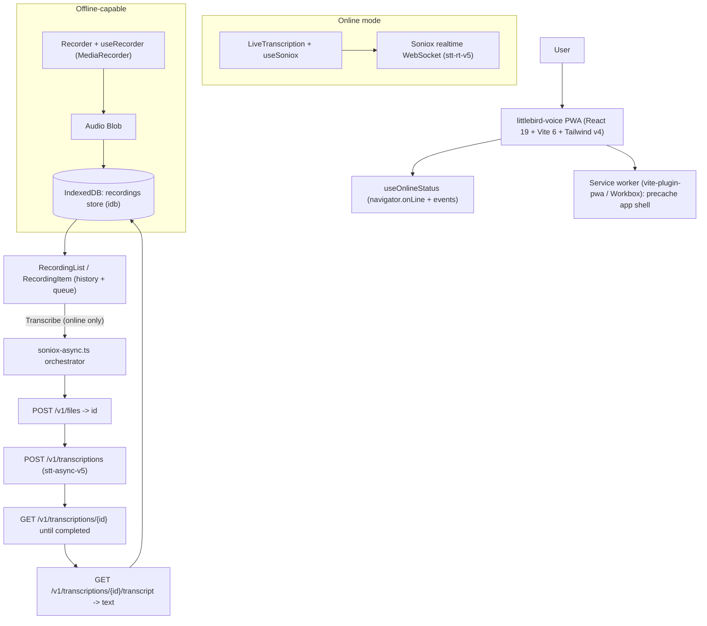

# littlebird-voice — Summary (v1: Web + PWA)

## Problem
littlebird.ai is a Mac-only, cloud-only meeting transcription tool with **no web version and no offline mode**. We are building a fresh web app + installable PWA whose key differentiator is that **voice recording keeps working offline**: record now, transcribe later when back online.

## Scope (this phase)
Standalone installable PWA only. No browser extension, no native desktop/mobile app, no per-site injection, no auth/backend. New repo `littlebird-voice` under `charann29` (not `pharmacy-image-search`).

## Two modes
- **Online → live transcription:** mic streams to Soniox realtime WebSocket (`@soniox/speech-to-text-web`, model `stt-rt-v5`, language hints en/hi/te, diarization) — ported from the reference `speech-react` app.
- **Offline → record-and-queue:** `MediaRecorder` captures audio to a Blob stored in IndexedDB. When back online, one click runs the Soniox **async REST** flow and saves the transcript.

## Proposed architecture

## Verified Soniox endpoints (checked 2026-07-20)
- Realtime: `@soniox/speech-to-text-web` SonioxClient, model `stt-rt-v5`.
- Async (base `https://api.soniox.com`, `Authorization: Bearer <key>`):
  1. `POST /v1/files` (multipart `file`) → response field **`id`**.
  2. `POST /v1/transcriptions` `{ model: "stt-async-v5", file_id, language_hints: ["en","hi","te"] }` → `id`.
  3. `GET /v1/transcriptions/{id}` → poll `status` ∈ `queued|processing|completed|error`.
  4. `GET /v1/transcriptions/{id}/transcript` → `{ text, tokens[] }`.
- Uncertainty flagged: upload returns `id` (not `file_id`); terminal-failure status is `error` (some SDK docs say `failed`) — code treats any non-completed terminal status as failure. `stt-async-v5` is the current async model.

## Key design decisions
- **IndexedDB via `idb`** stores the audio Blob directly + metadata (`status: pending|transcribing|done|error`), independent of the SW cache so recordings survive updates/reloads.
- **Recorder never gated on connectivity** — `getUserMedia`/`MediaRecorder` are local; only the Transcribe actions and live mode require network.
- **React Context** (`RecordingsProvider`) as the single state store; no external state lib. Minimal two-tab UI (Live | Recordings), dark aesthetic from the reference.
- **PWA** via `vite-plugin-pwa` (autoUpdate, Workbox precache of app shell, `navigateFallback` for SPA offline boot, `NetworkOnly` for `api.soniox.com`).
- **Security caveat:** the API key is client-exposed (`VITE_SONIOX_API_KEY`, matching the reference) — acceptable for MVP; documented future path is a serverless proxy, and `soniox-async.ts` isolates the base URL + auth header to make that a one-file swap.

## Build tasks (see detailed plan)
1. Scaffold + shared foundation `[first]`
2. Live transcription slice `[after 1, parallel]`
3. Offline recorder + IndexedDB queue slice `[after 1, parallel]`
4. Async transcription orchestrator slice `[after 1, parallel]`
5. History view + transcribe wiring + PWA integration `[after 2,3,4]`
6. README, env docs, manual test script `[after 5]`

## Remaining blocking question
Repo name confirmation (`littlebird-voice` proposed). Otherwise no design-direction blockers.

## UI/design note
This plan includes user-facing UI (live view, recorder, history, install/PWA chrome). It needs a design subagent + Design-tab artifacts before user-visible plan submission — owned by the main orchestrator.
