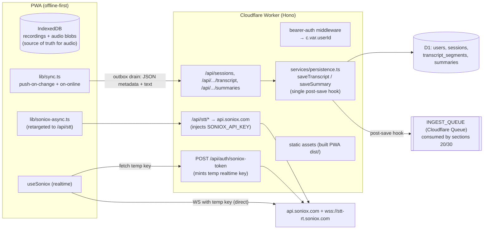

# 10 — Backend Foundation (Cloudflare Worker + D1)

## Product / spec summary

**Goal.** Give littlebird-voice a server so (a) the Soniox API key stops shipping in the client bundle, and (b) sessions (recordings/meetings), transcripts, and summaries live in a database that later sections (AI features, memory/search, integrations) can build on. The PWA stays offline-first: audio blobs remain local-only in IndexedDB; text and metadata sync up when online.

**Users.** Single user for MVP (the repo owner). Ownership is designed in from day one so multi-user is a data migration + auth change, not a rewrite: `users` and `sessions` carry `user_id` directly; `transcript_segments` and `summaries` are scoped **indirectly** via their `session_id → sessions.user_id` FK chain (deliberate — no `user_id` column of their own; queries join through `sessions`).

**Expected behavior.**
- All online features work through a same-origin `/api/*` backed by one Cloudflare Worker; the deployed Worker also serves the built PWA (static assets), so prod has no CORS.
- Live transcription fetches a short-lived Soniox temporary key from the Worker instead of embedding the permanent key (Soniox supports `POST /v1/auth/temporary-api-key` with `usage_type: "transcribe_websocket"`; the `@soniox/speech-to-text-web` SDK accepts an async `apiKey` function — verified 2026-07-21). **No client-side permanent key remains.**
- The async transcription flow (upload → create → poll → transcript → cleanup) is relayed through the Worker, which injects the key.
- Every finished recording syncs up as a `session` row + diarized transcript segments. Sync is one-way push in MVP (client → server), idempotent via client-generated UUIDs. Delete locally ⇒ delete on server.
- Sync is durable: every upsert/delete intent is persisted in an IndexedDB **outbox** before any network attempt, and the outbox is drained on app hydration, on `online` events, and when the API token is set/changed. Deleting a recording offline removes the local row/audio immediately but leaves a remote-deletion tombstone in the outbox until the server acknowledges it.
- Auth: single shared bearer token (Worker secret). Wrong/absent token ⇒ 401 JSON error. The user pastes the token once into the PWA (stored in localStorage).
- Offline behavior is unchanged: recording, playback, queueing all work with zero network; sync retries via the outbox drain triggers above.

**Non-goals (this section).** LLM summaries/Ask-AI (section 20), embeddings/search (section 30), tab/screen capture and OAuth connectors (section 40), multi-user signup, audio blob upload to the server (future R2 design note below — no column/binding/endpoint in MVP), realtime WS relaying through the Worker (unnecessary given temporary keys).

**Acceptance criteria.**
1. `grep VITE_SONIOX_API_KEY src/` returns nothing; live + async transcription still work end to end via the Worker.
2. `wrangler dev` + `npm run dev` gives a working local stack; `wrangler deploy` ships PWA + API as one Worker.
3. Requests without `Authorization: Bearer <APP_AUTH_TOKEN>` to any `/api/*` route (except `/api/health`) get 401.
4. Recording made offline → back online → transcribed → a `sessions` row exists with segments; deleting it locally removes the server row.
5. All D1 access goes through migrations in `worker/migrations/`; `wrangler d1 migrations apply` works locally and remote.
6. Delete a synced recording while offline → local record gone immediately → back online (or token set later) → server row is deleted without user action (outbox tombstone drained and acknowledged).
7. Every transcript/summary write lands via the shared persistence service (`worker/src/services/persistence.ts`) and enqueues an `INGEST_QUEUE` message.

**Edge cases handled in the design.** Sync while token unset (outbox accumulates; drained when the token is set — token change is an explicit drain trigger); server unreachable (op stays in the outbox with attempt count/backoff, retried on next drain trigger); duplicate sync pushes (UUID upsert = idempotent, so replaying the outbox is safe); recording deleted mid-sync (a queued upsert for a tombstoned id is dropped at drain time — mirrors existing `tombstonesRef` pattern in `src/hooks/useRecordings.tsx`); delete-then-server-404 (treated as acknowledged — the goal state already holds); Soniox temp key fetch failure (surfaced via existing `micError` path); large async uploads (Workers accept ≥100 MB request bodies on free plan; 10-min opus ≈ 6–10 MB — fine).

**Constraints.** Cloudflare free plan suffices (Workers free tier + D1 free tier). Node ≥ 20 (repo tested on 22). Keep the frontend's `tsc -b` typecheck green; the worker gets its own tsconfig.

---

## Architecture



**Decisions and reasoning.**
- **Hono** over plain `fetch` handler: routing, middleware (auth), and typed `Env` for near-zero size cost; it is the de-facto Workers standard. No competing convention exists in the repo.
- **One Worker serves API + PWA** (Workers static assets, `assets` binding with `run_worker_first` for `/api/*`): same origin ⇒ no CORS, one deploy command, free tier. Dev keeps Vite's HMR by proxying `/api` → `wrangler dev`.
- **Repo layout:** `worker/` subdirectory with its own `package.json` + `tsconfig.json` (frontend build stays untouched; no workspace tooling needed).
- **Auth = single shared bearer token** (`APP_AUTH_TOKEN` Worker secret). Middleware resolves it to the single seeded user row and sets `userId`. Upgrade path: swap the middleware for per-user session lookup (cookie or token table) — every route already reads `c.var.userId`, and every table already has `user_id`, so nothing else changes.
- **Realtime key stays out of the Worker data path:** the browser streams audio directly to `wss://stt-rt.soniox.com` using a 5-minute single-use temporary key minted by the Worker. Proxying the WS itself buys nothing and adds latency/complexity.
- **Client UUID = server primary key** for sessions. The existing `Recording.id` (`crypto.randomUUID()`) becomes `sessions.id`; sync is a `PUT` upsert, naturally idempotent and retry-safe.
- **Sync is one-way push in MVP.** Server is a mirror of text/metadata; IndexedDB remains authoritative locally. A `GET /api/sessions` list endpoint exists anyway because sections 20/30 need it and a future second device will pull from it.
- **Durable sync via a persisted outbox.** A second IndexedDB store, `syncOutbox` (same `littlebird-voice` DB, added in the v2 upgrade), holds pending operations: `{ opId, recordingId, op: "upsert" | "delete", enqueuedAt, attempts, lastError }`. Ops are enqueued ATOMICALLY with the local mutation — the DB layer exposes `putRecordingAndEnqueue` / `updateRecordingAndEnqueue` / `deleteRecordingAndEnqueue`, each one IndexedDB transaction spanning both stores, so a crash between "persist recording" and "enqueue op" is impossible (add/transcribe-done/edit ⇒ `upsert`; remove ⇒ `delete`). Ops are removed only after a 2xx (or delete-404) from the server. `drainOutbox()` runs on hydration, on `online` events, and on token set/change; it coalesces per recording (a `delete` supersedes queued `upserts`), retries with attempt-count backoff, and never blocks the UI. Local audio/rows delete immediately; only the remote-deletion tombstone persists in the outbox until acknowledged. Rationale: fire-and-forget push would silently lose deletes (and edits) made while offline, token-less, or during an outage.
- **Shared persistence services, not route-inlined SQL.** All transcript and summary writes go through `worker/src/services/persistence.ts` (`saveTranscript`, `saveSummary`). Both this section's REST routes and section 20's `generateSummary` call the same functions, and each function ends with a single post-save hook that publishes to `INGEST_QUEUE` — giving section 30 exactly one place where memory ingestion is enqueued, regardless of which code path wrote the data.
- **Background jobs via Cloudflare Queues (free plan).** Cloudflare Queues has been available on the Workers Free plan since Feb 2026, so the scaffold provisions a queue up front. `ctx.waitUntil` (~30s budget after the response) is not safe for section 20/30's embedding and map-reduce summarization work; a queue consumer with retries is. This section provisions the queue and the producer binding + publishes from the persistence hooks; sections 20/30 own the consumers.
- **R2 audio backup: future note only (not in MVP).** Audio blobs stay client-side. If server-side audio is wanted later: add an `R2_AUDIO` bucket binding, a `PUT /api/sessions/:id/audio` raw-bytes endpoint, and an `audio_key TEXT` column on `sessions` via a new migration — a small additive change, deliberately excluded now (no column, no binding, no flag, no endpoint).

**Contracts exported for sibling sections (20/30/40).** These are canonical — other sections align to what is written here.
- **Config file:** `worker/wrangler.jsonc` (JSONC, NOT `wrangler.toml`). All bindings (D1, Queues, future Vectorize/R2/etc.) are declared there.
- **Session status enum (canonical):** `'pending' | 'transcribing' | 'done' | 'error'` — `'done'` (not `'ready'`) is the value meaning a transcript is complete. Used in the D1 CHECK constraint, API bodies, and frontend types alike.
- **Error body schema (canonical):** every non-2xx JSON response is `{ "error": { "code": string, "message": string } }`. `code` is a stable machine string (`"unauthorized"`, `"not_found"`, `"bad_request"`, `"upstream_error"`); `message` is human-readable.
- Worker `Env` type (`worker/src/env.ts`): `{ DB: D1Database; ASSETS: Fetcher; INGEST_QUEUE: Queue<IngestMessage>; SONIOX_API_KEY: string; APP_AUTH_TOKEN: string }` — extend by adding fields here + `wrangler.jsonc`.
- Auth: middleware in `worker/src/auth.ts`; handlers read `c.var.userId` (string, FK to `users.id`).
- **Persistence services (canonical write path):** `worker/src/services/persistence.ts` exports `saveTranscript(env: Env, userId: string, sessionId: string, segments: SegmentInput[]): Promise<{ count: number; revision: number }>` and `saveSummary(env: Env, userId: string, sessionId: string, kind: string, payload: object, model?: string): Promise<Summary>` (`Summary` includes `revision`). Both validate session ownership (`sessions.user_id = userId`), write D1 **and atomically increment the revision counter in the same batch** (`sessions.transcript_revision` for transcripts; `summaries.revision` for summaries), then fire a single post-save hook that publishes an `IngestMessage` carrying that new revision as `sourceRevision`. All transcript/summary writes — this section's REST routes and section 20's `generateSummary` — MUST go through these functions; never write these tables from route handlers directly. Section 30 hooks memory ingestion by consuming the queue, not by patching call sites.
- **Revisions (canonical staleness token):** `sessions.transcript_revision` and `summaries.revision` are server-incremented monotonic integers, bumped only by the persistence services. `IngestMessage.sourceRevision` is always this counter value — never epoch ms (not monotonic under concurrency). Consumers compare against the current row's revision and drop stale messages.
- **Background jobs:** Cloudflare Queue `littlebird-ingest`, producer binding `INGEST_QUEUE` (available on the Free plan since Feb 2026), dead-letter queue `littlebird-ingest-dlq`. Canonical message type (`worker/src/services/ingest-message.ts`):
  `IngestMessage = { userId: string; kind: "transcript" | "summary" | "document"; parentId: string; sourceRevision: number; jobs?: ("index" | "summarize")[]; requestId?: string }`.
  Identity convention (fixed — section 30's vector IDs depend on it): `parentId` is `sessions.id` for BOTH `kind: "transcript"` and `kind: "summary"` (the `kind` field, plus `summaries.kind` looked up server-side, distinguishes what to ingest); `parentId` is the document id for `kind: "document"` (section 40's connector imports). `jobs` optionally narrows what consumers do (default: all applicable); `requestId` is an optional correlation id for request-scoped flows (e.g. section 20 Ask-AI). Consumer wiring: exactly ONE dispatcher, `worker/src/queue/consumer.ts`, is created by section 30 (its T3) and registers the single `queue()` handler that fans out by `kind`/`jobs`; this section only provisions the queue, the DLQ, the producer binding, and the consumer config in `wrangler.jsonc`. Do not use `ctx.waitUntil` for embedding/summarization work.
- Route pattern: one file per feature in `worker/src/routes/*.ts`, each exporting a Hono sub-app mounted in `worker/src/index.ts` (e.g. section 20 mounts `routes/ai.ts` at `/api`).
- Tables: `users`, `sessions`, `transcript_segments`, `summaries` (DDL below). New tables via numbered files in `worker/migrations/`. `summaries.kind` is the extension point for section 20 (`meeting_summary`, `follow_ups`, `ask_ai_answer`, …); section 30 keys embeddings on `transcript_segments.id` / `sessions.id`; section 40 adds connector/OAuth tables referencing `users.id`.
- **Ownership scoping:** `sessions` has a `user_id` column; `transcript_segments` and `summaries` deliberately do NOT — they are scoped indirectly through `session_id → sessions.user_id`. Queries touching them must join through `sessions` (the persistence services do this for you).
- Frontend: `apiFetch(path, init)` in `src/lib/api.ts` (adds bearer header, normalizes the canonical error schema); shared request/response types in `src/lib/api-types.ts`. Frontend unit-test harness: root `vitest` + jsdom + Testing Library (`npm test` at repo root) — sections 20/30 write hook/component tests against it.

---

## D1 DDL — `worker/migrations/0001_init.sql`

```sql
PRAGMA defer_foreign_keys = false; -- D1 enforces FKs; keep ordering explicit

CREATE TABLE users (
  id          TEXT PRIMARY KEY,              -- uuid
  email       TEXT UNIQUE,
  name        TEXT,
  created_at  INTEGER NOT NULL               -- epoch ms
);
-- Seed the single MVP user (fixed id referenced by auth middleware):
INSERT INTO users (id, email, name, created_at)
VALUES ('00000000-0000-4000-8000-000000000001', NULL, 'Owner', 0);

CREATE TABLE sessions (
  id          TEXT PRIMARY KEY,              -- client-generated uuid (= Recording.id)
  user_id     TEXT NOT NULL REFERENCES users(id),
  title       TEXT NOT NULL DEFAULT '',
  source      TEXT NOT NULL DEFAULT 'mic'
              CHECK (source IN ('mic','tab','screen')),  -- 'tab'/'screen' used by section 40
  status      TEXT NOT NULL DEFAULT 'pending'
              CHECK (status IN ('pending','transcribing','done','error')),
  created_at  INTEGER NOT NULL,              -- epoch ms (client clock)
  updated_at  INTEGER NOT NULL,
  duration_ms INTEGER NOT NULL DEFAULT 0,
  mime_type   TEXT,
  blob_size   INTEGER,                       -- bytes; audio itself stays client-side (MVP)
  self_speaker TEXT,                         -- diarization label of the app user ("1","2",…) or NULL; set via PATCH, consumed by section 20
  transcript_revision INTEGER NOT NULL DEFAULT 0,  -- server-side monotonic counter; incremented atomically by saveTranscript()
  error       TEXT
);
CREATE INDEX idx_sessions_user_created ON sessions(user_id, created_at DESC);

CREATE TABLE transcript_segments (
  id          INTEGER PRIMARY KEY AUTOINCREMENT,
  session_id  TEXT NOT NULL REFERENCES sessions(id) ON DELETE CASCADE,
  seq         INTEGER NOT NULL,              -- 0-based order within session
  speaker     TEXT,                          -- Soniox diarization label ("1","2",…) or NULL
  start_ms    INTEGER,
  end_ms      INTEGER,
  text        TEXT NOT NULL,
  UNIQUE (session_id, seq)
);
CREATE INDEX idx_segments_session ON transcript_segments(session_id, seq);

CREATE TABLE summaries (
  id          TEXT PRIMARY KEY,              -- uuid
  session_id  TEXT NOT NULL REFERENCES sessions(id) ON DELETE CASCADE,
  kind        TEXT NOT NULL DEFAULT 'meeting_summary',  -- extension point for section 20
  payload_json TEXT NOT NULL,                -- opaque JSON payload
  model       TEXT,                          -- producing model id, set by section 20
  revision    INTEGER NOT NULL DEFAULT 0,    -- server-side monotonic counter; incremented by saveSummary() on each upsert
  created_at  INTEGER NOT NULL,
  UNIQUE (session_id, kind)                  -- one latest per kind; replace on regenerate
);
```

Notes: epoch-ms integers everywhere (matches client `Date.now()`); no soft delete — `DELETE` cascades, and IndexedDB remains the local archive. Transcript writes replace all segments for a session in one `batch()` (delete + inserts) — simplest idempotent shape for re-transcription. Ownership: only `sessions` carries `user_id`; `transcript_segments` and `summaries` inherit scope through `session_id` (see exported contracts). The session `status` CHECK is the canonical enum (`done` = transcript complete). Revisions: `transcript_revision` / `revision` are server-incremented monotonic counters (`SET x = x + 1 ... RETURNING x` inside the persistence services' write batch) — deliberately NOT epoch ms, which is not monotonic under concurrent writes; they feed `IngestMessage.sourceRevision` so queue consumers can drop stale messages.

---

## API endpoint table

All routes require `Authorization: Bearer <APP_AUTH_TOKEN>` except `GET /api/health`. Errors use the canonical schema `{"error": {"code": string, "message": string}}` with 400/401/404/502.

| Method | Path | Body (JSON unless noted) | Response |
|---|---|---|---|
| GET | `/api/health` | — | `{ ok: true }` (unauthenticated liveness only) |
| GET | `/api/auth/check` | — | `204` with a valid token, `401` otherwise — Settings UI uses this to validate a pasted token |
| POST | `/api/auth/soniox-token` | — | `{ api_key, expires_at }` — Worker calls Soniox `POST /v1/auth/temporary-api-key` `{ usage_type: "transcribe_websocket", expires_in_seconds: 300, single_use: true }` |
| GET | `/api/sessions` | query `?limit=50&before=<created_at>` | `{ sessions: SessionMeta[] }` (no segments) |
| PUT | `/api/sessions/:id` | `{ title?, source, status, created_at, updated_at, duration_ms, mime_type?, blob_size?, self_speaker?, error? }` | `201/200 { session }` — idempotent upsert keyed on client UUID; sets `user_id` from auth |
| GET | `/api/sessions/:id` | — | `{ session, segments: Segment[], summaries: SummaryMeta[] }` |
| PATCH | `/api/sessions/:id` | any subset of PUT fields (e.g. `{ title }`, `{ self_speaker: "1" }` — section 20 sets the user's diarization label through this route, no duplicate route needed) | `{ session }` |
| DELETE | `/api/sessions/:id` | — | `204` (cascades segments + summaries) |
| PUT | `/api/sessions/:id/transcript` | `{ segments: [{ speaker?, start_ms?, end_ms?, text }] }` | `{ count }` — replaces all segments via `saveTranscript()` (delete + insert in one D1 batch; enqueues `INGEST_QUEUE` message) |
| GET | `/api/sessions/:id/transcript` | — | `{ segments, text }` (`text` = segments joined) |
| PUT | `/api/sessions/:id/summaries/:kind` | `{ payload: object, model? }` | `{ summary }` (incl. `revision`) — upsert per `(session_id, kind)` via `saveSummary()`, which bumps `summaries.revision` and enqueues an `INGEST_QUEUE` message with `sourceRevision = revision`; section 20's write path |
| GET | `/api/sessions/:id/summaries` | — | `{ summaries: [{ id, kind, payload, model, revision, created_at }] }` |
| POST | `/api/stt/files` | multipart, field `file` (relayed verbatim) | Soniox response passthrough (`{ id, ... }`) |
| POST | `/api/stt/transcriptions` | `{ model, file_id, language_hints }` (relayed) | passthrough (`{ id, ... }`) |
| GET | `/api/stt/transcriptions/:id` | — | passthrough (`{ status, error_type?, error_message? }`) |
| GET | `/api/stt/transcriptions/:id/transcript` | — | passthrough (`{ text, tokens }`) |
| DELETE | `/api/stt/transcriptions/:id` · `/api/stt/files/:id` | — | passthrough (cleanup) |

The `/api/stt/*` relay strips the client's app-token header, adds `Authorization: Bearer ${env.SONIOX_API_KEY}`, forwards method/body/query to `https://api.soniox.com/v1/...`, and streams the response back. Allow-list exactly the five paths above — it is not a generic proxy.

---

## Implementation tasks

### T1 — Worker scaffold: Wrangler + D1 + Queue + auth + persistence services + core CRUD  `[parallel]`
Create:
- `worker/package.json` — deps `hono`; devDeps `wrangler`, `typescript`, `vitest`, `@cloudflare/vitest-pool-workers`; scripts `dev` (`wrangler dev`), `deploy` (`wrangler deploy`), `test` (`vitest run`), `typecheck`.
- `worker/wrangler.jsonc` (canonical config file — JSONC, not TOML) — `name: "littlebird-voice"`, `main: "src/index.ts"`, `compatibility_date: "2026-07-01"`, `d1_databases: [{ binding: "DB", database_name: "littlebird-voice", database_id: "<filled at provision>" }]`, `queues: { producers: [{ binding: "INGEST_QUEUE", queue: "littlebird-ingest" }], consumers: [{ queue: "littlebird-ingest", max_retries: 3, retry_delay: 30, dead_letter_queue: "littlebird-ingest-dlq" }] }`, `assets: { directory: "../dist", binding: "ASSETS", not_found_handling: "single-page-application", run_worker_first: ["/api/*"] }`. Note: the consumer config is declared here, but the single dispatcher `worker/src/queue/consumer.ts` (the `queue()` handler) is created by section 30 (its T3) — this section provisions queue + DLQ + bindings only, and does NOT export a `queue` handler yet.
- `worker/tsconfig.json`, `worker/src/env.ts` (the exported `Env` interface above, incl. `INGEST_QUEUE: Queue<IngestMessage>`).
- `worker/src/services/ingest-message.ts` — the canonical `IngestMessage` union type from exported contracts (kind `"transcript" | "summary" | "document"`, `jobs?`, `requestId?`).
- `worker/src/services/persistence.ts` — `saveTranscript()` and `saveSummary()` per the exported-contracts signatures: ownership check (join `sessions.user_id`), D1 write in one `db.batch()` (delete+insert segments + `UPDATE sessions SET transcript_revision = transcript_revision + 1` for transcripts; upsert per `(session_id, kind)` with `revision = revision + 1` for summaries), read back the new revision, then the single post-save hook publishing to `env.INGEST_QUEUE` with `sourceRevision` = that revision.
- `worker/migrations/0001_init.sql` — DDL above.
- `worker/src/index.ts` — Hono app: mounts routes, canonical `{error:{code,message}}` error handler, falls through to `env.ASSETS.fetch()` for non-`/api` paths.
- `worker/src/auth.ts` — bearer middleware: timing-safe compare against `env.APP_AUTH_TOKEN`, sets `c.set("userId", SINGLE_USER_ID)`; exported `SINGLE_USER_ID` constant matching the seed row. Also `GET /api/auth/check` → `204` (authenticated no-op; the Settings UI validates a pasted token against it — `/api/health` stays unauthenticated liveness).
- `worker/src/routes/sessions.ts` — sessions CRUD + transcript + summaries endpoints per table above (incl. `self_speaker` in PUT/PATCH bodies). Session metadata CRUD uses prepared statements directly; transcript and summary writes call the persistence services (never inline SQL for those tables).
- `worker/README.md` — provision (`wrangler d1 create littlebird-voice` + paste id, `wrangler queues create littlebird-ingest`, `wrangler queues create littlebird-ingest-dlq`, `wrangler d1 migrations apply littlebird-voice --local|--remote`), secrets (`wrangler secret put SONIOX_API_KEY`, `wrangler secret put APP_AUTH_TOKEN`), dev, deploy. Note: Queues is available on the Workers Free plan (since Feb 2026).

Modify: root `.gitignore` (add `worker/.wrangler/`, `worker/node_modules/`).

Tests: `worker/src/routes/sessions.test.ts` + `worker/src/services/persistence.test.ts` with `@cloudflare/vitest-pool-workers` (real local D1 + queue binding, migrations applied in setup): 401 without token; `GET /api/auth/check` 204 with token / 401 without; error bodies match `{error:{code,message}}`; PUT upsert idempotency (same UUID twice ⇒ one row); PATCH persists `self_speaker`; PUT transcript replaces segments, bumps `transcript_revision` by exactly 1 per call, and publishes one `IngestMessage` whose `sourceRevision` equals the new counter; summaries upsert per kind bumps `revision` and publishes; DELETE cascades; persistence services reject a `sessionId` owned by another `user_id`. Run `npm test` + `npm run typecheck` in `worker/`.

### T2 — Soniox temp-key mint + async relay  `[after T1]`
Create:
- `worker/src/routes/soniox.ts` — `POST /api/auth/soniox-token` (calls Soniox temp-key endpoint, maps non-2xx to 502 with detail) and the five allow-listed `/api/stt/*` relay routes (forward method/query/body streams; inject key; pass status/body through).

Modify: `worker/src/index.ts` (mount).

Tests: vitest with a stubbed `fetch` (route-scoped `fetchMock` from vitest-pool-workers): temp-key success/failure mapping; relay preserves method, path, status, and body; relay rejects non-allow-listed paths (404); all routes 401 without app token. Manual: `wrangler dev` + curl the temp-key route with a real `SONIOX_API_KEY` in `worker/.dev.vars`.

### T3 — Frontend: kill client key, use the backend, root test harness  `[after T2]`
Create:
- `src/lib/api.ts` — `apiFetch(path, init)`: base `/api` (same-origin), bearer token from `localStorage("lb.apiToken")`, normalizes the canonical `{error:{code,message}}` schema; `getApiToken()/setApiToken(token)`; `onApiTokenChange(cb)` subscription (used by T4's outbox drain trigger).
- `src/lib/api-types.ts` — `SessionMeta` (incl. `self_speaker: string | null`, `transcript_revision`), `Segment`, `SummaryMeta` (incl. `revision`), `SessionStatus` (`'pending'|'transcribing'|'done'|'error'`), request bodies incl. the PATCH body with `self_speaker?` (mirrors the endpoint table; sections 20/30/40 import from here).
- Root frontend test harness (downstream sections 20/30 depend on this): `vitest.config.ts` (jsdom environment) + `src/test/setup.ts`; root `package.json` devDeps `vitest`, `jsdom`, `@testing-library/react`, `@testing-library/user-event`, `@testing-library/jest-dom`; script `test`: `vitest run`. Seed test: `src/lib/api.test.ts` (token header attach, error-schema normalization).

Modify:
- `src/config.ts` — delete `SONIOX_API_KEY`; `API_BASE` → `"/api/stt"`.
- `src/lib/soniox-async.ts` — `authHeaders()` now returns the app bearer header (or route through `apiFetch`); paths become `/files`, `/transcriptions/...` under the new base. This is the one-file seam v1 left on purpose; orchestrator logic unchanged.
- `src/hooks/useSoniox.ts` — `apiKey: async () => (await apiFetch("/auth/soniox-token", { method: "POST" })).api_key` (SDK ≥1.4 supports async apiKey; audio buffers until it resolves).
- `vite.config.ts` — dev `server.proxy: { "/api": "http://localhost:8787" }`.
- `.env.example` — drop `VITE_SONIOX_API_KEY`, document the dev flow instead.
- Minimal token-entry UI: small settings affordance in `src/App.tsx` (prompt/input writing `setApiToken`) — flagged for design pass, see notes.

Tests: `npm run typecheck`; root `npm test` runs the new harness green (api.test.ts); grep confirms no `VITE_SONIOX_API_KEY` in `src/`; manual E2E against `wrangler dev` (`worker/.dev.vars` with real key): live transcription streams; queued recording transcribes via relay. Verify DevTools shows no Soniox key in any request from the page (only the app token to same-origin).

### T4 — Durable sync (outbox) + deploy story  `[after T3]`
Create:
- `src/lib/sync.ts` — outbox-driven sync:
  - `drainOutbox()` (canonical name, used everywhere) — serialized (single-flight guard), walks ops oldest-first: `upsert` ⇒ `PUT /api/sessions/:id` then, if transcript exists, `PUT /api/sessions/:id/transcript` (segments from stored Soniox tokens when available, else one segment with full text); `delete` ⇒ `DELETE /api/sessions/:id`. Op is removed only on 2xx (delete-404 counts as acknowledged). On failure: increment `attempts`, record `lastError`, leave op queued (attempt-count backoff caps retry frequency within a drain). No-ops silently when no API token is set — ops accumulate.
  - Drain triggers: app hydration, `window "online"` event, and `onApiTokenChange` (from T3) so setting/changing the token immediately syncs the backlog.
  - Upsert ops for ids no longer in the recordings store are dropped at drain time (deleted-mid-sync; mirrors the existing `tombstonesRef` pattern in `useRecordings.tsx`).
  - `getPendingOpCount()` for the badge.
  - Note: `sync.ts` only READS/settles the outbox; op enqueueing lives in `db.ts` (atomic with the recording mutation, below).

Modify:
- `src/types.ts` — `Recording` gains `syncState: "local" | "dirty" | "synced"` (derived/display state; the outbox is the retry source of truth) and `segments: Segment[] | null` (persist diarized tokens from the async transcript instead of discarding them — change `getTranscript` usage in `soniox-async.ts` to also return tokens); new `SyncOp` type for outbox records `{ opId, recordingId, op, enqueuedAt, attempts, lastError }`.
- `src/lib/db.ts` — DB version 2 upgrade: new object store `syncOutbox` (`keyPath: "opId"`, index `by-recordingId`); default `syncState: "local"`, `segments: null` on existing recording rows. **Atomic mutate-and-enqueue methods** — each runs ONE IndexedDB transaction spanning BOTH stores (`["recordings","syncOutbox"]`, mode `readwrite`) so a crash can never persist the mutation without its sync op (or vice versa):
  - `putRecordingAndEnqueue(recording: Recording): Promise<void>` — put recording + upsert op (coalesced: replaces any queued upsert for the id).
  - `updateRecordingAndEnqueue(id: string, patch: Partial<Recording>): Promise<Recording | undefined>` — merge patch + upsert op (coalesced).
  - `deleteRecordingAndEnqueue(id: string): Promise<void>` — delete recording row/blob + delete op (removes/supersedes any queued upserts for the id in the same transaction).
  Plus outbox read/settle DAO used only by `drainOutbox()`: `getOps/deleteOp/updateOp`.
- `src/hooks/useRecordings.tsx` — hooks call ONLY the atomic methods: add/transcribe-done/edit ⇒ `putRecordingAndEnqueue`/`updateRecordingAndEnqueue`, then kick `drainOutbox()`; `remove()` ⇒ `deleteRecordingAndEnqueue` (local row + audio gone immediately; the queued delete op is the remote-deletion tombstone that survives until acknowledged), then kick `drainOutbox()`. Local-only writes that must NOT sync (e.g. transient status flips) keep using the plain `updateRecording`. Replace the old fire-and-forget calls entirely.
- `src/components/OnlineBadge.tsx` (or adjacent) — "synced / n pending" indicator from `getPendingOpCount()` (flagged for design pass).
- Root `package.json` — script `deploy`: `npm run build && npm --prefix worker run deploy`.
- `README.md` — new architecture, local dev (two terminals: `wrangler dev` + `vite`), provision + deploy steps, secrets list.

Tests: `npm run typecheck`; root `npm test` (harness from T3) — unit tests for atomicity (with fake-indexeddb: abort a `putRecordingAndEnqueue` transaction mid-way ⇒ neither store changed; success ⇒ both changed), outbox coalescing rules, `drainOutbox()` single-flight, delete-supersedes-upsert, 404-on-delete acknowledgment, and segment mapping (mock `fetch`). Manual E2E: record offline → go online → auto-transcribe → `wrangler d1 execute littlebird-voice --local --command "SELECT ..."` shows session + segments; delete a synced recording while the worker is stopped → local row gone, outbox holds the delete → restart worker + fire `online` → server row gone; clear token, mutate, set token → backlog syncs without a reload.

**Final integration verification (after T4):** `npm run build`, `wrangler deploy`, apply remote migrations, set both secrets, open the deployed URL, run one full live session and one offline→async session; confirm rows in remote D1 (`wrangler d1 execute ... --remote`) and zero Soniox-key exposure in the client.

---

## Open questions for the user

**Q1 — Cloudflare account & hosting target (blocking for deploy, not for build).**
The plan assumes deploying one Cloudflare Worker that serves both the PWA and the API (free plan is enough: Workers + D1 free tiers).
- **(A) Yes — use my Cloudflare account, host the PWA on the Worker too** *(recommended: same origin, no CORS, one deploy)*. We'll need a `CLOUDFLARE_API_TOKEN` (Workers Scripts:Edit + D1:Edit) and account ID as secrets, or you run `wrangler login`/`wrangler deploy` yourself.
- **(B) API-only Worker; I host the frontend elsewhere.** Adds a CORS layer + `VITE_API_BASE` env; slightly more config, otherwise identical.
- **(C) No Cloudflare account / undecided.** We build everything against `wrangler dev` locally and defer deployment.

No other blocking questions: shared-bearer-token auth, Hono, client-UUID upsert sync via a persisted outbox, Cloudflare Queues for background jobs, and deferring R2 audio to a future note are decided above with upgrade paths documented.
