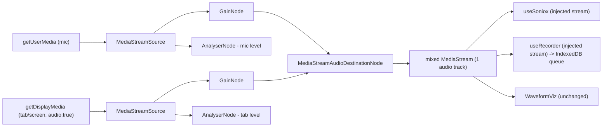
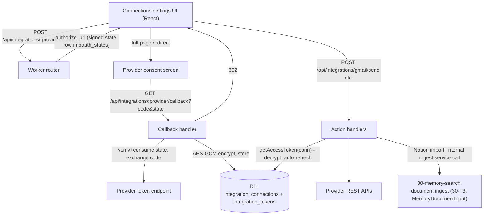

# 40 — Capture Upgrades + Integrations Framework

Section of the littlebird-ai-v2 plan. Two independent tracks:

- **Track A — Capture upgrades (client)**: mix mic + tab/screen audio into one stream feeding both the live Soniox path and the offline MediaRecorder queue; Meeting-mode UI.
- **Track B — Integrations framework (Worker)**: connector registry + OAuth + encrypted token storage in D1; first four connectors (Google Calendar, Gmail, Slack, Notion); Connections settings UI.

Contracts assumed from sibling sections (flagged, do not re-plan here):

| Assumed name | Owner | Used as |
|---|---|---|
| Worker source root `worker/src/`, router mounting `/api/*` | 10-backend-foundation | All Track B files live here |
| Request-scoped auth: `user_id: string` resolved by auth middleware; `env.DB: D1Database` | 10-backend-foundation | FK + row scoping for all integration tables |
| `sessions` table with `id`, `user_id`, `title`, `transcript`/summary access | 10-backend-foundation / 20-ai-features | `session_id` payloads for export actions |
| Internal document-ingest service (canonical `MemoryDocumentInput { title, source, text, external_id?, metadata? }`; idempotent re-import keyed on `(user_id, source, external_id)`); also exposed as `POST /api/memory/documents` | 30-memory-search (30-T3) | Notion doc import target — called via the internal ingest service function, not over HTTP |
| Summary / action items / drafted follow-up email text generation | 20-ai-features | Track B actions **send provided text**; they never call the LLM themselves |

---

## 1. Product / spec summary

### Track A — Meeting capture

**Goal.** Today the app only hears the microphone. In a meeting (Google Meet / Zoom-in-browser / any tab playing audio), remote participants are inaudible to the app. Track A lets the user capture **their mic + the meeting tab's audio** as a single recording/transcription, so the transcript covers both sides of the conversation.

**Users / flows.**
- User opens the app in a second tab next to their browser-based meeting, picks "Tab + Mic", selects the meeting tab in the browser share picker (checking "Also share tab audio"), and gets one live transcript + one queued recording covering everyone.
- "Screen + Mic" is the same flow with a screen/window surface (system audio where the OS supports it).
- "Mic only" remains the default and behaves exactly like v1.

**Expected behavior.**
- One source picker with three options: **Mic only / Tab + Mic / Screen + Mic**. Options that the current browser cannot support are rendered disabled with an explanatory tooltip/caption (feature-detected, see limitations).
- Starting Meeting mode acquires mic (getUserMedia) and, for the two mixed modes, display media (getDisplayMedia with `audio: true`) — both behind the same user gesture. **Both acquisition promises are created synchronously inside the click handler** (no `await` before `getDisplayMedia`): `getDisplayMedia` consumes transient user activation, and awaiting the mic prompt first can leave the activation expired, making `getDisplayMedia` reject with `InvalidStateError`. If either acquisition fails, all already-acquired tracks from the other are stopped before surfacing the error/fallback state. Both streams are mixed via WebAudio into **one audio-only MediaStream** that is passed to *both* the Soniox realtime client and the MediaRecorder queue path, so live transcription and the offline-durable recording always contain identical audio.
- The browser's share picker is authoritative: "Tab + Mic" cannot force or restrict the user to a tab. The mode only sets hints (`preferCurrentTab`/`selfBrowserSurface`/`systemAudio` dictionary members) and picker-guidance copy ("choose a Chrome Tab and tick 'Also share tab audio'"); if the user picks a window/screen instead, capture proceeds with whatever audio the picker granted.
- Active-source indicator dots (mic / tab-or-screen), each lit while its track is `live`, with a per-source level meter driven by AnalyserNodes on the pre-mix branches.
- If the user shares a surface **without** ticking the audio checkbox (display stream has zero audio tracks), show a warning ("No tab audio shared — only your mic is being captured") and continue mic-only rather than failing.
- If the user hits the browser's native "Stop sharing" bar, the display track `ended` event downgrades the session to mic-only live (indicator dot goes off, warning shown); recording continues.
- Stopping works exactly like v1: graceful Soniox stop, MediaRecorder finalize → IndexedDB queue → async transcription when online.

**Native limitations (state these in UI copy and README — they are hard platform constraints, not bugs):**
- **No silent / no-prompt capture.** `getDisplayMedia` **always** shows the browser's share picker; there is no persistable permission. Every meeting session requires the user to re-select the tab/screen. This cannot be automated.
- **User gesture required.** `getDisplayMedia` must be called from a click handler; capture cannot auto-start on a calendar trigger. (Calendar integration can pre-open a session and show a "Start capture" button, but the click is mandatory.)
- **We cannot observe screen content.** We take only the audio track; no video is recorded or analyzed. Even reading pixels would require this same explicit consent per session.
- **Tab/system audio is desktop-Chromium-only.** Chrome/Edge desktop: tab audio works everywhere; **system/screen audio only on Windows and ChromeOS** (on macOS/Linux Chrome offers no "share system audio" checkbox for full-screen capture — tab audio still works). Firefox: `getDisplayMedia` audio is not supported. Safari: `getDisplayMedia` exists (13+) but never returns audio. Mobile (iOS/Android): unsupported entirely.
- Consequence: "Tab + Mic" is the reliable cross-desktop-Chromium option; "Screen + Mic" must be labeled as Windows/ChromeOS-only for the system-audio part; on Firefox/Safari/mobile only "Mic only" is enabled.
- **Echo caveat:** if the user is not on headphones, the mic also picks up tab playback (double audio). Mitigation is copy-level ("use headphones"), plus `echoCancellation: true` on the mic track; no DSP work in scope.

**Non-goals (Track A):** bot/participant joining meetings server-side, video capture, per-speaker separation of tab audio (Soniox diarization applies to the mixed stream as-is), Electron/extension-based silent capture.

**Acceptance criteria (Track A):**
1. "Tab + Mic" on desktop Chrome produces a live transcript containing words spoken only in the captured tab and words spoken only into the mic.
2. The queued IndexedDB recording for the same session plays back both sources.
3. Existing Live and Recorder tabs behave byte-for-byte like v1 when Meeting mode is not used (mic-only default path unchanged).
4. Share-without-audio, "Stop sharing" mid-session, and permission-denied each produce a visible non-fatal state, never a crash or silent data loss.
5. Unsupported browsers show disabled mixed-mode options with an explanation.

### Track B — Integrations framework

**Goal.** After a meeting produces a transcript/summary/action items (20-ai-features), the user can push results out (Slack message, Gmail follow-up, Notion page) and pull context in (upcoming Google Calendar meetings, Notion docs into memory) — without any provider token ever reaching the browser.

**Expected behavior.**
- Settings → Connections screen lists the four providers with status (Not connected / Connected as `<account>` / Error), Connect and Disconnect buttons.
- Connect opens the provider's OAuth consent screen (full-page redirect); the callback lands on the Worker, which exchanges the code, encrypts and stores tokens in D1, and redirects back to the app (`/settings/connections?connected=<provider>`).
- Connector actions (list calendar events, send email, post to Slack, export/import Notion) are Worker endpoints; the client sends only content and target identifiers, never tokens.
- Disconnect revokes the token at the provider (best effort) and deletes the rows.
- Expired Google access tokens are refreshed transparently by the Worker on use; a dead refresh token flips the connection to `status='error'` (surfaced as "Reconnect" in UI). Slack bot tokens are long-lived (token rotation not enabled) and Notion tokens do not expire — a revoked token surfaces as a provider error → "Reconnect".

**Non-goals (Track B):** webhooks/event subscriptions from providers, background sync jobs/cron, Slack slash-commands or bots that read messages, calendar write access, generic "any provider" plugin marketplace. Auto-creating sessions from calendar events is listed as an open question, not committed scope.

**Acceptance criteria (Track B):**
1. Each of the 4 providers can be connected, listed as connected with account label, and disconnected.
2. Tokens exist in D1 only as AES-GCM ciphertext; no API response or client bundle ever contains an access/refresh token.
3. OAuth `state` is signed, single-use, and expires (10 min); a replayed or forged state is rejected with 400.
4. Calendar: upcoming events for the next 7 days render in the app. Gmail: a provided draft is sent and arrives. Slack: a summary posts to a chosen channel. Notion: a summary page is created in a chosen database, and a chosen Notion page's text lands in memory search results.
5. All endpoints are scoped to the authenticated `user_id`; user A can never see or use user B's connection.

---

## 2. Architecture

### Track A — capture data flow



Key decisions:
- **`CaptureMixer` class in `src/lib/captureMixer.ts`** (mirrors the existing `WaveformViz` class style): owns one `AudioContext`, a `MediaStreamAudioDestinationNode`, per-source `GainNode` + `AnalyserNode`. API sketch:
  - `constructor()`
  - `async start(sources: { mic: MediaStream; display?: MediaStream }): Promise<MediaStream>` — returns `dest.stream` (audio-only).
  - `getLevels(): { mic: number; display: number | null }` — RMS 0..1 from the analysers, polled by the UI at rAF/interval.
  - `onSourceEnded(cb: (source: "mic" | "display") => void)` — wired to track `ended` events.
  - `stop(): void` — disconnect nodes, close context, stop **source** tracks it was given ownership of (mixer owns both raw streams; consumers never stop the mixed stream's tracks — see ownership rule below).
- **Stream ownership rule:** whoever creates a MediaStream stops it. `useMeetingCapture` (via `CaptureMixer`) owns mic + display streams. `useSoniox`/`useRecorder`, when given an injected stream, must **not** call `track.stop()` on it — they only detach. This is the entire backward-compat refactor:
  - `useRecorder(canvasRef, options)` gains `options.getStream?: () => Promise<MediaStream>` and an internal `ownsStream` flag (`true` only for the default getUserMedia path). `cleanupCapture` stops tracks only when `ownsStream`.
  - `useSoniox(onText, canvasRef, options?)` gains the same `options.getStream?`. `teardownAudio()` stops tracks only when owned. Default behavior (no option) is byte-identical to v1.
- **Display video track:** `getDisplayMedia({ video: true, audio: {...} })` — video must be requested (Chrome requires it) but the video track is immediately unused; keep it alive (stopping it can end the capture session) and stop it in `mixer.stop()`. Request options: `audio: { echoCancellation: false, noiseSuppression: false, autoGainControl: false }`, `selfBrowserSurface: "exclude"`, `systemAudio: "include"` (typed via a small local ambient type; these dictionary members are not all in lib.dom yet). These are **hints only** — the user's choice in the browser picker always wins; the mode cannot force a tab vs screen selection.
- **Recorder path gets the mixed stream too**, so offline durability semantics are unchanged: if the network drops mid-meeting, the Soniox socket dies but the queued blob still contains the full mixed audio for async transcription later.
- `useMeetingCapture(canvasRef)` orchestrator returns `{ mode, setMode, state, levels, activeSources, warning, error, start, stop }` and internally composes `CaptureMixer` + `useSoniox` + `useRecorder` (both with injected `getStream`), plus `useRecordings().addFromBlob` on complete — same persistence path as the Recorder tab.

### Track B — connector framework (Worker)



Key decisions:
- **`Connector` interface** (`worker/src/integrations/types.ts`):
  - `slug: "google-calendar" | "gmail" | "slack" | "notion"`
  - `authorizeUrl(params: { state: string; redirectUri: string; env: Env }): string`
  - `exchangeCode(params: { code: string; redirectUri: string; env: Env }): Promise<TokenSet>` — `TokenSet = { accessToken, refreshToken?, expiresAt?, tokenType, scopes, externalAccountId, displayName, metadata? }`
  - `refresh?(refreshToken: string, env: Env): Promise<TokenSet>` (Google only in this plan; Notion tokens don't expire; Slack — see rotation decision below)
  - `revoke?(tokenSet, env): Promise<void>`
  - Registry: `worker/src/integrations/registry.ts` exports `connectors: Record<slug, Connector>`; the two Google connectors share one Google OAuth app but request **different scopes** and are stored as **separate connections** (per-connector consent = scope minimization).
- **State param:** random 32-byte id, stored in `oauth_states` with `user_id`, `provider`, `expires_at = now+10min`, and additionally **HMAC-SHA256-signed** (`state = <id>.<hmac(id)>` using `OAUTH_STATE_SIGNING_KEY`) so a forged id never even hits the DB. Callback verifies signature → loads row → checks unexpired and `used_at IS NULL` → marks used in the same statement (`UPDATE ... SET used_at = ? WHERE state_id = ? AND used_at IS NULL`, checking `meta.changes = 1` for single-use atomicity). The callback is a browser navigation without auth headers, so **`user_id` comes from the state row**, never from the callback request.
- **Token encryption:** `worker/src/integrations/crypto.ts` — AES-256-GCM via WebCrypto. Key = 32 bytes base64 in Worker secret `INTEGRATIONS_TOKEN_KEY` (imported once per isolate with `crypto.subtle.importKey`). Each encrypt uses a fresh random 12-byte IV; ciphertext stored as `base64(iv || ct || tag)`. `getAccessToken(connectionId)` helper decrypts, refreshes if `expires_at < now + 60s` (persisting the rotated tokens), and returns a plaintext token that lives only in Worker memory for the request.
- **Tokens never reach the browser:** no endpoint serializes token rows; the list endpoint returns only `{ provider, status, displayName, connectedAt, scopes }`.
- **Redirect URIs on Cloudflare:** exactly `https://<worker-name>.<account>.workers.dev/api/integrations/<provider>/callback` (or the custom domain equivalent). All four providers require https and exact-match registration. Google additionally rejects raw IPs and requires the domain on the OAuth consent screen; workers.dev is acceptable for testing-mode apps. `wrangler dev` local testing needs either a tunnel or registering `http://localhost:8787/...` (Google and Slack allow localhost redirect URIs in dev; Notion generally requires https but permits localhost exceptions in development — if the localhost redirect is rejected for a given integration config, fall back to the deployed dev Worker). The base URL is config (`env.APP_BASE_URL` / `env.WORKER_BASE_URL` vars from 10-backend-foundation's `worker/wrangler.jsonc`), never derived from the incoming Host header.
- **Secrets to request from the user** (Worker secrets via `wrangler secret put`, requested through the platform secret flow): `GOOGLE_OAUTH_CLIENT_ID`, `GOOGLE_OAUTH_CLIENT_SECRET` (one Google Cloud project; enable Calendar API + Gmail API; OAuth consent screen in Testing mode initially), `SLACK_CLIENT_ID`, `SLACK_CLIENT_SECRET` (Slack app with bot token scopes below), `NOTION_CLIENT_ID`, `NOTION_CLIENT_SECRET` (public Notion integration), `INTEGRATIONS_TOKEN_KEY`, `OAUTH_STATE_SIGNING_KEY` (both generated, not user-provided: `openssl rand -base64 32`).
- **Scope minimization / provider details:**

| Connector | OAuth endpoints | Scopes (minimal) | API calls made |
|---|---|---|---|
| Google Calendar | authorize `https://accounts.google.com/o/oauth2/v2/auth` (`access_type=offline&prompt=consent`), token `https://oauth2.googleapis.com/token`, revoke `https://oauth2.googleapis.com/revoke` | `https://www.googleapis.com/auth/calendar.events.readonly` + `openid email` (account label) | `GET https://www.googleapis.com/calendar/v3/calendars/primary/events?timeMin=&timeMax=&singleEvents=true&orderBy=startTime&maxResults=50` |
| Gmail | same Google app/endpoints, separate consent | `https://www.googleapis.com/auth/gmail.send` + `openid email` | `POST https://gmail.googleapis.com/gmail/v1/users/me/messages/send` body `{ raw: base64url(RFC822) }` (RFC822 built in `worker/src/integrations/connectors/gmail.ts`, no library) |
| Slack | authorize `https://slack.com/oauth/v2/authorize`, token `https://slack.com/api/oauth.v2.access`. **Token rotation: disabled** (rotation is opt-in per Slack app; we do not enable it, so the bot token is long-lived with no refresh token — `refresh_token_enc` stays NULL and no `refresh()` is implemented for Slack) | bot scopes `chat:write`, `channels:read` (+ `im:write` **only if** DM sending is confirmed in scope) | `GET https://slack.com/api/conversations.list?types=public_channel&exclude_archived=true`, `POST https://slack.com/api/chat.postMessage` `{ channel, text, blocks? }`. Note: bot can post to a private channel only after being invited; surface Slack's `not_in_channel` error verbatim. |
| Notion | authorize `https://api.notion.com/v1/oauth/authorize?owner=user`, token `https://api.notion.com/v1/oauth/token` (Basic auth client_id:secret) | Notion has no scope string; capabilities set on the integration: read content, insert content. Token does not expire (no refresh). | `POST https://api.notion.com/v1/search` (filter `object=data_source`, Notion-Version `2025-09-03`; page picker uses `object=page`), `POST https://api.notion.com/v1/pages` (create summary page with children blocks), `GET https://api.notion.com/v1/blocks/{page_id}/children?page_size=100` (paginate) for doc import → plain-text flatten → memory ingest |

- **Gmail caveat (affects scope question below):** `gmail.send` is a Google **sensitive** scope (not restricted — it does not inherently trigger Google's restricted-scope security assessment). In Testing mode (≤100 test users) it works with an "unverified app" interstitial; publishing to production requires standard Google OAuth verification for sensitive scopes. Calendar readonly is likewise sensitive. So the difference between shipping Calendar-read and Gmail-send is user-consent friction and verification review time, not a security assessment.

---

## 3. D1 DDL

New migration in 10-backend-foundation's migrations dir (assumed `worker/migrations/`; flag: adopt their numbering), e.g. `worker/migrations/0004_integrations.sql`:

```sql
CREATE TABLE integration_connections (
  id            TEXT PRIMARY KEY,                -- uuid
  user_id       TEXT NOT NULL,                   -- FK -> users(id) from 10-backend-foundation
  provider      TEXT NOT NULL,                   -- 'google-calendar'|'gmail'|'slack'|'notion'
  external_account_id TEXT NOT NULL,             -- google sub / slack team_id / notion workspace_id
  display_name  TEXT NOT NULL,                   -- email / workspace name shown in UI
  scopes        TEXT NOT NULL,                   -- space-separated granted scopes ('' for notion)
  status        TEXT NOT NULL DEFAULT 'active',  -- 'active'|'error'|'revoked'
  metadata      TEXT,                            -- JSON: slack bot_user_id/incoming team, notion workspace_icon, etc.
  created_at    INTEGER NOT NULL,                -- unix ms
  updated_at    INTEGER NOT NULL,
  UNIQUE (user_id, provider)                     -- MVP: one connection per provider per user
);
CREATE INDEX idx_integration_connections_user ON integration_connections(user_id);

CREATE TABLE integration_tokens (
  connection_id     TEXT PRIMARY KEY
                    REFERENCES integration_connections(id) ON DELETE CASCADE,
  access_token_enc  TEXT NOT NULL,               -- base64(iv||ciphertext||tag), AES-256-GCM
  refresh_token_enc TEXT,                        -- NULL for notion + slack (rotation disabled); set for google
  token_type        TEXT NOT NULL DEFAULT 'Bearer',
  expires_at        INTEGER,                     -- unix ms; NULL = non-expiring
  updated_at        INTEGER NOT NULL
);

CREATE TABLE oauth_states (
  state_id    TEXT PRIMARY KEY,                  -- random 32-byte hex (signature travels in the param, not stored)
  user_id     TEXT NOT NULL,
  provider    TEXT NOT NULL,
  redirect_to TEXT,                              -- app path to return the browser to after callback
  created_at  INTEGER NOT NULL,
  expires_at  INTEGER NOT NULL,                  -- created_at + 10 min
  used_at     INTEGER                            -- single-use marker
);
CREATE INDEX idx_oauth_states_expires ON oauth_states(expires_at); -- opportunistic cleanup on connect
```

Token rows are separated from connection rows so listing connections never selects ciphertext columns.

---

## 4. API endpoints (Worker, all under authed `/api/*` except the callback)

Framework:
- `GET /api/integrations` → `{ providers: [{ provider, connected, status, displayName?, scopes?, connectedAt? }] }` (all 4, connected or not).
- `POST /api/integrations/:provider/connect` body `{ redirectTo?: string }` → `{ authorizeUrl }`. Creates the `oauth_states` row.
- `GET /api/integrations/:provider/callback?code&state` → **unauthenticated browser navigation**; verifies/consumes state, exchanges code, upserts connection+tokens, `302` to `${APP_BASE_URL}${redirect_to || "/settings/connections"}?connected=<provider>` (or `?error=<code>` on failure — never leak provider error bodies into the URL beyond a short code).
- `DELETE /api/integrations/:provider` → best-effort revoke, delete connection (tokens cascade), `{ ok: true }`.

Error bodies follow the shared schema from 10-backend-foundation: `{ error: { code, message } }`. Per-connector actions (each 404s with `{ error: { code: "not_connected", message } }` when no active connection; 502 with `{ error: { code: "provider_error", message } }` (message carries the upstream status/short error code) on upstream failure; a failed refresh flips status to `error` and returns 409 `{ error: { code: "reconnect_required", message } }`):
- `GET /api/integrations/google-calendar/events?days=7` → `{ events: [{ id, title, startsAt, endsAt, attendees: [{email, name?}], meetLink?, htmlLink }] }` (normalized; hangoutsLink/conferenceData mapped to `meetLink`).
- `POST /api/integrations/gmail/send` body `{ to: string[], subject, bodyText, bodyHtml?, sessionId? }` → `{ messageId }`. `sessionId` is stored in an `X-Littlebird-Session` header/metadata for traceability only.
- `GET /api/integrations/slack/channels` → `{ channels: [{ id, name }] }` (paginated upstream, flattened, cached per-request only).
- `POST /api/integrations/slack/send` body `{ channelId, text }` → `{ ok, ts }`.
- `GET /api/integrations/notion/databases` → `{ databases: [{ id, title }] }` (via search filter).
- `POST /api/integrations/notion/export` body `{ databaseId, title, summary, actionItems: string[] , sessionId? }` → `{ pageId, url }`. Creates one page: title property + heading/paragraph blocks for summary + to_do blocks for action items.
- `GET /api/integrations/notion/pages?query=` → `{ pages: [{ id, title }] }` (picker for import).
- `POST /api/integrations/notion/import` body `{ pageIds: string[] }` → `{ imported: [{ pageId, documentId }] }`. Fetches block children (paginated), flattens rich text to plain text, and inserts through 30-memory-search's **internal document-ingest service** (module-level call inside the Worker, not HTTP) using the canonical `MemoryDocumentInput`: `{ title: <page title>, source: "notion", text: <flattened text>, external_id: <notion page id>, metadata: { url: <page url> } }`. Re-import is idempotent — the ingest service keys on `(user_id, source, external_id)`, so re-importing the same Notion page updates rather than duplicates. Depends on 30-T3 (document ingest) being done.

Client API layer: extend the app's Worker fetch wrapper (assumed `src/lib/api.ts` from 10-backend-foundation; if it doesn't exist yet, add `src/lib/api/integrations.ts` using plain `fetch` with credentials per their auth scheme — flag).

---

## 5. Implementation tasks

Track A and Track B are fully independent of each other. Track B depends on 10-backend-foundation's Worker skeleton (router, auth middleware, D1 binding, migrations) landing first.

### T1 — [parallel] Capture mixer + injectable-stream refactors (Track A)

Files:
- **Create `src/lib/captureMixer.ts`**: `CaptureMixer` class per §2 (AudioContext, dest node, per-source gain + analyser, `getLevels`, `onSourceEnded`, `stop` stopping owned source tracks incl. the unused display video track). Also export `getCaptureSupport(): { tabAudio: boolean; systemAudio: "windows-chromeos" | false }` feature detection (checks `navigator.mediaDevices.getDisplayMedia` + Chromium UA heuristics) and a local ambient type for `getDisplayMedia` audio/`systemSurface` dictionary members missing from lib.dom.
- **Modify `src/hooks/useRecorder.ts`**: add `UseRecorderOptions.getStream?: () => Promise<MediaStream>`; track `ownsStreamRef`; `cleanupCapture` stops tracks only when owned; default path (no option) unchanged.
- **Modify `src/hooks/useSoniox.ts`**: add optional third arg `options?: { getStream?: () => Promise<MediaStream> }`; `startListening` uses it instead of `getUserMedia` when provided; `teardownAudio` skips `track.stop()` for injected streams (still disconnects viz). All existing call sites compile unchanged.

Tests / validation:
- `npm run typecheck` and `npm run build` green.
- Manual (per `/memory/testing/littlebird-voice/setup-instructions.md` dev-server flow): v1 Live tab and Recorder tab regress-tested mic-only — start/stop/discard, offline queue save. Unit-testable pieces (mixer graph construction, ownership flag) validated by a small script only if the repo gains a test runner in another section; otherwise manual + typecheck (repo currently has no test framework — do not add one just for this).

### T2 — [after T1] useMeetingCapture + Meeting-mode UI (Track A)

Files:
- **Create `src/hooks/useMeetingCapture.ts`**: orchestrator per §2. Acquisition inside one click handler: for mixed modes, **create the `getUserMedia` and `getDisplayMedia` promises synchronously (no intervening `await`)**, then `await Promise.allSettled([...])` — awaiting the mic prompt before calling `getDisplayMedia` consumes the transient user activation and makes `getDisplayMedia` throw `InvalidStateError`. Cleanup on partial failure: if either acquisition rejects, stop all tracks of whichever stream *was* acquired before surfacing the state. Display-denied → offer mic-only fallback state; zero-audio-track share → `warning` state; display `ended` → downgrade + warning. Picker choice is authoritative — mode only passes hints/copy, never forces tab selection. Wires the mixed stream into `useSoniox` + `useRecorder` via `getStream`, persists completed audio through `useRecordings().addFromBlob` (mixed recordings get the existing `Recording` shape; no schema change).
- **Create `src/components/MeetingCapture.tsx`**: exported screen component (default/named export consumed by section 50's shell) — source picker (three options, unsupported ones disabled with caption from `getCaptureSupport`), start/stop button, live transcript reuse of the existing transcript rendering from `LiveTranscription.tsx` patterns, active-source dots + level meters (poll `mixer.getLevels()`), warning/error banners, headphones/echo hint copy, and the per-session share-prompt explanation. **This task does NOT touch `src/App.tsx` or any routing**: by the time T2 runs, section 50 (frontend shell) has already replaced the 3-tab App with a react-router sidebar shell, and the `/capture/meeting` route is mounted solely by section 50 (50-T5/50-T1). T2 only exports the screen component and its hooks at the agreed paths.
- **Modify `src/components/LiveTranscription.tsx` / `src/components/Recorder.tsx`** only if small extractions (transcript pane, timer) are needed for reuse — keep diffs minimal.

Tests / validation:
- Component-level tests (root vitest+jsdom harness from section 10): `MeetingCapture` renders the picker with unsupported modes disabled per mocked `getCaptureSupport`; warning banner shown for the zero-audio-track state; `useMeetingCapture` state transitions with mocked `getUserMedia`/`getDisplayMedia` (partial-failure cleanup stops acquired tracks).
- Manual browser check via the `/capture/meeting` route provided by the section-50 shell, on desktop Chrome: play a YouTube tab, run "Tab + Mic", confirm transcript contains tab speech + mic speech; stop; confirm queued recording plays both. Exercise: share-without-audio warning, "Stop sharing" downgrade, deny display permission, deny mic permission, offline mid-meeting (recording still saved, live path errors gracefully).
- Firefox/Safari (or UA-spoof check): mixed options disabled with explanation; mic-only works.
- `npm run typecheck` green.

### T3 — [parallel; requires 10-backend-foundation Worker skeleton] Connector framework, OAuth, storage, settings UI (Track B)

Files (Worker paths assume 10-backend-foundation's `worker/` layout — align when merging):
- **Create `worker/migrations/0004_integrations.sql`**: DDL from §3.
- **Create `worker/src/integrations/types.ts`**: `Connector`, `TokenSet`, provider slug union, action error shapes.
- **Create `worker/src/integrations/crypto.ts`**: `encryptToken`/`decryptToken` (AES-256-GCM, key from `INTEGRATIONS_TOKEN_KEY`), `signState`/`verifyState` (HMAC-SHA256, `OAUTH_STATE_SIGNING_KEY`), constant-time compare.
- **Create `worker/src/integrations/store.ts`**: D1 access — upsert connection+tokens, get connection by (user, provider), `getAccessToken(connectionId)` with auto-refresh + rotated-token persistence + `status='error'` on refresh failure, delete, expired-state cleanup.
- **Create `worker/src/integrations/registry.ts`** + **`worker/src/integrations/routes.ts`**: the 4 framework endpoints from §4 (list/connect/callback/disconnect), mounted into the main router; callback excluded from auth middleware.
- **Create `src/hooks/useIntegrations.ts`** (client): fetch list, connect (navigate to `authorizeUrl`), disconnect, handle `?connected=`/`?error=` return params.
- **Create `src/components/ConnectionsSettings.tsx`**: exported screen component — provider cards with status, Connect/Disconnect/Reconnect. As with T2, no `src/App.tsx`/routing edits: the settings route (`/settings/connections`) is mounted by section 50's shell; this task only exports the component + hook.
- **Modify `worker/wrangler.jsonc`** (file owned by 10-backend-foundation): add the 8 secrets (via `wrangler secret put`, documented in-repo) and confirm `WORKER_BASE_URL`/`APP_BASE_URL` vars exist — coordinate the diff at merge.

Registry ships in T3 with a single trivial connector stubbed? **No stubs**: T3 lands framework + the **Google Calendar** connector (simplest real OAuth with refresh) so the framework is proven end-to-end; T4 adds the remaining three.
- **Create `worker/src/integrations/connectors/googleCalendar.ts`**: authorize/exchange/refresh/revoke + `GET /api/integrations/google-calendar/events` handler per §4 table.

Tests / validation:
- Worker unit tests with the harness 10-backend-foundation establishes (`vitest` + `@cloudflare/vitest-pool-workers`; root test infra vitest+jsdom also comes from section 10 — assumption confirmed by review): crypto round-trip, state sign/verify/expiry/single-use (second consume fails), store upsert/refresh persistence, callback rejects forged + replayed state, list endpoint contains no token material (assert response JSON lacks `token`).
- Manual: full Google Calendar connect → events listed → disconnect, against a deployed dev Worker with real Google testing-mode credentials.

### T4 — [after T3; Notion import additionally after 30-T3 (document ingest)] Gmail, Slack, Notion connectors + action endpoints + UI actions (Track B)

Files:
- **Create `worker/src/integrations/connectors/gmail.ts`**: connector + `/send` handler with RFC822 builder (headers: From `me`, To, Subject with RFC2047 encoding for non-ASCII, MIME multipart/alternative when `bodyHtml` present; base64url).
- **Create `worker/src/integrations/connectors/slack.ts`**: oauth.v2.access exchange (bot token from `access_token`, `team.id/name` → account fields), `/channels` + `/send` handlers, `not_in_channel` error mapping.
- **Create `worker/src/integrations/connectors/notion.ts`**: Basic-auth token exchange, `/databases`, `/pages`, `/export` (page create with title property + summary/action-item blocks), `/import` (block-children pagination → plain-text flatten → 30-memory internal ingest call with `MemoryDocumentInput` incl. `external_id` = page id for idempotent re-import; requires 30-T3 done).
- **Modify `worker/src/integrations/registry.ts` / `routes.ts`**: register the three connectors + action routes.
- **Modify `src/components/ConnectionsSettings.tsx` + `src/hooks/useIntegrations.ts`**: per-connector action affordances that 20-ai-features' session view will call into (channel picker fed by `/slack/channels`, Notion database/page pickers, calendar list widget). Keep the send/export triggers as exported functions/components so the session-detail UI (20-ai-features scope) can embed them.
- **Extend Worker tests**: RFC822 builder golden tests, Notion block flattening test, per-connector callback exchange with mocked `fetch`.

Tests / validation:
- Unit tests above; `npm run typecheck` both packages.
- Manual end-to-end with real testing-mode apps: send an email to self, post to a test Slack channel (incl. `not_in_channel` path), export a summary to a Notion database, import a Notion page and find its text via memory search (30-memory-search endpoint).

---

## 6. Open questions (blocking — for the user)

1. **Connector set + action direction for MVP.** Options: (a) *Read-only first* — Google Calendar read + Notion import only; Gmail/Slack/Notion-export in a fast follow. Minimizes consent-screen friction and defers any outbound-send risk (`gmail.send` is a *sensitive* scope — standard Google verification for production, no restricted-scope security assessment). (b) *All four with send actions* as specced, accepting "unverified app" screens while the Google app stays in Testing mode (≤100 users). (c) *Drop Gmail*, keep Slack as the only outbound channel — Slack app setup is the lightest-weight outbound option.
2. **OAuth app ownership and redirect domain.** Who creates the Google Cloud project / Slack app / Notion integration — the user in their own accounts (then provides client IDs/secrets as Worker secrets), or should the plan assume new apps created during implementation under the user's accounts with guided steps? And is `*.workers.dev` acceptable as the redirect/consent domain for now, or is a custom domain available (Google consent screen shows this domain to users; changing it later means re-registering redirect URIs in all three provider consoles)?
3. **Single-user or multi-user MVP.** Tables above are multi-user (`user_id`-scoped, matching 10-backend-foundation's auth). If the MVP is explicitly single-user/personal, Google/Notion apps can stay in permanent Testing/internal mode with zero verification. If multi-user is intended soon, that changes question 1's calculus (verification becomes mandatory for Gmail send). Options: (a) personal single-user MVP, (b) multi-user from day one.
4. **Calendar → sessions automation.** Should connecting Google Calendar (a) only render an "Upcoming meetings" prep list (each with a "Start capture" button that pre-creates a session titled from the event), or (b) also auto-create `sessions` rows for upcoming events on a schedule (needs a Worker cron trigger and touches 10-backend-foundation's `sessions` ownership)? (a) is what T3/T4 above deliver; (b) is extra scope needing coordination.

Non-blocking assumptions to confirm at merge (main agent, not user): Worker dir layout/migration numbering, auth middleware API, client fetch wrapper name. Confirmed by review: memory-ingest contract (`MemoryDocumentInput`, 30-T3, idempotency on `(user_id, source, external_id)`), Worker test harness from section 10 (vitest + workers pool; root vitest+jsdom), error schema `{ error: { code, message } }`, config file `worker/wrangler.jsonc`.
