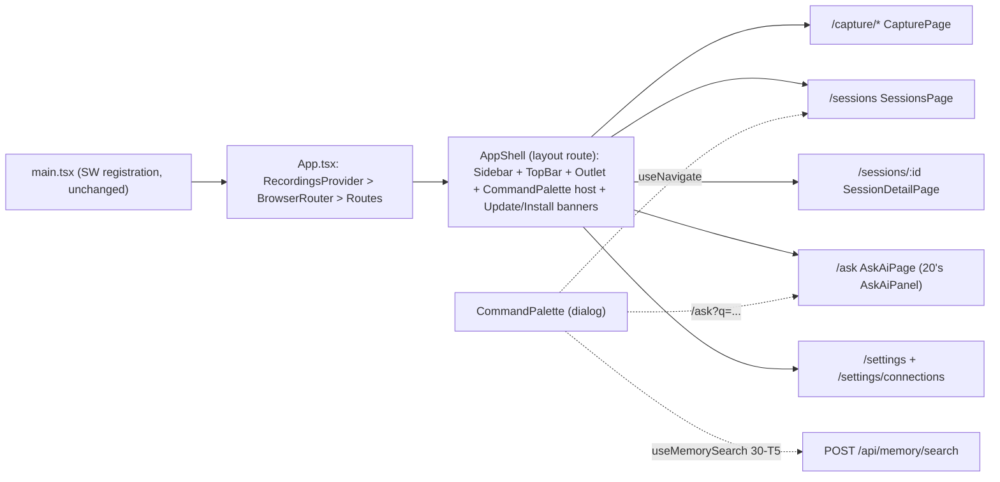

# 50 — Frontend Shell & Navigation

Section of the littlebird-ai-v2 plan. Owns: router + persistent sidebar shell, Sessions list, Session detail, ⌘K command palette, Settings & Privacy screen, and the fate of the v1 tab UI. Consumes (does not re-plan): 10-backend-foundation (`src/lib/api.ts`, sessions CRUD, sync outbox, canonical status enum), 20-ai-features (`SummaryPanel`/`FollowUpDraft`/`AskAiPanel` + hooks), 30-memory-search (`useMemorySearch`, `src/lib/memory-api.ts`), 40-integrations-capture (`MeetingCapture`, `ConnectionsSettings`).

Approved mockups (authoritative for visuals): `/code/.plans/designs/shell-sessions.html`, `command-palette.html`, `session-detail.html`. `capture-meeting.html` is section 40's; this shell only hosts it.

---

## 1. Product / spec summary

**Goal.** Replace the v1 three-tab phone layout (`src/App.tsx` local-state switch: Live / Recorder / Recordings) with a littlebird.ai-style workspace: persistent left sidebar, URL-addressable views, a day-grouped Sessions list that unifies local recordings and server sessions, a two-column session detail with AI panes, and a global ⌘K palette for search/ask/navigation.

**Users / flows.** Same single-user persona. Daily loop: Capture (live note, offline recording, or — via section 40 — a meeting) → session appears in Sessions with a status pill → open detail to read the diarized transcript, AI summary, and draft a follow-up → later, hit ⌘K to find "what discount did we offer Acme" across all sessions.

**Expected behavior / acceptance criteria.**
1. The app shell (sidebar, topbar, active route) paints with zero network: all routes are client-rendered from the precached bundle; deep links (e.g. `/sessions/<id>`) resolve offline via the existing workbox `navigateFallback: "/index.html"`. No route's first paint awaits a fetch.
2. Sessions list shows one merged, day-grouped list (Today / Yesterday / weekday-date headers) with source tags (Mic / Tab + Mic / Screen + Mic) and status pills using the canonical enum `pending | transcribing | done | error`. Local-only, server-only, and both-sided sessions all render; deleting removes both sides (via `useRecordings.remove`, which 10-T4 wires to remote delete).
3. `/sessions/:id` renders the diarized transcript (speaker-labelled segments), plays back the local audio blob when present, and hosts section 20's Summary / Follow-ups / Ask tabs. Copy-transcript and delete work; delete navigates back to `/sessions`.
4. ⌘K / Ctrl-K opens the palette from anywhere: typing debounces into `useMemorySearch`; results render as Ask-AI row → semantic memory chunks with relevance bars → session matches → actions. Full keyboard operation (arrows/Enter/Esc/Tab-trapped focus); Enter on a session navigates; Enter on Ask hands the query to section 20's Ask AI page.
5. v1 behaviors preserved: OnlineBadge in the topbar, offline recording + queue drain untouched (Capture hosts `LiveTranscription` and `Recorder` unchanged), PWA update banner still prompt-based (never auto-reloads), install affordance kept, "you're offline — record instead" hint kept on the live view, empty-state copy from `RecordingList` kept.
6. Settings & Privacy: paste/rotate the app bearer token (section 10's auth); saving a valid token triggers an outbox drain; a privacy note states audio never leaves the device; Integrations (section 40's Connections UI) is reachable at `/settings/connections` — the exact path 40's OAuth callback redirects to.
7. `npm run typecheck` (`tsc -b`) and `npm run build` stay green after every task; unit tests run under the root vitest+jsdom infra provided by section 10.

**Non-goals.**
- Summaries, Memory, Prep, Follow-ups, and Routines as standalone views. **These sidebar items are omitted entirely in MVP** — not rendered as grayed-out dead links. Their capabilities live inside session detail (summary/follow-ups tabs) and the palette (memory search). The MVP sidebar is: Capture (button), Sessions, Ask AI, Integrations, Settings & Privacy.
- The palette's "context chips" row (`Sessions · last 30 days`, entity chips, Tab-to-add-context in the mockup). Post-MVP; `useMemorySearch` filters stay unused by the palette for now.
- The mockup's participant avatar stacks and sidebar user card (no participant data source and no user profile exists — single-token auth). Rows show source/time/duration meta only.
- The session-detail "Share" button (no share target in MVP).
- Multi-device pull sync (10 is push-only in MVP; server-only rows can still appear and are handled read-only).

**Edge cases.**
- No token set: Sessions list = local rows only; server fetch silently skipped; Settings shows "Not connected"; palette memory group hidden.
- Offline: shell + list + detail render from local data; palette opens but the Memory group is replaced by an inline "Semantic search needs a connection" note and the Sessions group falls back to local title/transcript substring filtering; AI tabs show their offline-disabled state (owned by 20).
- Session exists on server but not locally (cleared browser data): row renders from `SessionMeta`, detail renders server transcript, audio player replaced by "Audio stays on the device that recorded it".
- Session exists locally but never synced: row renders from `Recording`; detail falls back to local `segments`/`transcript`.
- Unknown `/sessions/:id`: "Session not found" state with a back link.
- Palette honesty fix: the mockup footer claims "Memory index on-device · searchable offline" — **false** per section 30 (search is a Worker endpoint). Ship copy: "Searches your synced sessions · requires connection"; the design-tab copy should be corrected at submission.

---

## 2. Router choice & shell architecture

**Router: `react-router` v7, declarative/library mode** (single `react-router` package, `<BrowserRouter>` + `<Routes>` — not framework mode, no `@react-router/dev`).

Why over a hand-rolled hash/state router:
- We need param routes (`/sessions/:id`), programmatic navigation from the palette (`useNavigate`), location state (scroll-to-segment on memory-result click), and an OAuth-return landing route (`/settings/connections?connected=…` from 40) — hand-rolling all of that is more code to write and test than the dependency saves.
- Bundle cost ≈ 20 kB gzip. This is precached once by the existing `vite-plugin-pwa` config, so the PWA pays it on first install only; offline paint is unaffected. Acceptable.
- Path URLs (not hash) work today with zero config change: workbox `navigateFallback: "/index.html"` is already set in `vite.config.ts`, so offline deep links and the OAuth callback navigation both land on the SPA correctly. (Considered `wouter` at ~2 kB; rejected because location-state, route objects, and long-term familiarity favor react-router, and size is amortized by precache.)

### Route table

| Path | Element | Data source | Notes |
|---|---|---|---|
| `/` | `<Navigate to="/sessions" replace>` | — | |
| `/capture` | `<Navigate to="/capture/live" replace>` | — | Sidebar Capture button target |
| `/capture/live` | `CapturePage` mode=live | existing `useSoniox` | hosts `LiveTranscription` unchanged; keeps v1 offline hint linking to `/capture/recorder` |
| `/capture/recorder` | `CapturePage` mode=recorder | existing `useRecorder`/`useRecordings` | hosts `Recorder` unchanged |
| `/capture/meeting` | `CapturePage` mode=meeting | 40's `useMeetingCapture` | **this section owns the route and mounts** section 40's exported `MeetingCapture` component (T5); 40 exports the component only. Segmented control shows the Meeting tab only once the component exists |
| `/sessions` | `SessionsPage` | `useSessionsIndex` (merge) | day groups, filters, pills |
| `/sessions/:id` | `SessionDetailPage` | `useSessionDetail` | two-column per mockup |
| `/ask` | `AskAiPage` | 20's `useAskAi` scope=all | reads `?q=` and auto-submits once; palette Ask handoff target |
| `/settings` | `SettingsPage` | `getApiToken`/`setApiToken` (10-T3) | token + privacy |
| `/settings/connections` | `ConnectionsPage` | 40's `useIntegrations` | thin wrapper hosting `ConnectionsSettings`; OAuth redirect target |
| `*` | `<Navigate to="/sessions" replace>` | — | |

### Shell composition



- `AppShell` is a layout route wrapping every page: 248px sidebar (brand block reusing v1 `BrandLogo`, gradient Capture button, Workspace/Assistant/System nav groups per mockup, offline-first footer card with the real cached-session count), topbar (route title, searchbox-as-button that opens the palette, `OnlineBadge` unchanged), scrollable `<Outlet/>` content, and the globally mounted `CommandPalette` + relocated `UpdateBanner`/`InstallBanner`.
- Sidebar nav items rendered in MVP (per Non-goals): **Capture** button → `/capture`; **Workspace:** Sessions (with total-count pill, amber pending-count pill reusing v1 badge logic); **Assistant:** Ask AI (→ `/ask`, shows `⌘K` kbd hint); **System:** Integrations (→ `/settings/connections`), Settings & Privacy (→ `/settings`). Active state via `NavLink` `aria-current="page"`.
- **`App.tsx` fate:** shrinks to providers + router (`RecordingsProvider > BrowserRouter > Routes` with the `AppShell` layout route). `BrandLogo`, `UpdateBanner`, `InstallBanner` move to `src/components/shell/`; `TabButton`, the `Tab` type, and the tab `<nav>` are deleted; the live-tab offline hint moves into `CapturePage`.
- **Offline-first guarantee:** no loaders block render; every page mounts instantly and hydrates from IndexedDB first, then layers server data when `useOnlineStatus()` is true and a token is set. Nothing new is added to `vite.config.ts` (the existing precache + `navigateFallback` cover routing).
- **Mobile:** mockups are desktop-only, but v1 is an installable phone PWA (install banner targets iOS). Recommended default pending user confirmation (see Open questions): below the `md` breakpoint the sidebar collapses into a slide-over drawer behind a hamburger in the topbar (same nav content; `Esc`/scrim closes; focus-trapped like the palette). No separate mobile layout work beyond this.

### File structure (this section)

```
src/
  App.tsx                      # MODIFY: providers + router only
  router.tsx                   # NEW: route table (exported for tests)
  components/shell/
    AppShell.tsx               # NEW: layout route (sidebar+topbar+outlet+palette+banners)
    Sidebar.tsx                # NEW: nav groups, capture button, offline footer card, mobile drawer
    TopBar.tsx                 # NEW: route title, search button, OnlineBadge, hamburger (mobile)
    BrandLogo.tsx              # NEW: extracted from App.tsx
    UpdateBanner.tsx           # NEW: extracted from App.tsx (behavior unchanged)
    InstallBanner.tsx          # NEW: extracted from App.tsx (behavior unchanged)
  pages/
    CapturePage.tsx            # NEW: segmented Live/Recorder(/Meeting) hosting v1 components
    SessionsPage.tsx           # NEW: filters row + day-grouped SessionList
    SessionDetailPage.tsx      # NEW: two-column detail
    AskAiPage.tsx              # NEW: hosts 20's AskAiPanel (scope=all), reads ?q=
    SettingsPage.tsx           # NEW: token card + privacy card + link to connections
    ConnectionsPage.tsx        # NEW: thin host for 40's ConnectionsSettings
  components/sessions/
    SessionList.tsx            # NEW: adapted from RecordingList (banners, counts, day groups)
    SessionRow.tsx             # NEW: adapted from RecordingItem (source tag, pill, transcribe/retry)
    StatusPill.tsx             # NEW: extracted from RecordingItem's StatusPill, canonical enum
  components/session/
    TranscriptPane.tsx         # NEW: diarized segment list, copy, highlight/scroll-to
    AudioPlayer.tsx            # NEW: local-blob playback (objectURL lifecycle)
    SessionDetailTabs.tsx      # NEW: tablist hosting 20's SummaryPanel/FollowUpDraft/AskAiPanel
  components/palette/
    CommandPalette.tsx         # NEW: dialog, input, grouped results, footer
    paletteItems.ts            # NEW: pure builder -> flat ordered item list (testable)
    useCommandPalette.tsx      # NEW: open-state context + global keybinding
  hooks/
    useSessionsIndex.ts        # NEW: local+server merged list
    useSessionDetail.ts        # NEW: local+server merged single session
  lib/
    mergeSessions.ts           # NEW: pure merge rule (unit-tested)
  components/RecordingList.tsx # DELETE in T5 (superseded by SessionList)
  components/RecordingItem.tsx # DELETE in T5 (superseded by SessionRow + detail page)
```

Unchanged and reused as-is: `LiveTranscription.tsx`, `Recorder.tsx`, `OnlineBadge.tsx`, `icons.tsx`, `useSoniox`, `useRecorder`, `useRecordings`, `useOnlineStatus`, `lib/db.ts` (10-T4 owns its v2 migration), `main.tsx`.

---

## 3. Views

### 3.1 Sessions list (`/sessions`)

**Merge rule** (pure function `mergeSessions(local: Recording[], server: SessionMeta[] | null): SessionListItem[]` in `src/lib/mergeSessions.ts`):
- **Join key: the client UUID.** `Recording.id === sessions.id` (10's design: client UUID is the server primary key).
- For ids present locally: the local `Recording` wins for `status`, `createdAt`, `durationMs`, `error`, and blob presence (`hasLocalAudio: true`) — local is source of truth until synced. The server row contributes `title` (v1 `Recording` has no title) and `source`; fallbacks when absent: title → `"Voice note — {short date, time}"` derived at render; source → `"mic"`.
- Ids only on the server (cleared browser data / other device): included as read-only metadata rows, `hasLocalAudio: false`, all fields from `SessionMeta`.
- Offline or no token: `server = null`, list is local-only. Server fetch failure degrades identically (never blocks the list).
- Output sorted by `createdAt` desc, then grouped by calendar day for headers: `Today`, `Yesterday`, else `Friday, Jul 17` style (Intl.DateTimeFormat, local tz).

`useSessionsIndex()` returns `{ items, dayGroups, pendingCount, isServerBacked }`: hydrates from `useRecordings().recordings` (already reactive), fetches `GET /api/sessions?limit=100` via `apiFetch` when online+token, re-fetches on `online` event and on window focus. No polling.

**Row** (`SessionRow`, adapted from `RecordingItem`): source-appropriate icon tile (mic vs meeting per mockup), title, meta line (source tag pill, time · duration, "Captured offline" when the item was recorded offline and is still pending), status pill on the right (canonical enum; extracted `StatusPill` keeps v1's transcribing spinner), chevron. Row click → `/sessions/:id`. Rows keep `RecordingItem`'s inline actions where they matter for the queue: pending+online rows get a Transcribe affordance; error rows get Retry (both call `useRecordings.transcribeOne`). Play/copy/delete move to the detail page.
**List chrome** (from `RecordingList`, kept): "back online — N ready" CTA banner with Transcribe-all, offline info bar, count header ("N sessions · M pending"), the v1 empty-state copy. Filter chips per mockup: `All | Meetings | Voice notes` (client-side on `source`: meetings = tab/screen, voice notes = mic); the mockup's extra "Source" dropdown chip is folded into these three for MVP.
**Pill copy:** `pending → "Pending"`, `transcribing → "Transcribing…"`, `error → "Error"`, `done → "Done"`, and `done + has_summary → "Summarized"` if section 10 adds a `has_summary` boolean to `SessionMeta` (see assumed contracts; if absent, all done rows read "Done").

### 3.2 Session detail (`/sessions/:id`)

`useSessionDetail(id)` loads in parallel: local `getRecording(id)` (from `lib/db.ts`) and, when online+token, `GET /api/sessions/:id` (session + segments + summaries meta). Neither blocks the other; render as data arrives. Both missing → not-found state.

- **Header** per mockup: back button (`navigate(-1)` with `/sessions` fallback), title with inline rename (Enter/blur commits: `PATCH /api/sessions/:id {title}` when server-backed; see assumed contract on local `title` persistence), meta line (source tag, date · duration), status pill, Copy-transcript button, Delete button (confirm → `useRecordings.remove(id)` → navigate to `/sessions`; server-only rows call `DELETE /api/sessions/:id` directly via `apiFetch`).
- **Left column — `TranscriptPane`:** diarized segment list per mockup (speaker chip + timestamp `mm:ss` + text). Segment source precedence: local `Recording.segments` (added by 10-T4) → server `transcript_segments` → single unlabelled block from local `Recording.transcript` → status-appropriate empty state ("Transcribing…", "Pending — will transcribe when online", error with Retry). Copy button copies plain text (`Speaker N: text` lines). Accepts `highlight?: { start_ms }` from router location state (palette handoff) and scrolls the matching segment into view with a transient highlight. `AudioPlayer` sits under the column header when `hasLocalAudio`: play/pause, seek track, `elapsed / total`; `URL.createObjectURL(blob)` created on mount, revoked on unmount. Server-only rows show the "audio stays on the recording device" note instead.
- **Right column — `SessionDetailTabs`:** `role="tablist"` with three tabs per mockup — **AI Summary** (20's `SummaryPanel`), **Follow-ups** (20's `FollowUpDraft`), **Ask** (20's `AskAiPanel` with `scope="session"`). All three take `sessionId` and are self-contained per 20-T3 (own loading/offline/error states). Tabs: arrow-key roving focus, `aria-selected`, panels `role="tabpanel"`. Until 20-T3 lands, the tab content renders a typed placeholder ("AI features arrive with the AI slice") behind the same prop interface so this section merges independently.

### 3.3 Command palette (⌘K)

`useCommandPalette` context in `AppShell` exposes `{ isOpen, open(initialQuery?), close }`. Triggers: global `keydown` for `(metaKey || ctrlKey) && key === 'k'` (with `preventDefault`, active even while an input is focused — it's a chord), the topbar searchbox button, and programmatic `open()`.

**Structure** per mockup: input row (spark icon, text input, `esc` kbd hint) → scrollable body with groups → footer (`↑↓ navigate · ↵ open` + connectivity note). Groups in fixed order, each rendered only when non-empty:
1. **Ask AI** — always present when query non-empty: one row "Ask AI: “{query}”" with subtitle "Answer with citations from your sessions". Enter → `close()` + `navigate('/ask?q=' + encodeURIComponent(query))`; `AskAiPage` auto-submits via 20's `useAskAi.ask(q, 'all')` exactly once per `q`.
2. **Memory** — semantic chunks from `useMemorySearch(query).results`: quoted snippet (2-line clamp), meta line `speaker · session_title · created_at · mm:ss(start_ms)`, right-aligned relevance bar + score. **Bars consume `display_score`** — section 30's response field normalized to [0,1] relative to the top result — never the raw fused `score` (RRF fusion caps raw scores around ~0.03, which would render invisible bars). Bar width = `display_score * 100%`, printed value = `display_score.toFixed(2)`, `hi` style at `display_score ≥ 0.9`, tabular numerals. Enter → `/sessions/:session_id` with `state: { highlight: { start_ms } }`.
3. **Sessions** — `useMemorySearch(query).sessions` keyword title matches; offline fallback: local substring filter over `useRecordings().recordings` (title/transcript). Row shows title (match `<mark>`ed), meta, status pill. Enter → `/sessions/:id`.
4. **Actions** — static navigation commands filtered by query prefix match: Go to Capture / Sessions / Integrations / Settings, "Start capture"; plus one contextual action when the current route is `/sessions/:id`: "Draft follow-up for “{title}”" → opens that session's Follow-ups tab (navigate with `state: { tab: 'followups' }`). Empty-query state shows Actions + the 5 most recent sessions (no Memory group).

Data: rely on 30-T5's `useMemorySearch` for its built-in 250 ms debounce + AbortController; the palette adds no second debounce. Loading state: two skeleton rows in the Memory group. `disabled: true` from the hook (offline) → Memory group replaced by the inline connectivity note; footer shows "Searches your synced sessions · requires connection" (never the mockup's inaccurate on-device claim; when online the footer omits the note entirely).

**Keyboard & a11y spec** (`paletteItems.ts` builds one flat ordered array across groups so selection logic is index math, pure and unit-testable):
- Dialog: `role="dialog"`, `aria-modal="true"`, `aria-label="Search and ask AI"`; rendered in a portal over a scrim; scrim click and `Esc` close; body scroll locked while open; on close, focus returns to the element focused before opening.
- Focus trap: focus stays inside the dialog (the input is the only tabbable element besides the close affordance; `Tab`/`Shift+Tab` cycle within).
- Combobox pattern: input `role="combobox"` `aria-expanded="true"` `aria-controls="palette-results"` `aria-activedescendant={selectedItemId}`; results container `role="listbox"` `id="palette-results"`; rows `role="option"` with stable ids; group headers are non-focusable presentational rows.
- `ArrowDown`/`ArrowUp` move selection through the flat list with wrap-around; `Home`/`End` jump; selection follows pointer hover; selected row `scrollIntoView({ block: 'nearest' })`; `Enter` activates the selected item; typing keeps focus in the input at all times (options are never focused — active-descendant only).
- Visual selection per mockup (`row.sel` indigo treatment); `prefers-reduced-motion` disables the backdrop blur/fade.

### 3.4 Settings & Privacy (`/settings`) and Connections host

- **API token card:** password-type input (show/hide toggle) bound to 10-T3's `getApiToken()/setApiToken()`. Save → `setApiToken(value)` → validate with authenticated `GET /api/auth/check` (204 = valid, 401 = bad token; `/api/health` is unauthenticated and cannot validate a token) → status line "Connected" / "Invalid token" / "Server unreachable" (network error ≠ bad token) → on success call 10-T4's `drainOutbox()` (the "token set/changed" outbox-drain trigger 10's spec requires — this screen is that affordance; 10's `onApiTokenChange` hook fires the same drain, so the explicit call is a belt-and-braces UX confirmation, not a second code path). Disconnect button clears the token (sync pauses per 10's design). Helper copy points at `worker/README.md` for where the token comes from.
- **Privacy card:** static copy — audio recordings are stored only in this browser's IndexedDB and are never uploaded; transcripts, titles, and summaries sync to your own Cloudflare Worker; deleting a session removes it from both places.
- **Connections:** `/settings/connections` is its own page (sidebar "Integrations" item) hosting section 40's `ConnectionsSettings` unchanged; this section owns only the route, page title, and the wrapper that keeps 40's `?connected=` / `?error=` query params reachable after the OAuth redirect. Until 40-T3 lands, the page renders a typed placeholder.

---

## 4. Implementation tasks

Prereq note: the root vitest+jsdom test infra ships with section 10; T1 adds `@testing-library/react`, `@testing-library/user-event`, and `@testing-library/jest-dom` as devDeps if not already present, plus a root `test` script if missing. Every task ends with `npm run typecheck` and `npm run build` green.

### T1 — Router, AppShell, Capture page, Settings skeleton `[parallel]`
The full navigation slice on top of v1, before any server data exists.
- Add dep `react-router@^7`. Create `src/router.tsx` (route table above), `src/components/shell/{AppShell,Sidebar,TopBar,BrandLogo,UpdateBanner,InstallBanner}.tsx`, `src/pages/{CapturePage,SettingsPage,ConnectionsPage,AskAiPage}.tsx` (Connections + AskAi render typed placeholders behind the final prop interfaces).
- Rewrite `src/App.tsx` to providers + router; move banners/logo out; delete `TabButton`/`Tab`; move the offline hint into `CapturePage`. `CapturePage` renders a segmented control (Live / Recorder; Meeting slot hidden until 40-T2) hosting `LiveTranscription` and `Recorder` unchanged.
- `SettingsPage` token card compiles against 10-T3's `getApiToken/setApiToken` and `apiFetch` contracts and validates via `GET /api/auth/check` (204/401); the save→`drainOutbox()` call is added behind a guarded import once 10-T4 lands (annotation: that one wiring line is `[after 10-T4]`; everything else in T1 has no backend dependency).
- Temporary bridge: `/sessions` renders the existing `RecordingList` unchanged until T2 replaces it, so the app is never without a recordings view.
- Sidebar: MVP items only (Non-goals list), counts wired to `useRecordings`, mobile drawer behavior per §2 (pending Q1's answer).
- Tests: vitest+RTL with `MemoryRouter` — route table renders the right page per path, unknown path redirects to `/sessions`, sidebar shows exactly the 5 MVP entries (regression guard for the placeholder policy), active `NavLink` gets `aria-current`, capture segmented control switches hosts. Browser-level: `npm run build && npm run preview`, verify offline shell paint (DevTools offline → reload `/capture/recorder`, record works), deep-link `/sessions` offline resolves, update banner still appears on SW change, v1 manual test plan items for Live/Recorder tabs re-pass under the new routes.

### T2 — Sessions list slice `[after T1; server overlay after 10-T4]`
- Create `src/lib/mergeSessions.ts` (pure merge rule §3.1), `src/hooks/useSessionsIndex.ts`, `src/components/sessions/{SessionList,SessionRow,StatusPill}.tsx`, `src/pages/SessionsPage.tsx`; remove the T1 bridge. Adapt banners/empty state/actions from `RecordingList`/`RecordingItem` per §3.1 (originals left in place until T5 deletes them).
- Works local-only immediately after T1 (merge with `server = null`); the `GET /api/sessions` overlay activates once 10-T4 exists.
- Tests: unit tests on `mergeSessions` (local-wins fields, server-only rows, title/source fallbacks, sort + day-group boundaries incl. midnight/timezone edge, dedupe by id); RTL: day headers, filter chips, pill-per-status, pending Transcribe affordance calls `transcribeOne`, offline renders local-only without fetch (mock `navigator.onLine`), empty-state copy matches v1. Browser-level: seed via `/memory/testing/littlebird-voice/seed.sh`, verify all four statuses render with correct pills and the back-online banner drains the queue.

### T3 — Session detail slice `[after T2; AI tabs activate with 20-T3]`
- Create `src/hooks/useSessionDetail.ts`, `src/components/session/{TranscriptPane,AudioPlayer,SessionDetailTabs}.tsx`, `src/pages/SessionDetailPage.tsx` per §3.2. Row click navigation from T2's `SessionRow`. AI tabs host 20-T3's components when present, typed placeholders otherwise.
- Tests: RTL — segment-source precedence (local segments → server segments → plain text → status empty-state), not-found state, copy produces speaker-labelled plain text, delete confirm calls `remove` and navigates, tablist keyboard semantics (arrow roving, `aria-selected`), highlight state scrolls to segment (mock `scrollIntoView`); unit test objectURL create/revoke lifecycle (spy on `URL.createObjectURL/revokeObjectURL`). Browser-level: play a seeded local blob, offline detail render from IndexedDB, rename PATCH round-trip against `wrangler dev`.

### T4 — Command palette `[after T1; memory data after 30-T5; Ask handoff after 20-T3]`
- Create `src/components/palette/{CommandPalette.tsx,paletteItems.ts,useCommandPalette.tsx}` per §3.3; mount in `AppShell`; wire topbar search button and `⌘K`; implement `/ask?q=` auto-submit in `AskAiPage`. Before 30-T5 lands, the Memory/Sessions groups run in the offline-fallback mode (local filtering), so the palette ships usable navigation immediately.
- Tests: unit tests on `paletteItems` (group ordering, flat-index wrap-around, contextual follow-up action only on detail routes, empty-query composition); RTL with mocked `useMemorySearch` — relevance bar width and printed value derive from `display_score` (fixture results carry both a tiny raw `score` ≈ 0.03 and `display_score` in [0,1]; assert the bar uses the latter and `hi` styling triggers at ≥ 0.9), ⌘K and Ctrl-K open (and `preventDefault`), Esc/scrim close and restore focus to trigger, arrows/Home/End move `aria-activedescendant`, Enter on session navigates (assert via `MemoryRouter` location), Enter on Ask navigates to `/ask?q=…` and `ask()` fires exactly once, offline state hides Memory group and shows the connectivity note, combobox/listbox roles and focus trap asserted. Browser-level: axe pass on the open palette; keyboard-only round trip open→search→navigate→detail.

### T5 — Integration mounts, v1 retirement, final verification `[after T2, T3, T4; mounts depend on 20-T3, 30-T5, 40-T2/T3 availability]`
- Replace the three placeholder hosts with the real components: `/capture/meeting` ← 40's `MeetingCapture` (segmented control gains the Meeting tab), `/settings/connections` ← 40's `ConnectionsSettings`, `/ask` + detail tabs ← 20's panels; wire the Settings save→`drainOutbox()` drain (10-T4).
- Delete `src/components/RecordingList.tsx` and `RecordingItem.tsx`; grep for dangling imports; confirm no `Tab` type remnants.
- Final verification: `npm run typecheck`, `npm run build`, full vitest run; browser E2E against `wrangler dev` — record offline → reconnect → transcribe → session syncs → detail shows summary → ⌘K finds it semantically → Ask answers with citations → delete removes local + server rows; OAuth return lands on `/settings/connections?connected=…` and renders status; Lighthouse PWA check still passes (installable, offline start); note the built JS size delta vs v1 in the PR description.

---

## 5. Assumed contracts / coordination notes (for the main agent, not user questions)

- **10-T4 `Recording` v2 fields:** this plan consumes `segments` and `syncState` as specced. Ask 10 to also include `title: string | null` in the same DB v2 upgrade + sync payload, so rename persists locally/offline; if declined, rename becomes online-only (PATCH only) and the list always derives local titles — the UI here works either way.
- **`SessionMeta.has_summary?: boolean`** on `GET /api/sessions` (one LEFT JOIN) enables the mockup's "Summarized" pill; absent, done rows read "Done". Cheap ask to 10.
- **Source tags on local rows:** 40 chose no `Recording` schema change, so local rows default to `mic` and meeting sessions get their `tab`/`screen` tag from the server row after sync. If 40 later persists `source` locally, `mergeSessions` prefers it — one-line change.
- **40's `ConnectionsSettings` mount point:** 40-T3 says "wire a Settings surface into src/App.tsx or the router — coordinate at merge"; this plan is that router: `/settings/connections`, matching 40's OAuth redirect default exactly.
- **Meeting route ownership (confirmed):** section 40 only exports the `MeetingCapture` component; this section owns the `/capture/meeting` route and its mount (T5). 40-T2's original "modify App.tsx for a meeting tab" step is superseded by this route table at merge.
- **Outbox API names (confirmed with 10):** the canonical drain function is `drainOutbox()` (invoked on hydration, on `online` events, and on token change via `onApiTokenChange`). The DB layer exposes atomic `putRecordingAndEnqueue` / `updateRecordingAndEnqueue` / `deleteRecordingAndEnqueue`; any hook this section touches persists through those combined methods, never a separate persist-then-enqueue pair (this section only calls `drainOutbox()` from Settings and existing `useRecordings` mutators, so no new enqueue call sites are introduced here).
- **Palette scores (confirmed with 30):** `POST /api/memory/search` results include both raw fused `score` (RRF, ~0.03 ceiling) and `display_score` in [0,1] normalized to the top result; all palette UI keys on `display_score`.
- **Palette/design copy fix:** the approved `command-palette.html` footer line "Memory index on-device · searchable offline" contradicts section 30's server-side search; the shipped copy (§3.3) is honest, and the Design-tab artifact should be updated to match before user-visible submission.
- **20-T3's `AskAiPanel`** is assumed to accept an externally supplied initial question (the `/ask?q=` handoff); if its API is imperative-only (`useAskAi.ask`), `AskAiPage` calls the hook directly and passes entries down — either shape works, reconcile at merge.

## 6. Open questions (blocking)

**Q1 — Mobile navigation.** The approved mockups are desktop-only (fixed 248px sidebar), but v1 is an installable phone PWA and the install banner explicitly targets iOS. Below the tablet breakpoint, should the shell:
- **(A) Collapse the sidebar into a slide-over drawer** behind a hamburger in the topbar *(recommended: one nav structure, matches the approved desktop design exactly, least extra UI)* — this is what T1 builds by default.
- **(B) Use a bottom tab bar on phones** (Capture / Sessions / Ask / Settings), closer to v1's thumb-friendly ergonomics but a second nav implementation to design, build, and keep in sync.
- **(C) Ship desktop-first and defer mobile polish** — fastest, but degrades the currently-working phone experience until a follow-up.

No other blocking questions: router choice, nav placeholder omission policy, merge rule, and palette scope-downs (no context chips) are decided above with rationale.
