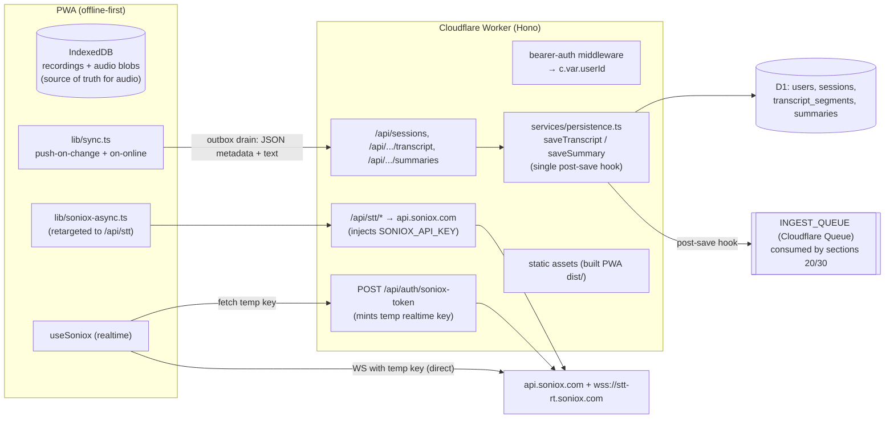
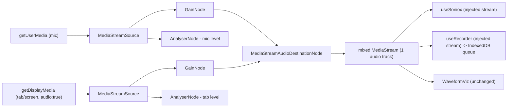
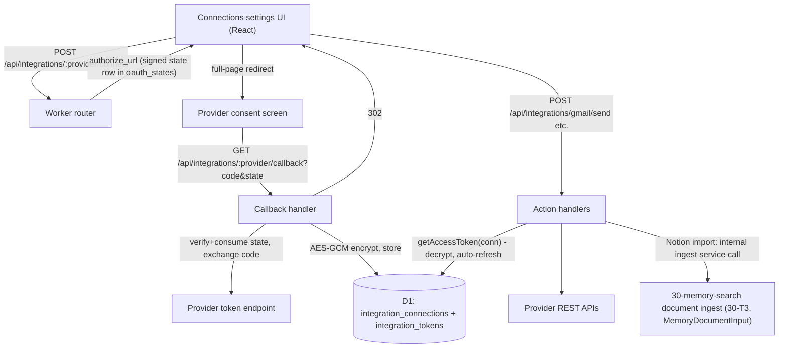
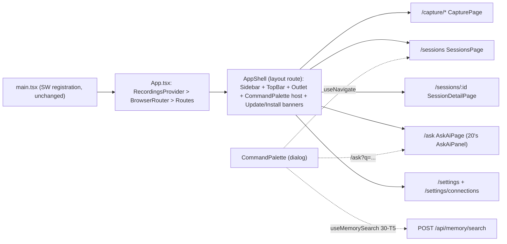

# littlebird-voice v2 — littlebird.ai-style AI meeting assistant (Detailed Plan)

Consolidated from five section drafts (two internal review rounds; all 21
findings resolved). Read `v2-littlebird-ai-summary.md` first. Sections ordered
by dependency.

## Global execution order (task DAG)
1. **Section 10 (backend foundation)**: 10-T1 → 10-T2 → 10-T3 → 10-T4.
2. **After 10-T1/T2 (worker scaffold, persistence services, queue+DLQ, Soniox relay):**
   - Section 20: 20-T1 (AI core + summaries) → 20-T2 (streaming endpoints; also [after 30-T4] for scope=all Ask) → 20-T3 (frontend hooks/components; [after 10-T3]).
   - Section 30: 30-T1 (provision) → 30-T2 (chunk/embed) → 30-T3 (queue dispatcher + ingest + documents; [after 20-T1] since the dispatcher invokes 20's exported handler) → 30-T4 (hybrid search) → 30-T5 (hook; [after 10-T3]).
   - Section 40 Track A: 40-T1 (mixer) → 40-T2 (MeetingCapture component export only).
3. **After 10-T3 (frontend api client + root test infra):** Section 50: 50-T1 (router+shell) → 50-T2 (sessions list) / 50-T3 (session detail; [after 20-T3]) / 50-T4 (palette; [after 30-T5]) / 50-T5 (settings + mounts /capture/meeting and /settings/connections; [after 40-T2/40-T3]).
4. **Last:** Section 40 Track B: 40-T3 (framework/OAuth) → 40-T4 (connectors; [after 30-T3] for Notion import), then the cross-section integration task below.

## Cross-section integration task (final gate, owned by the integrator)
Depends on ALL producer tasks. Verify: (a) saveTranscript/saveSummary bump
revisions atomically and publish IngestMessages consumed by 30's dispatcher
(auto-summary redelivery is a no-op; stale revisions dropped; DLQ works);
(b) DELETE /api/sessions/:id calls deleteMemoryFor; (c) 20's scope=all Ask
calls searchMemory in-process with kind filters and citations show
session_title/created_at; (d) 40's Notion import posts canonical
MemoryDocumentInput through 30's ingest service (202 queued);
(e) full browser E2E on the deployed shell: offline recording + atomic outbox
sync (upserts AND deletes), Meeting capture states, session detail,
palette (display_score bars), summary/Ask streaming, token check via
/api/auth/check, mocked OAuth callback — with screenshots of approved UI states.

## Canonical contracts (all sections aligned)
- Worker root `worker/` (own package.json/tsconfig, `worker/wrangler.jsonc`); routes = Hono sub-apps in `worker/src/routes/*.ts`; `Env` in `worker/src/env.ts`; auth middleware sets `c.var.userId`; authenticated `GET /api/auth/check` (204/401).
- Tables: `users`, `sessions` (user_id-scoped; + `transcript_revision`, nullable `self_speaker`), `transcript_segments`, `summaries` (+ `revision`; both scoped via sessions.user_id joins). Status enum `'pending'|'transcribing'|'done'|'error'`.
- Error schema everywhere: `{error:{code,message}}`.
- Persistence services `worker/src/services/persistence.ts`: `saveTranscript` / `saveSummary` are the ONLY write paths; they atomically increment revisions (db.batch) and publish `IngestMessage {userId, kind:"transcript"|"summary"|"document", parentId, sourceRevision, jobs?, requestId?}` to `INGEST_QUEUE` (max_retries 3, DLQ `littlebird-ingest-dlq`). parentId = sessionId for transcript AND summary kinds; document id for documents. No ctx.waitUntil for embedding/summarization.
- Single queue dispatcher `worker/src/queue/consumer.ts` owned by 30-T3; invokes 20's exported `handleTranscriptAutoSummary(env,msg)` for transcript messages with jobs:["summarize"]. Auto-summary is revision-idempotent; manual regenerate uses forceSummary+requestId.
- Memory: `searchMemory(env, userId, request)` in `worker/src/memory/search.ts`; results carry session_title/created_at (or document_title/url); RRF fusion (k=60) + normalized `display_score` ∈ [0,1] for UI. Ask-AI always filters kind:["transcript","summary"]. `MemoryDocumentInput {title, source, text, external_id?, metadata?}`; idempotency (user_id, source, external_id); POST /api/memory/documents → 202 {id, status:"queued"}.
- Frontend: `src/lib/api.ts` (+`onApiTokenChange`), `src/lib/api-types.ts`; IndexedDB outbox with atomic `putRecordingAndEnqueue`/`updateRecordingAndEnqueue`/`deleteRecordingAndEnqueue` (single transaction spanning both stores); `drainOutbox()` on hydration/online/token-change. Root vitest+jsdom infra from 10-T3.
- LLM: Workers AI `@cf/meta/llama-3.3-70b-instruct-fp8-fast` behind `LlmProvider` (`AI_MODEL` var). Embeddings `@cf/baai/bge-m3` (1024-dim) into Vectorize, namespace = user_id.
- UI follows the Design-tab mockups. MVP sidebar: Capture, Sessions, Ask AI, Integrations, Settings & Privacy only. Section 40 exports MeetingCapture/ConnectionsSettings components; section 50 owns all routing/mounting.

---


<!-- ===== parts/10-backend-foundation.md ===== -->

# 10 — Backend Foundation (Cloudflare Worker + D1)

## Product / spec summary

**Goal.** Give littlebird-voice a server so (a) the Soniox API key stops shipping in the client bundle, and (b) sessions (recordings/meetings), transcripts, and summaries live in a database that later sections (AI features, memory/search, integrations) can build on. The PWA stays offline-first: audio blobs remain local-only in IndexedDB; text and metadata sync up when online.

**Users.** Single user for MVP (the repo owner). Ownership is designed in from day one so multi-user is a data migration + auth change, not a rewrite: `users` and `sessions` carry `user_id` directly; `transcript_segments` and `summaries` are scoped **indirectly** via their `session_id → sessions.user_id` FK chain (deliberate — no `user_id` column of their own; queries join through `sessions`).

**Expected behavior.**
- All online features work through a same-origin `/api/*` backed by one Cloudflare Worker; the deployed Worker also serves the built PWA (static assets), so prod has no CORS.
- Live transcription fetches a short-lived Soniox temporary key from the Worker instead of embedding the permanent key (Soniox supports `POST /v1/auth/temporary-api-key` with `usage_type: "transcribe_websocket"`; the `@soniox/speech-to-text-web` SDK accepts an async `apiKey` function — verified 2026-07-21). **No client-side permanent key remains.**
- The async transcription flow (upload → create → poll → transcript → cleanup) is relayed through the Worker, which injects the key.
- Every finished recording syncs up as a `session` row + diarized transcript segments. Sync is one-way push in MVP (client → server), idempotent via client-generated UUIDs. Delete locally ⇒ delete on server.
- Sync is durable: every upsert/delete intent is persisted in an IndexedDB **outbox** before any network attempt, and the outbox is drained on app hydration, on `online` events, and when the API token is set/changed. Deleting a recording offline removes the local row/audio immediately but leaves a remote-deletion tombstone in the outbox until the server acknowledges it.
- Auth: single shared bearer token (Worker secret). Wrong/absent token ⇒ 401 JSON error. The user pastes the token once into the PWA (stored in localStorage).
- Offline behavior is unchanged: recording, playback, queueing all work with zero network; sync retries via the outbox drain triggers above.

**Non-goals (this section).** LLM summaries/Ask-AI (section 20), embeddings/search (section 30), tab/screen capture and OAuth connectors (section 40), multi-user signup, audio blob upload to the server (future R2 design note below — no column/binding/endpoint in MVP), realtime WS relaying through the Worker (unnecessary given temporary keys).

**Acceptance criteria.**
1. `grep VITE_SONIOX_API_KEY src/` returns nothing; live + async transcription still work end to end via the Worker.
2. `wrangler dev` + `npm run dev` gives a working local stack; `wrangler deploy` ships PWA + API as one Worker.
3. Requests without `Authorization: Bearer <APP_AUTH_TOKEN>` to any `/api/*` route (except `/api/health`) get 401.
4. Recording made offline → back online → transcribed → a `sessions` row exists with segments; deleting it locally removes the server row.
5. All D1 access goes through migrations in `worker/migrations/`; `wrangler d1 migrations apply` works locally and remote.
6. Delete a synced recording while offline → local record gone immediately → back online (or token set later) → server row is deleted without user action (outbox tombstone drained and acknowledged).
7. Every transcript/summary write lands via the shared persistence service (`worker/src/services/persistence.ts`) and enqueues an `INGEST_QUEUE` message.

**Edge cases handled in the design.** Sync while token unset (outbox accumulates; drained when the token is set — token change is an explicit drain trigger); server unreachable (op stays in the outbox with attempt count/backoff, retried on next drain trigger); duplicate sync pushes (UUID upsert = idempotent, so replaying the outbox is safe); recording deleted mid-sync (a queued upsert for a tombstoned id is dropped at drain time — mirrors existing `tombstonesRef` pattern in `src/hooks/useRecordings.tsx`); delete-then-server-404 (treated as acknowledged — the goal state already holds); Soniox temp key fetch failure (surfaced via existing `micError` path); large async uploads (Workers accept ≥100 MB request bodies on free plan; 10-min opus ≈ 6–10 MB — fine).

**Constraints.** Cloudflare free plan suffices (Workers free tier + D1 free tier). Node ≥ 20 (repo tested on 22). Keep the frontend's `tsc -b` typecheck green; the worker gets its own tsconfig.

---

## Architecture



**Decisions and reasoning.**
- **Hono** over plain `fetch` handler: routing, middleware (auth), and typed `Env` for near-zero size cost; it is the de-facto Workers standard. No competing convention exists in the repo.
- **One Worker serves API + PWA** (Workers static assets, `assets` binding with `run_worker_first` for `/api/*`): same origin ⇒ no CORS, one deploy command, free tier. Dev keeps Vite's HMR by proxying `/api` → `wrangler dev`.
- **Repo layout:** `worker/` subdirectory with its own `package.json` + `tsconfig.json` (frontend build stays untouched; no workspace tooling needed).
- **Auth = single shared bearer token** (`APP_AUTH_TOKEN` Worker secret). Middleware resolves it to the single seeded user row and sets `userId`. Upgrade path: swap the middleware for per-user session lookup (cookie or token table) — every route already reads `c.var.userId`, and every table already has `user_id`, so nothing else changes.
- **Realtime key stays out of the Worker data path:** the browser streams audio directly to `wss://stt-rt.soniox.com` using a 5-minute single-use temporary key minted by the Worker. Proxying the WS itself buys nothing and adds latency/complexity.
- **Client UUID = server primary key** for sessions. The existing `Recording.id` (`crypto.randomUUID()`) becomes `sessions.id`; sync is a `PUT` upsert, naturally idempotent and retry-safe.
- **Sync is one-way push in MVP.** Server is a mirror of text/metadata; IndexedDB remains authoritative locally. A `GET /api/sessions` list endpoint exists anyway because sections 20/30 need it and a future second device will pull from it.
- **Durable sync via a persisted outbox.** A second IndexedDB store, `syncOutbox` (same `littlebird-voice` DB, added in the v2 upgrade), holds pending operations: `{ opId, recordingId, op: "upsert" | "delete", enqueuedAt, attempts, lastError }`. Ops are enqueued ATOMICALLY with the local mutation — the DB layer exposes `putRecordingAndEnqueue` / `updateRecordingAndEnqueue` / `deleteRecordingAndEnqueue`, each one IndexedDB transaction spanning both stores, so a crash between "persist recording" and "enqueue op" is impossible (add/transcribe-done/edit ⇒ `upsert`; remove ⇒ `delete`). Ops are removed only after a 2xx (or delete-404) from the server. `drainOutbox()` runs on hydration, on `online` events, and on token set/change; it coalesces per recording (a `delete` supersedes queued `upserts`), retries with attempt-count backoff, and never blocks the UI. Local audio/rows delete immediately; only the remote-deletion tombstone persists in the outbox until acknowledged. Rationale: fire-and-forget push would silently lose deletes (and edits) made while offline, token-less, or during an outage.
- **Shared persistence services, not route-inlined SQL.** All transcript and summary writes go through `worker/src/services/persistence.ts` (`saveTranscript`, `saveSummary`). Both this section's REST routes and section 20's `generateSummary` call the same functions, and each function ends with a single post-save hook that publishes to `INGEST_QUEUE` — giving section 30 exactly one place where memory ingestion is enqueued, regardless of which code path wrote the data.
- **Background jobs via Cloudflare Queues (free plan).** Cloudflare Queues has been available on the Workers Free plan since Feb 2026, so the scaffold provisions a queue up front. `ctx.waitUntil` (~30s budget after the response) is not safe for section 20/30's embedding and map-reduce summarization work; a queue consumer with retries is. This section provisions the queue and the producer binding + publishes from the persistence hooks; sections 20/30 own the consumers.
- **R2 audio backup: future note only (not in MVP).** Audio blobs stay client-side. If server-side audio is wanted later: add an `R2_AUDIO` bucket binding, a `PUT /api/sessions/:id/audio` raw-bytes endpoint, and an `audio_key TEXT` column on `sessions` via a new migration — a small additive change, deliberately excluded now (no column, no binding, no flag, no endpoint).

**Contracts exported for sibling sections (20/30/40).** These are canonical — other sections align to what is written here.
- **Config file:** `worker/wrangler.jsonc` (JSONC, NOT `wrangler.toml`). All bindings (D1, Queues, future Vectorize/R2/etc.) are declared there.
- **Session status enum (canonical):** `'pending' | 'transcribing' | 'done' | 'error'` — `'done'` (not `'ready'`) is the value meaning a transcript is complete. Used in the D1 CHECK constraint, API bodies, and frontend types alike.
- **Error body schema (canonical):** every non-2xx JSON response is `{ "error": { "code": string, "message": string } }`. `code` is a stable machine string (`"unauthorized"`, `"not_found"`, `"bad_request"`, `"upstream_error"`); `message` is human-readable.
- Worker `Env` type (`worker/src/env.ts`): `{ DB: D1Database; ASSETS: Fetcher; INGEST_QUEUE: Queue<IngestMessage>; SONIOX_API_KEY: string; APP_AUTH_TOKEN: string }` — extend by adding fields here + `wrangler.jsonc`.
- Auth: middleware in `worker/src/auth.ts`; handlers read `c.var.userId` (string, FK to `users.id`).
- **Persistence services (canonical write path):** `worker/src/services/persistence.ts` exports `saveTranscript(env: Env, userId: string, sessionId: string, segments: SegmentInput[]): Promise<{ count: number; revision: number }>` and `saveSummary(env: Env, userId: string, sessionId: string, kind: string, payload: object, model?: string): Promise<Summary>` (`Summary` includes `revision`). Both validate session ownership (`sessions.user_id = userId`), write D1 **and atomically increment the revision counter in the same batch** (`sessions.transcript_revision` for transcripts; `summaries.revision` for summaries), then fire a single post-save hook that publishes an `IngestMessage` carrying that new revision as `sourceRevision`. All transcript/summary writes — this section's REST routes and section 20's `generateSummary` — MUST go through these functions; never write these tables from route handlers directly. Section 30 hooks memory ingestion by consuming the queue, not by patching call sites.
- **Revisions (canonical staleness token):** `sessions.transcript_revision` and `summaries.revision` are server-incremented monotonic integers, bumped only by the persistence services. `IngestMessage.sourceRevision` is always this counter value — never epoch ms (not monotonic under concurrency). Consumers compare against the current row's revision and drop stale messages.
- **Background jobs:** Cloudflare Queue `littlebird-ingest`, producer binding `INGEST_QUEUE` (available on the Free plan since Feb 2026), dead-letter queue `littlebird-ingest-dlq`. Canonical message type (`worker/src/services/ingest-message.ts`):
  `IngestMessage = { userId: string; kind: "transcript" | "summary" | "document"; parentId: string; sourceRevision: number; jobs?: ("index" | "summarize")[]; requestId?: string }`.
  Identity convention (fixed — section 30's vector IDs depend on it): `parentId` is `sessions.id` for BOTH `kind: "transcript"` and `kind: "summary"` (the `kind` field, plus `summaries.kind` looked up server-side, distinguishes what to ingest); `parentId` is the document id for `kind: "document"` (section 40's connector imports). `jobs` optionally narrows what consumers do (default: all applicable); `requestId` is an optional correlation id for request-scoped flows (e.g. section 20 Ask-AI). Consumer wiring: exactly ONE dispatcher, `worker/src/queue/consumer.ts`, is created by section 30 (its T3) and registers the single `queue()` handler that fans out by `kind`/`jobs`; this section only provisions the queue, the DLQ, the producer binding, and the consumer config in `wrangler.jsonc`. Do not use `ctx.waitUntil` for embedding/summarization work.
- Route pattern: one file per feature in `worker/src/routes/*.ts`, each exporting a Hono sub-app mounted in `worker/src/index.ts` (e.g. section 20 mounts `routes/ai.ts` at `/api`).
- Tables: `users`, `sessions`, `transcript_segments`, `summaries` (DDL below). New tables via numbered files in `worker/migrations/`. `summaries.kind` is the extension point for section 20 (`meeting_summary`, `follow_ups`, `ask_ai_answer`, …); section 30 keys embeddings on `transcript_segments.id` / `sessions.id`; section 40 adds connector/OAuth tables referencing `users.id`.
- **Ownership scoping:** `sessions` has a `user_id` column; `transcript_segments` and `summaries` deliberately do NOT — they are scoped indirectly through `session_id → sessions.user_id`. Queries touching them must join through `sessions` (the persistence services do this for you).
- Frontend: `apiFetch(path, init)` in `src/lib/api.ts` (adds bearer header, normalizes the canonical error schema); shared request/response types in `src/lib/api-types.ts`. Frontend unit-test harness: root `vitest` + jsdom + Testing Library (`npm test` at repo root) — sections 20/30 write hook/component tests against it.

---

## D1 DDL — `worker/migrations/0001_init.sql`

```sql
PRAGMA defer_foreign_keys = false; -- D1 enforces FKs; keep ordering explicit

CREATE TABLE users (
  id          TEXT PRIMARY KEY,              -- uuid
  email       TEXT UNIQUE,
  name        TEXT,
  created_at  INTEGER NOT NULL               -- epoch ms
);
-- Seed the single MVP user (fixed id referenced by auth middleware):
INSERT INTO users (id, email, name, created_at)
VALUES ('00000000-0000-4000-8000-000000000001', NULL, 'Owner', 0);

CREATE TABLE sessions (
  id          TEXT PRIMARY KEY,              -- client-generated uuid (= Recording.id)
  user_id     TEXT NOT NULL REFERENCES users(id),
  title       TEXT NOT NULL DEFAULT '',
  source      TEXT NOT NULL DEFAULT 'mic'
              CHECK (source IN ('mic','tab','screen')),  -- 'tab'/'screen' used by section 40
  status      TEXT NOT NULL DEFAULT 'pending'
              CHECK (status IN ('pending','transcribing','done','error')),
  created_at  INTEGER NOT NULL,              -- epoch ms (client clock)
  updated_at  INTEGER NOT NULL,
  duration_ms INTEGER NOT NULL DEFAULT 0,
  mime_type   TEXT,
  blob_size   INTEGER,                       -- bytes; audio itself stays client-side (MVP)
  self_speaker TEXT,                         -- diarization label of the app user ("1","2",…) or NULL; set via PATCH, consumed by section 20
  transcript_revision INTEGER NOT NULL DEFAULT 0,  -- server-side monotonic counter; incremented atomically by saveTranscript()
  error       TEXT
);
CREATE INDEX idx_sessions_user_created ON sessions(user_id, created_at DESC);

CREATE TABLE transcript_segments (
  id          INTEGER PRIMARY KEY AUTOINCREMENT,
  session_id  TEXT NOT NULL REFERENCES sessions(id) ON DELETE CASCADE,
  seq         INTEGER NOT NULL,              -- 0-based order within session
  speaker     TEXT,                          -- Soniox diarization label ("1","2",…) or NULL
  start_ms    INTEGER,
  end_ms      INTEGER,
  text        TEXT NOT NULL,
  UNIQUE (session_id, seq)
);
CREATE INDEX idx_segments_session ON transcript_segments(session_id, seq);

CREATE TABLE summaries (
  id          TEXT PRIMARY KEY,              -- uuid
  session_id  TEXT NOT NULL REFERENCES sessions(id) ON DELETE CASCADE,
  kind        TEXT NOT NULL DEFAULT 'meeting_summary',  -- extension point for section 20
  payload_json TEXT NOT NULL,                -- opaque JSON payload
  model       TEXT,                          -- producing model id, set by section 20
  revision    INTEGER NOT NULL DEFAULT 0,    -- server-side monotonic counter; incremented by saveSummary() on each upsert
  created_at  INTEGER NOT NULL,
  UNIQUE (session_id, kind)                  -- one latest per kind; replace on regenerate
);
```

Notes: epoch-ms integers everywhere (matches client `Date.now()`); no soft delete — `DELETE` cascades, and IndexedDB remains the local archive. Transcript writes replace all segments for a session in one `batch()` (delete + inserts) — simplest idempotent shape for re-transcription. Ownership: only `sessions` carries `user_id`; `transcript_segments` and `summaries` inherit scope through `session_id` (see exported contracts). The session `status` CHECK is the canonical enum (`done` = transcript complete). Revisions: `transcript_revision` / `revision` are server-incremented monotonic counters (`SET x = x + 1 ... RETURNING x` inside the persistence services' write batch) — deliberately NOT epoch ms, which is not monotonic under concurrent writes; they feed `IngestMessage.sourceRevision` so queue consumers can drop stale messages.

---

## API endpoint table

All routes require `Authorization: Bearer <APP_AUTH_TOKEN>` except `GET /api/health`. Errors use the canonical schema `{"error": {"code": string, "message": string}}` with 400/401/404/502.

| Method | Path | Body (JSON unless noted) | Response |
|---|---|---|---|
| GET | `/api/health` | — | `{ ok: true }` (unauthenticated liveness only) |
| GET | `/api/auth/check` | — | `204` with a valid token, `401` otherwise — Settings UI uses this to validate a pasted token |
| POST | `/api/auth/soniox-token` | — | `{ api_key, expires_at }` — Worker calls Soniox `POST /v1/auth/temporary-api-key` `{ usage_type: "transcribe_websocket", expires_in_seconds: 300, single_use: true }` |
| GET | `/api/sessions` | query `?limit=50&before=<created_at>` | `{ sessions: SessionMeta[] }` (no segments) |
| PUT | `/api/sessions/:id` | `{ title?, source, status, created_at, updated_at, duration_ms, mime_type?, blob_size?, self_speaker?, error? }` | `201/200 { session }` — idempotent upsert keyed on client UUID; sets `user_id` from auth |
| GET | `/api/sessions/:id` | — | `{ session, segments: Segment[], summaries: SummaryMeta[] }` |
| PATCH | `/api/sessions/:id` | any subset of PUT fields (e.g. `{ title }`, `{ self_speaker: "1" }` — section 20 sets the user's diarization label through this route, no duplicate route needed) | `{ session }` |
| DELETE | `/api/sessions/:id` | — | `204` (cascades segments + summaries) |
| PUT | `/api/sessions/:id/transcript` | `{ segments: [{ speaker?, start_ms?, end_ms?, text }] }` | `{ count }` — replaces all segments via `saveTranscript()` (delete + insert in one D1 batch; enqueues `INGEST_QUEUE` message) |
| GET | `/api/sessions/:id/transcript` | — | `{ segments, text }` (`text` = segments joined) |
| PUT | `/api/sessions/:id/summaries/:kind` | `{ payload: object, model? }` | `{ summary }` (incl. `revision`) — upsert per `(session_id, kind)` via `saveSummary()`, which bumps `summaries.revision` and enqueues an `INGEST_QUEUE` message with `sourceRevision = revision`; section 20's write path |
| GET | `/api/sessions/:id/summaries` | — | `{ summaries: [{ id, kind, payload, model, revision, created_at }] }` |
| POST | `/api/stt/files` | multipart, field `file` (relayed verbatim) | Soniox response passthrough (`{ id, ... }`) |
| POST | `/api/stt/transcriptions` | `{ model, file_id, language_hints }` (relayed) | passthrough (`{ id, ... }`) |
| GET | `/api/stt/transcriptions/:id` | — | passthrough (`{ status, error_type?, error_message? }`) |
| GET | `/api/stt/transcriptions/:id/transcript` | — | passthrough (`{ text, tokens }`) |
| DELETE | `/api/stt/transcriptions/:id` · `/api/stt/files/:id` | — | passthrough (cleanup) |

The `/api/stt/*` relay strips the client's app-token header, adds `Authorization: Bearer ${env.SONIOX_API_KEY}`, forwards method/body/query to `https://api.soniox.com/v1/...`, and streams the response back. Allow-list exactly the five paths above — it is not a generic proxy.

---

## Implementation tasks

### T1 — Worker scaffold: Wrangler + D1 + Queue + auth + persistence services + core CRUD  `[parallel]`
Create:
- `worker/package.json` — deps `hono`; devDeps `wrangler`, `typescript`, `vitest`, `@cloudflare/vitest-pool-workers`; scripts `dev` (`wrangler dev`), `deploy` (`wrangler deploy`), `test` (`vitest run`), `typecheck`.
- `worker/wrangler.jsonc` (canonical config file — JSONC, not TOML) — `name: "littlebird-voice"`, `main: "src/index.ts"`, `compatibility_date: "2026-07-01"`, `d1_databases: [{ binding: "DB", database_name: "littlebird-voice", database_id: "<filled at provision>" }]`, `queues: { producers: [{ binding: "INGEST_QUEUE", queue: "littlebird-ingest" }], consumers: [{ queue: "littlebird-ingest", max_retries: 3, retry_delay: 30, dead_letter_queue: "littlebird-ingest-dlq" }] }`, `assets: { directory: "../dist", binding: "ASSETS", not_found_handling: "single-page-application", run_worker_first: ["/api/*"] }`. Note: the consumer config is declared here, but the single dispatcher `worker/src/queue/consumer.ts` (the `queue()` handler) is created by section 30 (its T3) — this section provisions queue + DLQ + bindings only, and does NOT export a `queue` handler yet.
- `worker/tsconfig.json`, `worker/src/env.ts` (the exported `Env` interface above, incl. `INGEST_QUEUE: Queue<IngestMessage>`).
- `worker/src/services/ingest-message.ts` — the canonical `IngestMessage` union type from exported contracts (kind `"transcript" | "summary" | "document"`, `jobs?`, `requestId?`).
- `worker/src/services/persistence.ts` — `saveTranscript()` and `saveSummary()` per the exported-contracts signatures: ownership check (join `sessions.user_id`), D1 write in one `db.batch()` (delete+insert segments + `UPDATE sessions SET transcript_revision = transcript_revision + 1` for transcripts; upsert per `(session_id, kind)` with `revision = revision + 1` for summaries), read back the new revision, then the single post-save hook publishing to `env.INGEST_QUEUE` with `sourceRevision` = that revision.
- `worker/migrations/0001_init.sql` — DDL above.
- `worker/src/index.ts` — Hono app: mounts routes, canonical `{error:{code,message}}` error handler, falls through to `env.ASSETS.fetch()` for non-`/api` paths.
- `worker/src/auth.ts` — bearer middleware: timing-safe compare against `env.APP_AUTH_TOKEN`, sets `c.set("userId", SINGLE_USER_ID)`; exported `SINGLE_USER_ID` constant matching the seed row. Also `GET /api/auth/check` → `204` (authenticated no-op; the Settings UI validates a pasted token against it — `/api/health` stays unauthenticated liveness).
- `worker/src/routes/sessions.ts` — sessions CRUD + transcript + summaries endpoints per table above (incl. `self_speaker` in PUT/PATCH bodies). Session metadata CRUD uses prepared statements directly; transcript and summary writes call the persistence services (never inline SQL for those tables).
- `worker/README.md` — provision (`wrangler d1 create littlebird-voice` + paste id, `wrangler queues create littlebird-ingest`, `wrangler queues create littlebird-ingest-dlq`, `wrangler d1 migrations apply littlebird-voice --local|--remote`), secrets (`wrangler secret put SONIOX_API_KEY`, `wrangler secret put APP_AUTH_TOKEN`), dev, deploy. Note: Queues is available on the Workers Free plan (since Feb 2026).

Modify: root `.gitignore` (add `worker/.wrangler/`, `worker/node_modules/`).

Tests: `worker/src/routes/sessions.test.ts` + `worker/src/services/persistence.test.ts` with `@cloudflare/vitest-pool-workers` (real local D1 + queue binding, migrations applied in setup): 401 without token; `GET /api/auth/check` 204 with token / 401 without; error bodies match `{error:{code,message}}`; PUT upsert idempotency (same UUID twice ⇒ one row); PATCH persists `self_speaker`; PUT transcript replaces segments, bumps `transcript_revision` by exactly 1 per call, and publishes one `IngestMessage` whose `sourceRevision` equals the new counter; summaries upsert per kind bumps `revision` and publishes; DELETE cascades; persistence services reject a `sessionId` owned by another `user_id`. Run `npm test` + `npm run typecheck` in `worker/`.

### T2 — Soniox temp-key mint + async relay  `[after T1]`
Create:
- `worker/src/routes/soniox.ts` — `POST /api/auth/soniox-token` (calls Soniox temp-key endpoint, maps non-2xx to 502 with detail) and the five allow-listed `/api/stt/*` relay routes (forward method/query/body streams; inject key; pass status/body through).

Modify: `worker/src/index.ts` (mount).

Tests: vitest with a stubbed `fetch` (route-scoped `fetchMock` from vitest-pool-workers): temp-key success/failure mapping; relay preserves method, path, status, and body; relay rejects non-allow-listed paths (404); all routes 401 without app token. Manual: `wrangler dev` + curl the temp-key route with a real `SONIOX_API_KEY` in `worker/.dev.vars`.

### T3 — Frontend: kill client key, use the backend, root test harness  `[after T2]`
Create:
- `src/lib/api.ts` — `apiFetch(path, init)`: base `/api` (same-origin), bearer token from `localStorage("lb.apiToken")`, normalizes the canonical `{error:{code,message}}` schema; `getApiToken()/setApiToken(token)`; `onApiTokenChange(cb)` subscription (used by T4's outbox drain trigger).
- `src/lib/api-types.ts` — `SessionMeta` (incl. `self_speaker: string | null`, `transcript_revision`), `Segment`, `SummaryMeta` (incl. `revision`), `SessionStatus` (`'pending'|'transcribing'|'done'|'error'`), request bodies incl. the PATCH body with `self_speaker?` (mirrors the endpoint table; sections 20/30/40 import from here).
- Root frontend test harness (downstream sections 20/30 depend on this): `vitest.config.ts` (jsdom environment) + `src/test/setup.ts`; root `package.json` devDeps `vitest`, `jsdom`, `@testing-library/react`, `@testing-library/user-event`, `@testing-library/jest-dom`; script `test`: `vitest run`. Seed test: `src/lib/api.test.ts` (token header attach, error-schema normalization).

Modify:
- `src/config.ts` — delete `SONIOX_API_KEY`; `API_BASE` → `"/api/stt"`.
- `src/lib/soniox-async.ts` — `authHeaders()` now returns the app bearer header (or route through `apiFetch`); paths become `/files`, `/transcriptions/...` under the new base. This is the one-file seam v1 left on purpose; orchestrator logic unchanged.
- `src/hooks/useSoniox.ts` — `apiKey: async () => (await apiFetch("/auth/soniox-token", { method: "POST" })).api_key` (SDK ≥1.4 supports async apiKey; audio buffers until it resolves).
- `vite.config.ts` — dev `server.proxy: { "/api": "http://localhost:8787" }`.
- `.env.example` — drop `VITE_SONIOX_API_KEY`, document the dev flow instead.
- Minimal token-entry UI: small settings affordance in `src/App.tsx` (prompt/input writing `setApiToken`) — flagged for design pass, see notes.

Tests: `npm run typecheck`; root `npm test` runs the new harness green (api.test.ts); grep confirms no `VITE_SONIOX_API_KEY` in `src/`; manual E2E against `wrangler dev` (`worker/.dev.vars` with real key): live transcription streams; queued recording transcribes via relay. Verify DevTools shows no Soniox key in any request from the page (only the app token to same-origin).

### T4 — Durable sync (outbox) + deploy story  `[after T3]`
Create:
- `src/lib/sync.ts` — outbox-driven sync:
  - `drainOutbox()` (canonical name, used everywhere) — serialized (single-flight guard), walks ops oldest-first: `upsert` ⇒ `PUT /api/sessions/:id` then, if transcript exists, `PUT /api/sessions/:id/transcript` (segments from stored Soniox tokens when available, else one segment with full text); `delete` ⇒ `DELETE /api/sessions/:id`. Op is removed only on 2xx (delete-404 counts as acknowledged). On failure: increment `attempts`, record `lastError`, leave op queued (attempt-count backoff caps retry frequency within a drain). No-ops silently when no API token is set — ops accumulate.
  - Drain triggers: app hydration, `window "online"` event, and `onApiTokenChange` (from T3) so setting/changing the token immediately syncs the backlog.
  - Upsert ops for ids no longer in the recordings store are dropped at drain time (deleted-mid-sync; mirrors the existing `tombstonesRef` pattern in `useRecordings.tsx`).
  - `getPendingOpCount()` for the badge.
  - Note: `sync.ts` only READS/settles the outbox; op enqueueing lives in `db.ts` (atomic with the recording mutation, below).

Modify:
- `src/types.ts` — `Recording` gains `syncState: "local" | "dirty" | "synced"` (derived/display state; the outbox is the retry source of truth) and `segments: Segment[] | null` (persist diarized tokens from the async transcript instead of discarding them — change `getTranscript` usage in `soniox-async.ts` to also return tokens); new `SyncOp` type for outbox records `{ opId, recordingId, op, enqueuedAt, attempts, lastError }`.
- `src/lib/db.ts` — DB version 2 upgrade: new object store `syncOutbox` (`keyPath: "opId"`, index `by-recordingId`); default `syncState: "local"`, `segments: null` on existing recording rows. **Atomic mutate-and-enqueue methods** — each runs ONE IndexedDB transaction spanning BOTH stores (`["recordings","syncOutbox"]`, mode `readwrite`) so a crash can never persist the mutation without its sync op (or vice versa):
  - `putRecordingAndEnqueue(recording: Recording): Promise<void>` — put recording + upsert op (coalesced: replaces any queued upsert for the id).
  - `updateRecordingAndEnqueue(id: string, patch: Partial<Recording>): Promise<Recording | undefined>` — merge patch + upsert op (coalesced).
  - `deleteRecordingAndEnqueue(id: string): Promise<void>` — delete recording row/blob + delete op (removes/supersedes any queued upserts for the id in the same transaction).
  Plus outbox read/settle DAO used only by `drainOutbox()`: `getOps/deleteOp/updateOp`.
- `src/hooks/useRecordings.tsx` — hooks call ONLY the atomic methods: add/transcribe-done/edit ⇒ `putRecordingAndEnqueue`/`updateRecordingAndEnqueue`, then kick `drainOutbox()`; `remove()` ⇒ `deleteRecordingAndEnqueue` (local row + audio gone immediately; the queued delete op is the remote-deletion tombstone that survives until acknowledged), then kick `drainOutbox()`. Local-only writes that must NOT sync (e.g. transient status flips) keep using the plain `updateRecording`. Replace the old fire-and-forget calls entirely.
- `src/components/OnlineBadge.tsx` (or adjacent) — "synced / n pending" indicator from `getPendingOpCount()` (flagged for design pass).
- Root `package.json` — script `deploy`: `npm run build && npm --prefix worker run deploy`.
- `README.md` — new architecture, local dev (two terminals: `wrangler dev` + `vite`), provision + deploy steps, secrets list.

Tests: `npm run typecheck`; root `npm test` (harness from T3) — unit tests for atomicity (with fake-indexeddb: abort a `putRecordingAndEnqueue` transaction mid-way ⇒ neither store changed; success ⇒ both changed), outbox coalescing rules, `drainOutbox()` single-flight, delete-supersedes-upsert, 404-on-delete acknowledgment, and segment mapping (mock `fetch`). Manual E2E: record offline → go online → auto-transcribe → `wrangler d1 execute littlebird-voice --local --command "SELECT ..."` shows session + segments; delete a synced recording while the worker is stopped → local row gone, outbox holds the delete → restart worker + fire `online` → server row gone; clear token, mutate, set token → backlog syncs without a reload.

**Final integration verification (after T4):** `npm run build`, `wrangler deploy`, apply remote migrations, set both secrets, open the deployed URL, run one full live session and one offline→async session; confirm rows in remote D1 (`wrangler d1 execute ... --remote`) and zero Soniox-key exposure in the client.

---

## Open questions for the user

**Q1 — Cloudflare account & hosting target (blocking for deploy, not for build).**
The plan assumes deploying one Cloudflare Worker that serves both the PWA and the API (free plan is enough: Workers + D1 free tiers).
- **(A) Yes — use my Cloudflare account, host the PWA on the Worker too** *(recommended: same origin, no CORS, one deploy)*. We'll need a `CLOUDFLARE_API_TOKEN` (Workers Scripts:Edit + D1:Edit) and account ID as secrets, or you run `wrangler login`/`wrangler deploy` yourself.
- **(B) API-only Worker; I host the frontend elsewhere.** Adds a CORS layer + `VITE_API_BASE` env; slightly more config, otherwise identical.
- **(C) No Cloudflare account / undecided.** We build everything against `wrangler dev` locally and defer deployment.

No other blocking questions: shared-bearer-token auth, Hono, client-UUID upsert sync via a persisted outbox, Cloudflare Queues for background jobs, and deferring R2 audio to a future note are decided above with upgrade paths documented.


<!-- ===== parts/20-ai-features.md ===== -->

# 20 — AI Features (summaries, follow-up drafting, Ask AI)

Section of the littlebird-ai-v2 plan. Scope: all LLM-powered features. Builds on
10-backend-foundation (Cloudflare Worker + D1 + auth) and consumes
30-memory-search's retrieval endpoint. Does not plan capture, backend tables,
embeddings, or send-integrations.

All LLM calls run in the Worker. The browser never holds an LLM key and never
calls a model API directly.

---

## Product / spec summary

### Goals
- Turn a raw transcript into a structured meeting summary the user can scan in
  seconds (littlebird.ai's core value prop).
- Draft a grounded, editable, professional follow-up email/message from a
  session (optionally written first-person from the speaker the user marks as
  themselves).
- Answer questions over one session or over all sessions ("what did Priya
  commit to last week?").

### Users / flows
- Same single-user PWA persona as v1. After a session's transcript reaches
  `status = 'done'` (canonical status enum from 10-backend-foundation;
  `transcript_segments` rows written to D1 by the capture/backend flow), a
  summary is auto-generated via 30's queue dispatcher invoking this section's
  exported handler (see Background work below). The user opens the session-detail
  view and sees the summary panel; can hit "Regenerate"; can open a Follow-up
  tab to draft, edit, and copy a message; can ask questions in an Ask-AI panel
  (single session) or via the global command palette (all sessions).

### Expected behavior (acceptance criteria)
1. **Summary**: for a session with a complete transcript, `POST
   /api/sessions/:id/summarize` produces and stores a structured summary with
   sections: Overview, Action items (with owner/due when inferable), Decisions,
   Key quotes (verbatim), Risks/open questions. Rendered in session detail.
   Regenerate replaces the stored summary. Sessions with empty/absent
   transcripts return 409 with a clear error, not a hallucinated summary.
2. **Follow-up**: `POST /api/sessions/:id/followup` streams a grounded,
   editable, professional draft email/message built from the summary +
   transcript. Soniox speakers are anonymous, so "in your voice" is scoped
   down for MVP: an optional "Which speaker is you?" mapping on the session
   (`self_speaker`, see below) lets the model attribute first-person
   perspective to the user's own utterances; without it the draft is written
   neutrally on the user's behalf. No claim of style learned from past
   emails (there is no email-history ingestion; Gmail in 40-integrations is
   send-only). The draft appears in an editable textarea; user edits then
   copies. Nothing is auto-sent (sending is 40-integrations). Draft is
   ephemeral (not stored server-side).
3. **Ask AI**: `POST /api/ask` with `scope: "session"` answers strictly from
   that session's transcript; `scope: "all"` retrieves context via
   30-memory-search's `searchMemory(env, userId, request)` module function and
   cites which sessions the answer came from. Answers stream token-by-token to
   the UI. "I don't know from these transcripts" is the required behavior when
   context lacks the answer.
4. Summaries/answers match the dominant transcript language (en/hi/te); quotes
   stay verbatim in their original language.
5. Transcripts longer than the model context are handled by map-reduce
   chunking, not truncation, and never fail solely due to length.

### Non-goals
- Sending follow-ups anywhere (40-integrations).
- Building retrieval/embeddings (30-memory-search).
- Multi-turn chat memory in Ask AI (single question → single answer per call;
  the panel keeps a local Q&A history for display only).
- Realtime "summarize while recording".
- Learning the user's writing style from email history or other external
  corpora (no such ingestion exists; follow-up "voice" = first-person
  attribution via the optional speaker mapping only).

### Edge cases to handle
- Session status not `'done'` (still recording/transcribing/error) →
  summarize returns 409 `transcript_not_ready`.
- Model returns malformed JSON → one repair retry, then 502 `ai_bad_output`.
- Workers AI capacity error / 429 → retry with backoff (see error policy),
  then surface 503 `ai_unavailable`; the client shows retry affordance.
- `scope: "all"` with zero search hits → answer "no relevant sessions found",
  not an ungrounded LLM answer.
- Concurrent summarize calls for the same session → `saveSummary` upserts per
  `(session_id, kind)`, last write wins; UI disables the button while in
  flight.
- No `self_speaker` mapping set → follow-up drafts neutrally; UI offers the
  mapping but never requires it.

---

## LLM provider decision

**Default: Cloudflare Workers AI, model `@cf/meta/llama-3.3-70b-instruct-fp8-fast`.**

Why:
- Zero extra keys/accounts: it's a native binding (`env.AI`) on the same
  Worker the backend foundation already deploys. No secret management, no
  egress.
- Good-enough quality for summarization/drafting at 70B; native SSE streaming
  (`stream: true`) and JSON mode (`response_format: { type: "json_schema" }`)
  — both needed here.
- Cost: roughly $0.29/M input + $2.25/M output tokens (verify against current
  Cloudflare pricing at build time); a 1-hour meeting (~13k input tokens) plus
  a ~1k-token summary costs well under $0.01. Free tier (10k neurons/day)
  covers development.

Constraint: 24k-token context window → the map-reduce strategy below is
mandatory for long transcripts. (`@cf/meta/llama-4-scout-17b-16e-instruct` has
131k context but weaker reasoning; not the default, but works through the same
seam if long-context proves more valuable than quality.)

**Provider seam** (so Anthropic/OpenAI can be swapped in later): all model
calls go through one interface in `worker/src/ai/provider.ts`:

```ts
interface LlmProvider {
  complete(req: { system: string; user: string; json?: JsonSchema; maxTokens?: number }): Promise<string>;
  stream(req: { system: string; user: string; maxTokens?: number }): ReadableStream<string>; // decoded text deltas
}
// factory reads env: AI_PROVIDER ("workers-ai" default) + AI_MODEL
```

`WorkersAiProvider` is the only implementation in this plan. Model id lives in
an env var (`AI_MODEL`, default `@cf/meta/llama-3.3-70b-instruct-fp8-fast`),
never hardcoded at call sites.

---

## API endpoints

All under the 10-backend REST base, behind its auth middleware (user_id from
auth; every handler verifies the session belongs to the user). Error body
shape (canonical, from section 10): `{ error: { code: string, message: string } }`.

### `POST /api/sessions/:id/summarize`
- Generates (or regenerates) the summary. No body.
- 200 → `{ summary: SummaryV1 }`. Persistence goes through section 10's
  `saveSummary(env, userId, sessionId, kind, payload, model?)`
  (`worker/src/services/persistence.ts`, kind `"meeting_summary"`) — never a
  direct write to `summaries` — so its post-save hook publishes to
  `INGEST_QUEUE` and internally generated summaries get memory-indexed too.
  Payload lands in `summaries.payload_json`. Any future transcript writes from
  this section likewise use `saveTranscript(...)`, never raw SQL.
  Non-streaming (JSON-mode output can't stream usefully).
- 409 `{ error: { code: "transcript_not_ready" } }` if the session status is
  not `'done'` or there are no `transcript_segments` rows.
- Also runs server-side when a transcript completes: section 30's queue
  dispatcher invokes this section's exported
  `handleTranscriptAutoSummary(env, msg)` handler (see Background work).

### Self-speaker mapping (consumed from section 10)
Section 10 owns the nullable `sessions.self_speaker` column (canonical DDL)
and its `PATCH /api/sessions/:id` route — this section adds NO route for it.
This section only consumes: the follow-up prompt builder reads
`self_speaker` from the session row, and T3's speaker picker calls 10's
PATCH endpoint via `src/lib/api.ts`.

### `GET /api/sessions/:id/summary`
- Reads the stored summary row. 200 `{ summary: SummaryV1, generated_at }` or
  404 `{ error: { code: "no_summary" } }`.

### `POST /api/sessions/:id/followup`
- Body: `{ format: "email" | "message", instructions?: string }`
  (`instructions` = optional user steer, e.g. "keep it short, mention the
  deadline").
- Response: SSE stream (`text/event-stream`): `data: {"delta":"..."}` events,
  final `data: {"done":true}`. Nothing persisted.

### `POST /api/ask`
- Body: `{ question: string, scope: "session" | "all", session_id?: string }`
  (`session_id` required when scope=session).
- Response: SSE stream: `data: {"delta":"..."}` events, then a final
  `data: {"done":true, "sources":[{"session_id","title","snippet"}]}` event
  (sources only for scope=all).
- scope=all context comes from 30-memory-search's typed module function
  `searchMemory(env, userId, request)` (exported from
  `worker/src/memory/search.ts`), called in-process (same Worker) — NOT an
  HTTP self-call to `/api/memory/search`. Consumed contract (this section
  requires it): request `{ query: string, top_k: number, filters?: ... }`.
  Ask ALWAYS passes `filters: { kind: ["transcript", "summary"] }` — search
  results can otherwise be document-backed (`document_id`/`document_title`,
  no session fields), which would break the citation contract; with this
  filter every hit is session-backed and includes `session_id`,
  `session_title`, session `created_at`, `text`, `speaker?`, `start_ms?`,
  `end_ms?`, `score`. `session_title` and `created_at` are required for the
  citation lines and the `sources` SSE event. We pass `top_k: 12`.

### `SummaryV1` payload (stored in `summaries.payload_json` via `saveSummary`)

```ts
interface SummaryV1 {
  version: 1;
  model: string;               // model id used
  source_revision: number;     // sessions.transcript_revision this was built from (idempotency)
  request_id: string | null;   // requestId of a forced regeneration, else null (idempotency)
  overview: string;            // 2-4 sentences
  action_items: { text: string; owner: string | null; due: string | null }[];
  decisions: string[];
  key_quotes: { speaker: string | null; quote: string }[];
  risks_open_questions: string[];
}
```

---

## Prompt templates

Kept in `worker/src/ai/prompts.ts` as template functions. Transcripts are
rendered as `[{speaker}] ({mm:ss}) {text}` lines from the `transcript_segments`
rows.

**Summarize (system):**
> You summarize meeting/voice-note transcripts. Output only valid JSON matching
> the given schema. Overview: 2–4 sentences. Action items: concrete tasks;
> set owner/due only if stated or clearly inferable, else null. Decisions:
> things agreed or concluded. Key quotes: short verbatim quotes (keep original
> language). Risks/open questions: unresolved issues. Write in the transcript's
> dominant language. If a section has nothing, use an empty array. Never invent
> content not in the transcript.

**Summarize (user):** `Session title: {title}\nDuration: {mm:ss}\nTranscript:\n{transcript}`
— with `response_format: { type: "json_schema", json_schema: SUMMARY_SCHEMA }`.

**Summarize reduce step (long transcripts):** same system prompt, user message
is `Partial summaries of consecutive segments of one meeting:\n{JSON partials}\nMerge into one summary. Deduplicate action items/decisions; keep the best quotes.`

**Follow-up (system):**
> You draft a clear, professional follow-up {format} on behalf of the user who
> recorded this session. Write in first person. {self_speaker set ? "The user
> is speaker {self_speaker}; treat that speaker's statements and commitments
> as the user's own." : "It is unknown which speaker is the user; write
> neutrally on their behalf and do not guess."} Ground every claim in the
> summary/transcript; do not invent commitments. Structure: brief
> thanks/context, key outcomes, action items with owners, next step. Output
> only the draft ({format === "email" ? "include a Subject: line" : "no
> subject line"}). No preamble.

**Follow-up (user):** `Summary:\n{SummaryV1 as JSON}\n\nTranscript excerpts:\n{first + last ~1500 tokens of transcript}\n\nUser instructions: {instructions | "none"}`

**Ask (system):**
> Answer the question using ONLY the provided transcript context. Quote or
> paraphrase with attribution (speaker, and session title when multiple
> sessions are given). If the context does not contain the answer, say you
> can't find it in the transcripts. Be concise.

**Ask (user, scope=session):** `Transcript:\n{transcript (budgeted)}\n\nQuestion: {question}`
**Ask (user, scope=all):** `Context passages from the user's sessions:\n{for each hit: "— {session_title} ({date}):\n{text}"}\n\nQuestion: {question}`

**Relevance-extract map step (long single-session ask only):**
> From this transcript segment, copy the lines relevant to the question,
> verbatim with speaker labels. If nothing is relevant, output NONE.

---

## Token budget / long-transcript strategy

In `worker/src/ai/chunking.ts`. Token estimate: `ceil(chars / 4)` (no
tokenizer dependency; conservative for hi/te scripts — treat estimate as a
floor and keep 20% headroom).

Budget for the default model (24k context): reserve 2k for system+question and
2k for output → **max ~18k estimated input tokens per call**.

- **Summarize:** if the rendered transcript fits the budget → single call.
  Else split into chunks of ~10k tokens on speaker-turn boundaries (never
  mid-utterance), map: summarize each chunk to a partial `SummaryV1` (JSON
  mode), reduce: merge partials with the reduce prompt (one level of reduce is
  enough: 18k budget ÷ ~1k per partial ≫ realistic chunk counts).
- **Ask, scope=session:** if transcript fits → stuff it. Else map: run the
  relevance-extract prompt per chunk (parallel, max 4 concurrent), concatenate
  non-NONE extracts (cap at budget, drop lowest-position extras), then answer
  over the extracts.
- **Ask, scope=all:** `searchMemory` with `top_k: 12`; hits are short
  passages — always fits; truncate the hit list at budget as a guard.
- **Follow-up:** summary JSON + first/last ~1500 transcript tokens — always
  fits by construction.

## Error / retry policy

In `worker/src/ai/provider.ts` (shared wrapper). All HTTP error responses use
the canonical body `{ error: { code, message } }`:
- Transient model errors (429, 5xx, capacity, network) → retry twice with
  1s/3s backoff. Then map to HTTP 503 `{ error: { code: "ai_unavailable" } }`.
- JSON-mode output that fails schema/`JSON.parse` validation → one repair
  retry appending "Your previous output was invalid JSON. Output only valid
  JSON for the schema." Then 502 `{ error: { code: "ai_bad_output" } }`.
- Streaming endpoints: retries only apply before the first delta is sent;
  after that, on error emit `data: {"error":{"code":"...","message":"..."}}`
  and close.
- Queue path (`handleTranscriptAutoSummary`): throwing lets 30's dispatcher /
  the queue retry with its backoff (`max_retries` from 10's queue config);
  terminal `ai_bad_output` after the repair retry is logged and dropped — the
  user can still summarize manually. Retries are safe: the revision/requestId
  guards make the handler idempotent.
- Client: hooks surface `{ status: "error", code }`; UI shows a Retry button
  (no auto-retry loops in the browser).

## Background work (auto-summary on transcript completion)

Chosen approach: **queue-driven** via section 10's `INGEST_QUEUE` (Cloudflare
Queues — available on the Free plan since Feb 2026, so no plan upgrade
needed). Long map-reduce summaries must NOT run in `ctx.waitUntil` (the ~30s
post-response limit is too tight for multi-chunk map-reduce); the queue
consumer has full CPU/wall-clock allowances and built-in retries.

Ownership: section 30-T3 owns the single queue dispatcher
(`worker/src/queue/consumer.ts`). This section does NOT modify or register
the consumer; it only exports a pure handler the dispatcher invokes.

Flow:
- When the capture/backend flow saves the final transcript (via 10's
  `saveTranscript(...)`, which server-increments `sessions.transcript_revision`),
  10's post-save hook enqueues an `IngestMessage`
  `{ userId, kind: "transcript", parentId: sessionId, sourceRevision, jobs?,
  requestId? }` on `INGEST_QUEUE`.
- This section exports `handleTranscriptAutoSummary(env, msg: IngestMessage)`
  from `worker/src/ai/summarize.ts`; 30's dispatcher calls it for
  `kind: "transcript"` messages whose `jobs` include `"summarize"` (alongside
  its own embedding ingestion).
- **Idempotency (at-least-once delivery):** the generated payload records the
  transcript revision it was built from (`SummaryV1.source_revision =
  msg.sourceRevision`). `handleTranscriptAutoSummary` first loads the existing
  `meeting_summary`; if its `source_revision` already equals
  `msg.sourceRevision` and the message is not a forced regeneration, it
  returns without calling the model — redelivered messages are no-ops. It also
  skips (drops) stale messages where `msg.sourceRevision` no longer matches
  the session's current `transcript_revision`.
- **Manual regeneration** enqueues a distinct message shape:
  `{ ..., jobs: ["summarize"], forceSummary: true, requestId }` — `forceSummary`
  bypasses the revision short-circuit; `requestId` is the idempotency key so a
  redelivered forced message doesn't regenerate twice (compare against the
  `request_id` recorded in the stored payload).
- `generateSummary` persists via `saveSummary(env, userId, sessionId,
  "meeting_summary", payload)`, whose own post-save hook enqueues the summary
  for memory ingestion — summaries become searchable without extra wiring.
- The manual `POST /api/sessions/:id/summarize` route calls `generateSummary`
  synchronously in the request (acceptable: a single-call summary is seconds);
  when the estimated chunk count > 3 it instead responds 202
  `{ status: "queued" }` and enqueues the forced message above, and the UI
  polls `GET .../summary`.

## Cost notes

At ~$0.29/M in + ~$2.25/M out: summary of a 1h meeting ≈ $0.006; follow-up ≈
$0.003; ask(all) ≈ $0.002. Even heavy daily use is cents/month; no budget
guard needed beyond the existing auth. Map-reduce roughly doubles input tokens
for long sessions — still negligible. Verify current Workers AI pricing when
building.

---

## Implementation tasks

Layout from 10-backend-foundation: Worker code at `worker/` with
`worker/src/index.ts` (router), `worker/wrangler.jsonc`, an `Env` type with
`DB: D1Database` and `INGEST_QUEUE: Queue`, auth middleware providing
`user_id`, persistence services `saveTranscript`/`saveSummary` in
`worker/src/services/persistence.ts`, root vitest+jsdom test infra, and a
frontend fetch helper `src/lib/api.ts` that attaches auth. This section adds
`AI: Ai` to `Env` and an `"ai": { "binding": "AI" }` entry plus an `AI_MODEL`
var to `worker/wrangler.jsonc`.

### T1 — Worker AI core + summaries slice `[after 10-backend-foundation]`
Create:
- `worker/src/ai/provider.ts` — `LlmProvider` interface, `WorkersAiProvider`
  (env.AI, `AI_MODEL` env, retry/backoff + JSON-repair wrapper), factory.
- `worker/src/ai/prompts.ts` — all templates above + `SUMMARY_SCHEMA`
  (JSON schema for `SummaryV1`).
- `worker/src/ai/chunking.ts` — token estimator, speaker-boundary chunker,
  budget constants.
- `worker/src/ai/summarize.ts` — `generateSummary(env, userId, sessionId,
  opts?: { sourceRevision?, requestId? })`: verify status `'done'`, load
  `transcript_segments` rows, render, single-call or map-reduce, validate,
  persist via `saveSummary(env, userId, sessionId, "meeting_summary",
  payload)` (never a direct `summaries` write); AND the exported pure handler
  `handleTranscriptAutoSummary(env, msg: IngestMessage)` with the
  idempotency/staleness guards from Background work (revision short-circuit,
  `forceSummary`/`requestId` handling). This section does NOT create, modify,
  or register the queue consumer — 30-T3's dispatcher
  (`worker/src/queue/consumer.ts`) imports and invokes the handler.
- `worker/src/routes/ai.ts` — `POST /api/sessions/:id/summarize` (incl. the
  202-and-enqueue path for long transcripts), `GET /api/sessions/:id/summary`;
  register in `worker/src/index.ts`. (No `PATCH /api/sessions/:id` here —
  section 10 owns it.)
- `shared/types/summary.ts` (or wherever 10 puts shared types) — `SummaryV1`.
Modify: `worker/wrangler.jsonc` (AI binding, `AI_MODEL` var), `Env` type.
Tests (root vitest infra from section 10): unit tests for chunker
(boundary handling, budget math), token estimator, `SummaryV1` validation,
reduce-merge with fixture partials; `handleTranscriptAutoSummary` with a
mocked env — redelivered message with matching `source_revision` is a no-op,
stale `sourceRevision` is dropped, `forceSummary` bypasses the
short-circuit, duplicate forced `requestId` is a no-op; integration:
`wrangler dev` + curl summarize/summary happy path, 409 on non-`done`
session, malformed-JSON repair path with a mocked provider, and
`saveSummary` invoked (spy) rather than direct DB writes.

### T2 — Follow-up + Ask endpoints with streaming `[after T1]`
Create:
- `worker/src/ai/stream.ts` — helper turning `LlmProvider.stream()` into an
  SSE `Response` (`data: {"delta"}` / `{"done"}` / `{"error"}` framing).
- `worker/src/ai/followup.ts` — build follow-up prompt from stored summary
  (generate first if missing) + transcript head/tail excerpts + the session's
  `self_speaker` mapping (neutral variant when null).
- `worker/src/ai/ask.ts` — scope=session (stuff or relevance-extract
  map-reduce) and scope=all (call 30's `searchMemory(env, userId, request)`
  in-process with `filters: { kind: ["transcript", "summary"] }` so every hit
  is session-backed, build cited context using `session_title` + `created_at`
  from its results, emit `sources` in the final SSE event).
Modify: `worker/src/routes/ai.ts` — `POST /api/sessions/:id/followup`,
`POST /api/ask`.
Tests (root vitest infra): unit tests for prompt builders (excerpt
budgeting, self_speaker set/null variants, sources formatting, zero-hit
path, kind filter always passed to `searchMemory`) with mocked
provider/`searchMemory`; integration: curl `-N` both
endpoints, verify SSE framing, mid-stream error event, scope=all citations,
400 on missing `session_id` when scope=session.

### T3 — Frontend hooks + panels `[after T2]` (summary-only parts can start after T1)
Create:
- `src/lib/sse.ts` — POST + `ReadableStream` reader parsing the SSE framing
  into `{onDelta, onDone, onError}` callbacks (fetch-based, works with auth
  headers; native `EventSource` can't POST).
- `src/hooks/useSummary.ts` — `{ summary, status, generate }`; fetch stored
  summary on mount, `generate()` calls summarize; states
  idle/loading/generating/ready/error(code).
- `src/hooks/useFollowup.ts` — `{ draft, status, generate(format,
  instructions), setDraft }`; streams deltas into `draft`; user edits are
  local state; Copy button copies current text.
- `src/hooks/useAskAi.ts` — `{ entries, ask(question, scope, sessionId?),
  streaming }`; local Q&A history with per-entry streamed answer + sources.
  This is the data hook the separately-designed command palette calls —
  export its types from here.
- `src/components/session/SummaryPanel.tsx` — renders the five SummaryV1
  sections (action items as checklist rows with owner/due chips), Regenerate
  button, empty/error/generating states.
- `src/components/session/FollowUpDraft.tsx` — format toggle
  (email/message), optional instructions input, a "Which speaker is you?"
  picker (lists the session's diarized speaker labels, sets `self_speaker`
  via section 10's `PATCH /api/sessions/:id`, optional), streamed draft in
  an editable textarea, Copy button. Copy is the terminal action; explicitly
  no Send.
- `src/components/session/AskAiPanel.tsx` — question input, streamed answer
  list, source chips linking to sessions (scope=all).
Modify: the session-detail view (owned by the capture/sessions UI section —
reconcile mount point; these components take `sessionId` and are otherwise
self-contained), `src/lib/api.ts` for the new endpoints.
Tests: vitest for `sse.ts` parser (split-chunk deltas, error event) and hook
state machines with mocked fetch; `npm run typecheck`; manual: full flow
against `wrangler dev` — record → session status `done` → summary appears →
regenerate → follow-up stream + edit + copy → ask in both scopes offline/online
(AI features require connectivity; panels show an offline-disabled state via
`useOnlineStatus`).

### Final integration check `[after T3]`
One scripted pass: seed a `sessions` row (status `done`) +
`transcript_segments` rows into D1 (`wrangler d1 execute`), hit all five
endpoints via curl (summarize, summary, followup, ask, plus 10's
self_speaker PATCH), verify the queue-driven auto-summary by pushing a
`kind: "transcript"` message (jobs including `"summarize"`) through the
local queue and confirming a redelivery is a no-op, load the UI and verify
the three panels end-to-end, including a >24k-token synthetic transcript
exercising map-reduce (202 `queued` path).

---

## Contracts consumed / to reconcile (for the main agent, not user questions)
Resolved against sibling sections (aligned in this revision):
- Section 10: status enum `'pending'|'transcribing'|'done'|'error'` (`'done'` =
  transcript complete); tables `transcript_segments` + `summaries.payload_json`
  (upsert per `(session_id, kind)`, ownership via `session_id →
  sessions.user_id` join — `saveSummary` enforces it); persistence services
  `saveTranscript`/`saveSummary` in `worker/src/services/persistence.ts` with
  the post-save `INGEST_QUEUE` hook and the server-incremented
  `sessions.transcript_revision`; `IngestMessage = { userId, kind, parentId,
  sourceRevision, jobs?, requestId? }`; the nullable `sessions.self_speaker`
  column + its `PATCH /api/sessions/:id` route (owned by 10, consumed here);
  `worker/wrangler.jsonc`; error bodies `{ error: { code, message } }`; root
  vitest+jsdom test infra.
- Section 30: `searchMemory(env, userId, request)` from
  `worker/src/memory/search.ts` (results carrying `session_title` +
  `created_at` for citations; Ask passes `filters: { kind: ["transcript",
  "summary"] }`), and the single queue dispatcher
  `worker/src/queue/consumer.ts` (30-T3) that invokes this section's exported
  `handleTranscriptAutoSummary(env, msg)` for `kind: "transcript"` messages
  with jobs including `"summarize"`.
Still to reconcile:
- `summaries.kind` value: this section uses `"meeting_summary"` (listed in
  10's kind examples).
- Session-detail view + command-palette mount points — from the capture/UI
  and design workstreams.

## Open questions for the user
None blocking. Provider default (Workers AI, llama-3.3-70b-instruct-fp8-fast)
is a recommendation with an explicit swap seam; follow-up drafts are
deliberately ephemeral; summaries auto-generate on transcript completion with
manual regenerate. If the main agent wants user sign-off on the provider
(Workers AI convenience vs. Anthropic/OpenAI quality at the cost of an API
key), ask; otherwise proceed.


<!-- ===== parts/30-memory-search.md ===== -->

# 30 — Memory & Semantic Search

Section of the littlebird-ai v2 plan. Depends on 10-backend-foundation (Cloudflare Worker, D1 `env.DB`, auth `user_id`, tables `sessions`/`transcripts`/`summaries`, REST base `/api/*`). Consumed by 20-ai-features (Ask-AI retrieval imports `searchMemory()` from `worker/src/memory/search.ts`; `POST /api/memory/search` wraps the same function) and 40-integrations-capture (pushes external docs via `POST /api/memory/documents` using the shared `MemoryDocumentInput`).

## Product / spec summary

**Goal:** every finished session (transcript + summary) and every imported external document becomes searchable memory. One search API powers (a) Ask-AI cross-session retrieval and (b) the ⌘K command palette, which shows semantic chunks with relevance scores alongside plain keyword session matches.

**Acceptance criteria**
1. After a transcript or summary is saved server-side, its content is chunked, embedded, and searchable within seconds (async, non-blocking to the save request).
2. `POST /api/memory/search` returns scored chunks with metadata (session/document, `session_title`, kind, speaker, timestamps) filtered by `kind`, `session_id`, and date range; results are scoped to the authenticated `user_id` only. The same logic is exported as a typed module function `searchMemory(env, userId, request)` that section 20's Ask-AI calls directly (no HTTP hop) — per-result `session_title` + `created_at` give it citation data.
3. Search works for English, Hindi, and Telugu queries against transcripts in any of those languages (multilingual embeddings).
4. Keyword fallback: exact/term matches missed by the vector index (names, IDs, rare terms) still surface via D1 full-text search, merged into one ranked list; the response also includes keyword-matched session titles for the palette.
5. Re-transcribing or regenerating a summary replaces its memory chunks (no stale duplicates). Deleting a session deletes all its vectors and chunk rows. Deleting a document does the same.
6. External documents ingest through the same pipeline via `POST /api/memory/documents` using the shared `MemoryDocumentInput` contract `{title, source, text, external_id?, metadata?}` (section 40 aligns to this shape); re-POST with the same `(source, external_id)` updates the existing document idempotently.
7. Frontend exposes `useMemorySearch` (debounced, abortable, offline-aware) as the data layer for the palette.

**Non-goals:** palette UI (designed separately), Ask-AI prompt/answer generation (20-ai-features), audio search, reranking models, cross-user/team memory.

**Edge cases handled:** empty query (no-op), offline client (hook returns disabled state), transcript with no diarization (single-speaker chunking), very short texts (<1 chunk), embedding call failure (chunk rows persist with `embedded_at IS NULL`; keyword search still works; queue retry + reindex endpoint recover), out-of-order completion of concurrent re-ingests (guarded by `sourceRevision`), Vectorize eventual consistency (freshly ingested chunks may lag queries by a few seconds — acceptable).

## Architecture

### Embedding + vector store: Workers AI bge-m3 + Vectorize (default), behind a seam

- **Embedding model: `@cf/baai/bge-m3`** on Workers AI. 1024-dim dense vectors, 100+ languages — this is the deciding factor: transcripts are en/hi/te (`LANGUAGE_HINTS` in `src/config.ts`), and `bge-base-en-v1.5` is English-only. Price ~$0.012/M input tokens; free tier covered by the Workers AI daily neuron allocation.
- **Vector store: Cloudflare Vectorize.** Index `littlebird-memory`, `dimensions=1024`, `metric=cosine`. Zero extra infra, native Worker binding, metadata filtering, namespaces.
- **Tenancy: Vectorize namespace = `user_id`.** Hard partition per user (free tier allows 1,000 namespaces/index); every query passes `namespace`, so cross-tenant leakage is structurally impossible. Metadata filters handle everything else.
- **Vector ID (deterministic, enables idempotent upsert):** `${parentId}:${kind}:${chunkIndex}`. Canonical identity: `parentId` = **session id for BOTH `transcript` and `summary` kinds** (the `kind` segment distinguishes them) and document id for `document` kind. Summary rows in the `summaries` table are never addressed by their own row id in memory. Re-ingesting the same content overwrites in place.
- **Metadata per vector** (≤10 KiB limit; we stay tiny — canonical text lives in D1, not metadata): `{ user_id, kind: "transcript"|"summary"|"document", session_id?, document_id?, created_at (unix s), speaker?, start_ms?, end_ms? }`.
- **Metadata indexes** (must be created before first insert; max 10, 64-byte indexed values): `kind` (string), `session_id` (string), `created_at` (number). `user_id` needs no index — namespaces handle it.
- **Provider seam:** `EmbeddingProvider` interface in the Worker — `{ modelId: string; dimensions: number; embed(texts: string[]): Promise<number[][]> }` — with `WorkersAiEmbeddingProvider` as the only implementation now. Store `modelId` on each chunk row so a future provider swap can detect and reindex stale vectors. Vector-store access goes through a thin `MemoryIndex` wrapper (`upsert`, `query`, `deleteByIds`) so Vectorize could be swapped for pgvector/Pinecone later without touching the pipeline.

### D1 chunk registry + FTS5 (keyword fallback, deletion, canonical text)

New table `memory_chunks` (one row per vector; source of truth for chunk text and for "which vector IDs belong to session X"):

```sql
CREATE TABLE memory_chunks (
  id TEXT PRIMARY KEY,            -- == Vectorize vector id
  user_id TEXT NOT NULL,
  kind TEXT NOT NULL CHECK (kind IN ('transcript','summary','document')),
  session_id TEXT,                -- FK sessions.id when kind IN ('transcript','summary');
                                  -- (session_id, kind) is the chunk-set identity — summary
                                  -- chunks are keyed by session id + kind='summary', never by
                                  -- the summaries row id, so no separate source_id column is
                                  -- needed (kind already disambiguates; session_id is not overloaded)
  document_id TEXT,               -- FK memory_documents.id when kind = 'document'
  chunk_index INTEGER NOT NULL,
  text TEXT NOT NULL,
  speaker TEXT,
  start_ms INTEGER, end_ms INTEGER,
  content_hash TEXT NOT NULL,     -- sha-256 of text, skip re-embed when unchanged
  source_revision INTEGER NOT NULL DEFAULT 0, -- revision of the parent content this chunk came from
  embedding_model TEXT,
  embedded_at INTEGER,            -- NULL = not yet in Vectorize
  created_at INTEGER NOT NULL
);
CREATE INDEX idx_memory_chunks_session ON memory_chunks(session_id);
CREATE INDEX idx_memory_chunks_document ON memory_chunks(document_id);
CREATE INDEX idx_memory_chunks_user ON memory_chunks(user_id, created_at);

CREATE TABLE memory_documents (
  id TEXT PRIMARY KEY, user_id TEXT NOT NULL,
  title TEXT NOT NULL,
  source TEXT NOT NULL DEFAULT 'upload',   -- e.g. "notion", "web", "upload"
  external_id TEXT,               -- caller's stable id (e.g. Notion page id); NULL for one-off uploads
  metadata_json TEXT,             -- JSON blob: { url?, author?, ... } — page URL lives here
  revision INTEGER NOT NULL DEFAULT 0,  -- bumped on every upsert; sent as sourceRevision
  chunk_count INTEGER NOT NULL DEFAULT 0, -- persisted by the queue consumer after ingest
  created_at INTEGER NOT NULL, updated_at INTEGER NOT NULL
);
-- idempotency: one document per (user, source, external_id)
CREATE UNIQUE INDEX idx_memory_documents_external
  ON memory_documents(user_id, source, external_id) WHERE external_id IS NOT NULL;

CREATE VIRTUAL TABLE memory_chunks_fts USING fts5(
  text, content='memory_chunks', content_rowid='rowid'
);
-- + INSERT/UPDATE/DELETE triggers keeping fts in sync
```

D1 supports FTS5 (lowercase `fts5` required). Default `unicode61` tokenizer handles Hindi/Telugu because both scripts are whitespace-separated. Known caveat: `wrangler d1 export` fails on DBs containing FTS5 virtual tables — note in the migration README (drop/recreate virtual table around exports).

### Chunking strategy (diarized transcripts)

Pure function `chunkTranscript(tokens | text, opts)`:
- **Unit = speaker turn.** Group Soniox tokens (shape: `{text, start_ms, end_ms, speaker}` — see `src/lib/soniox-async.ts` `SonioxTranscript`) into consecutive same-speaker turns.
- **Pack turns into chunks of target ~1,000 chars (≈250 tokens), hard max 1,800 chars.** A turn longer than the max splits on sentence boundaries.
- **Overlap: repeat the last speaker turn (capped at 200 chars) at the start of the next chunk** — turn-level overlap preserves conversational context better than fixed-char overlap for diarized text.
- Each chunk's text is prefixed with speaker labels (`Speaker 1: …`) so embeddings capture who said what; `speaker` metadata is set when a chunk is single-speaker, else null. `start_ms`/`end_ms` = first/last token of the chunk.
- **Non-diarized text (summaries, documents):** split on paragraph/heading boundaries, same 1,000/1,800-char targets, 150-char overlap. Summaries are usually 1–3 chunks.

### Ingestion pipeline (Queue-based)

Async model: **Cloudflare Queues** (available on the Free plan since Feb 2026). Section 10 provisions the queue, the DLQ (`littlebird-ingest-dlq`, `max_retries: 3`), and the `INGEST_QUEUE` producer binding. **This section owns the single queue dispatcher** for the whole app. Canonical message shape:

```ts
interface IngestMessage {
  userId: string;
  kind: "transcript" | "summary" | "document";
  parentId: string;        // session id for transcript AND summary; document id for document
  sourceRevision: number;  // server-incremented: sessions.transcript_revision (bumped by
                           // saveTranscript) or summaries.revision (bumped by saveSummary);
                           // memory_documents revision for documents
  jobs?: ("index" | "summarize")[];  // default ["index"]
  requestId?: string;      // correlation id for tracing
}
```

**Dispatcher** `worker/src/queue/consumer.ts` — registers the one `queue()` handler in the Worker export and routes per message:
- `kind: "document"` and any message whose `jobs` include `"index"` (or omit `jobs`) → this section's `ingestMemory(env, msg)`.
- `kind: "transcript"` messages whose `jobs` include `"summarize"` → also invoke section 20's exported `handleTranscriptAutoSummary(env, msg)` (imported contract; section 20 owns its internals). Job failures throw so the queue retries; after 3 retries the message lands in `littlebird-ingest-dlq`.

The message carries no text — the consumer re-reads current content **via section 10's persistence layer** (exported read functions keyed by `parentId` + `kind`, e.g. `getTranscriptContent(env, sessionId)` / `getSummaryContent(env, sessionId)`; documents read from `memory_documents`). A stale queued message therefore simply ingests the latest content. The message's `sourceRevision` (authoritative, server-incremented by `saveTranscript`/`saveSummary`) drives the ordering guard.

Consumer job `ingestMemory(env, msg)` in `worker/src/memory/ingest.ts`:
1. **Revision guard:** if existing `memory_chunks` rows for `(parentId, kind)` have `source_revision > msg.sourceRevision`, a newer ingest already completed — ack and skip. This prevents out-of-order completion of concurrent re-ingests from clobbering newer chunks.
2. Load current content via the persistence layer, chunk → compute `content_hash` per chunk.
3. Diff against existing rows for `(parentId, kind)`: unchanged hashes skip re-embedding (idempotent — safe under Queues' at-least-once delivery); changed/new chunks are (re)embedded; rows beyond the new chunk count are deleted from D1 + Vectorize. **Regenerate = re-ingest**, no special path. All written rows carry `msg.sourceRevision`.
4. Embed changed chunks in batches (bge-m3 accepts arrays; batch ≤ 100 texts/call).
5. `upsert` to Vectorize (namespace = userId, deterministic IDs), then set `embedded_at`/`embedding_model`, and persist `chunk_count` onto `memory_documents` for document ingests (exposed via `GET /api/memory/documents/:id`). Rows written before embedding, so a mid-pipeline failure leaves keyword search working and `embedded_at IS NULL` marks recovery work; a failed message is retried by the queue, then dead-letters.

**Trigger points** — all enqueues go through section 10's persistence services, NOT route handlers:
- `saveTranscript` / `saveSummary` (`worker/src/services/persistence.ts`, section 10) bump `sessions.transcript_revision` / `summaries.revision` and expose a single post-save hook; this section registers the enqueue there (`env.INGEST_QUEUE.send({userId, kind, parentId: sessionId, sourceRevision, jobs})`). Internally generated summaries (section 20's `generateSummary`) also flow through `saveSummary`, so they get indexed with no extra wiring.
- `POST /api/memory/documents` → upsert `memory_documents` row (by `(user_id, source, external_id)` when `external_id` given), bump its revision, enqueue a `kind:'document'` message, return `202 {id, status:"queued"}` immediately (ingestion is async — no synchronous chunk_count).

Recovery: `POST /api/memory/reindex` (body `{session_id?}` or empty = sweep). It re-runs ingestion from source content, so it covers both `embedded_at IS NULL` chunks **and** the case where no chunk rows were created at all (e.g. a message exhausted retries into the DLQ) — the source rows in D1, read through the persistence layer, are always the recovery ground truth.

**Deletion propagation:** `deleteMemoryFor({session_id | document_id})` — `SELECT id FROM memory_chunks WHERE …` → `index.deleteByIds(ids)` (batch ≤ 1,000) → `DELETE FROM memory_chunks …` (FTS triggers clean the virtual table). 10-backend-foundation's `DELETE /api/sessions/:id` handler must call this (flag: assumed endpoint name). `DELETE /api/memory/documents/:id` lives in this section.

### Search (hybrid: vector + keyword)

Core logic lives in an exported, typed module function — the service contract for section 20:

```ts
// worker/src/memory/search.ts
export async function searchMemory(
  env: Env, userId: string, request: MemorySearchRequest,
): Promise<MemorySearchResponse>;
```

The HTTP route `POST /api/memory/search` is a thin wrapper (auth + validation + JSON); section 20's Ask-AI imports and calls `searchMemory` directly, no HTTP hop. It runs two queries in parallel and merges:

1. **Vector:** embed query (1 bge-m3 call) → `VECTORIZE.query(vec, { namespace: userId, topK, filter: {kind?, session_id?, created_at: {$gte,$lte}?}, returnMetadata: 'all' })` → hydrate chunk text from D1 by id.
2. **Keyword:** `SELECT … FROM memory_chunks_fts JOIN memory_chunks … WHERE memory_chunks_fts MATCH ?` (query sanitized into quoted FTS5 terms, `user_id` + filters applied, `ORDER BY rank LIMIT top_k`).
3. **Merge via reciprocal-rank fusion (RRF).** Raw scores are not comparable — Vectorize cosine is in [-1, 1] and FTS5 `bm25` rank is unbounded — so merge on rank, not score: `fused = Σ w_i / (60 + rank_i)` with weights `w_vector = 1.0`, `w_keyword = 0.7` (k=60 standard RRF constant). Dedupe by chunk id (a chunk in both lists sums both terms and keeps `source:'vector'`), sort by fused score desc, truncate to `top_k`. Report `score` = raw fused RRF value (ranking only — RRF values max out around 0.028, never render them as percentages) plus **`display_score` in [0, 1], normalized relative to the top result in this response: `display_score = score / max(score)`, so the top result is always 1.0.** Section 50's palette renders `display_score` (e.g. `display_score * 100%`, ≥ 0.9 = high). Keep the raw cosine in `vector_score` when present.
4. **Hydration:** batch-fetch `sessions` rows for all distinct `session_id`s in one `SELECT id, title, created_at FROM sessions WHERE id IN (…)` and attach `session_title` + session `created_at` to each result (citation data for Ask-AI). Document results get `document_title` + `metadata_json`-derived `url` the same way from `memory_documents`.
5. **Session keyword matches** for the palette: `SELECT id, title, created_at FROM sessions WHERE user_id=? AND title LIKE '%'||?||'%' LIMIT 5` (flag: assumes `sessions.title` from 10-backend-foundation).

## API endpoints (this section owns)

```
POST /api/memory/search        auth required  (thin wrapper over searchMemory())
  body: { query: string, top_k?: number = 8,
          filters?: { kind?: ("transcript"|"summary"|"document")[],
                      session_id?: string, date_from?: string, date_to?: string } }
  200: { results: [{ id, score, display_score, vector_score?, source: "vector"|"keyword",
                     text, kind, session_id?, session_title?, document_id?, document_title?,
                     url?, speaker?, start_ms?, end_ms?, created_at }],
         sessions: [{ id, title, created_at }] }   // plain keyword session matches
  400 empty query; 401 unauthenticated.
  // score = raw RRF fused value (ranking only, ~0.005–0.028 range — do not render);
  // display_score ∈ [0,1], normalized to the top result of THIS response (top = 1.0) —
  // section 50's palette renders display_score; session_title + created_at present on
  // every transcript/summary result (Ask-AI citations).

POST /api/memory/documents     auth required   (contract shared with 40-integrations)
  body: MemoryDocumentInput = { title: string, source: string, text: string,
                                external_id?: string, metadata?: object }
  // metadata is stored as metadata_json; put page URL there: metadata: { url: "…" }
  202: { id, status: "queued" }
  // ingestion is async (queue) — no synchronous chunk_count; re-POST with same
  // (source, external_id) updates the existing document and re-ingests
  // (idempotent via UNIQUE(user_id, source, external_id))

GET /api/memory/documents/:id  → 200 { id, title, source, external_id?, metadata?,
                                       chunk_count, created_at, updated_at }
  // chunk_count persisted by the queue consumer after ingest; 0 while still queued.

DELETE /api/memory/documents/:id  → 204; removes chunks + vectors.

POST /api/memory/reindex       auth required
  body: { session_id?: string }   // omitted = sweep; re-runs ingestion from source
  200: { reindexed: number }      // covers embedded_at IS NULL AND zero-chunk cases
```

Exported module contracts (not HTTP):
- `searchMemory(env, userId, request)` from `worker/src/memory/search.ts` — called by section 20's Ask-AI.
- `ingestMemory(env, msg)` and `deleteMemoryFor(env, {session_id | document_id})` from `worker/src/memory/ingest.ts` — deletion called by 10-backend-foundation's session-delete handler; ingestion enqueued via the `saveTranscript`/`saveSummary` post-save hook.
- The single queue dispatcher in `worker/src/queue/consumer.ts` (this section) is the app's only `queue()` handler; it consumes the canonical `IngestMessage` and calls section 20's `handleTranscriptAutoSummary(env, msg)` for transcript messages with `jobs:["summarize"]`.

## File structure (worker paths assume 10-backend-foundation's `worker/` root — align during integration)

```
worker/src/memory/
  provider.ts        # EmbeddingProvider interface + WorkersAiEmbeddingProvider (bge-m3)
  index-store.ts     # MemoryIndex wrapper over env.VECTORIZE (upsert/query/deleteByIds)
  chunking.ts        # chunkTranscript, chunkText (pure, unit-testable)
  ingest.ts          # ingestMemory (queue job), deleteMemoryFor, reindex sweep
  search.ts          # exported searchMemory(env, userId, request); hybrid RRF merge
  routes.ts          # /api/memory/* route handlers (thin wrappers)
worker/src/queue/consumer.ts        # THE single queue dispatcher (routes IngestMessage
                                    # to ingestMemory and to section 20's
                                    # handleTranscriptAutoSummary for jobs:["summarize"])
worker/migrations/000X_memory.sql   # memory_chunks, memory_documents, fts5 + triggers
worker/wrangler.jsonc               # vectorize binding VECTORIZE, ai binding AI,
                                    # INGEST_QUEUE consumer config (queue + DLQ
                                    # littlebird-ingest-dlq, max_retries 3, provisioned
                                    # by section 10)
src/lib/memory-api.ts               # typed client for /api/memory/search
src/hooks/useMemorySearch.ts        # debounced hook (palette data layer)
src/types.ts                        # + MemorySearchResult, MemorySearchFilters
```

## Implementation tasks

**T1 [parallel — after 10-backend-foundation's worker skeleton exists]: Storage provisioning.**
Migration `worker/migrations/000X_memory.sql` (tables incl. `memory_documents.external_id`/`metadata_json` + `UNIQUE(user_id, source, external_id)` partial index, `memory_chunks.source_revision`, FTS5 + sync triggers). Wrangler setup: `npx wrangler vectorize create littlebird-memory --dimensions=1024 --metric=cosine`, then `vectorize create-metadata-index` for `kind` (string), `session_id` (string), `created_at` (number) — before any insert. Add `VECTORIZE` + `AI` bindings and the `INGEST_QUEUE` consumer config to `worker/wrangler.jsonc` (queue + producer binding provisioned by section 10). Document the FTS5-blocks-`d1 export` caveat in the migration file header.
*Tests:* `wrangler d1 migrations apply --local` succeeds; insert a row and confirm `SELECT … FROM memory_chunks_fts MATCH 'term'` returns it; trigger sync verified on update/delete; duplicate `(user_id, source, external_id)` insert rejected.

**T2 [after T1]: Chunker + embedding seam.**
`worker/src/memory/chunking.ts` (speaker-turn packing, 1,000/1,800-char targets, turn overlap, sentence-split for long turns, paragraph mode for summaries/documents), `provider.ts` (interface + Workers AI impl, batch ≤100), `index-store.ts` (Vectorize wrapper with namespace + deterministic IDs).
*Tests:* vitest unit tests on chunking with fixture diarized token arrays (en + hi/te sample text): chunk sizes within bounds, overlap present, speaker prefixes correct, deterministic output; provider mocked via the interface.

**T3 [after T2]: Queue dispatcher + ingestion + deletion + documents API.**
`worker/src/queue/consumer.ts` — THE single queue handler for the app: parses `IngestMessage {userId, kind, parentId, sourceRevision, jobs?, requestId?}`, routes `kind:"document"` and index jobs to `ingestMemory`, and invokes section 20's exported `handleTranscriptAutoSummary(env, msg)` for transcript messages whose `jobs` include `"summarize"`; throws to trigger queue retry (DLQ `littlebird-ingest-dlq` after 3 retries, provisioned by section 10). `ingest.ts` (`ingestMemory`: `sourceRevision` guard first, then re-read content via section 10's persistence-layer read functions keyed by `parentId`+`kind`, hash-diff idempotent ingest, rows-before-embed ordering, persist `chunk_count` for documents; `deleteMemoryFor`), `POST /api/memory/documents` (upsert by `(user_id, source, external_id)`, store `metadata_json`, bump `revision`, enqueue, return `202 {id, status:"queued"}`), `GET /api/memory/documents/:id` (includes `chunk_count`), `DELETE /api/memory/documents/:id`, `POST /api/memory/reindex` (re-runs ingestion from source content; covers un-embedded chunks and the zero-chunk-rows case). Register the enqueue in section 10's `saveTranscript`/`saveSummary` post-save hook (`worker/src/services/persistence.ts`) — not in route handlers; those services supply `sourceRevision` from `sessions.transcript_revision` / `summaries.revision`. `deleteMemoryFor` wired into the session-delete handler (coordinate with section 10).
*Tests:* `@cloudflare/vitest-pool-workers` integration tests with a mock EmbeddingProvider: dispatcher routes document/index messages to `ingestMemory` and transcript+`jobs:["summarize"]` messages to a mocked `handleTranscriptAutoSummary`; message processed → rows + vectors exist; redelivered identical message → no re-embed (hash skip, at-least-once safe); changed text at higher `sourceRevision` → chunks replaced, stale IDs deleted; stale message (`sourceRevision` lower than stored) → skipped, newer chunks untouched; failing job throws → message retried, and after `max_retries` (3) it dead-letters to `littlebird-ingest-dlq` (simulate via queue test harness / mock retry count); summary and transcript chunks for the same session id coexist (distinct vector-ID `kind` segment) and re-ingest of one kind never touches the other; delete session → zero rows for BOTH kinds and `deleteByIds` called with the right IDs; document re-POST with same `(source, external_id)` updates in place (no duplicate row) and 202 response carries `status:"queued"`; `GET /api/memory/documents/:id` returns `chunk_count` after consumer run (0 before); reindex recreates chunks for a session with zero chunk rows.

**T4 [after T2, parallel with T3]: Hybrid search service + endpoint.**
`search.ts`: exported `searchMemory(env, userId, request)` — parallel Vectorize query (namespace, filters, returnMetadata) + FTS5 query (sanitized MATCH, filters), RRF merge (k=60, w_vector=1.0, w_keyword=0.7), `display_score` normalization (score / top score, top result = 1.0), dedupe, batch session/document hydration (`session_title` + `created_at` on every session-backed result; `document_title` + `url` from `metadata_json` on document results), session-title keyword matches. `routes.ts`: `POST /api/memory/search` as a thin wrapper (auth + validation: reject empty query, cap `top_k` ≤ 25). Export `searchMemory` + request/response types for section 20's direct import.
*Tests:* integration tests with seeded chunks (mock provider returning fixed vectors): filter combinations respected; user A never sees user B's chunks; keyword-only term (e.g. an ID string) surfaces via FTS in the fused list; a chunk hit by both queries ranks above single-source hits (RRF sum); top result has `display_score === 1.0`, all others in (0, 1], ordering by `display_score` matches ordering by raw `score`; every session-backed result carries `session_title` + `created_at`; direct `searchMemory()` call returns same shape as HTTP route; empty query → 400.

**T5 [after T4]: Frontend data layer.**
`src/lib/memory-api.ts` (fetch wrapper on `/api/memory/search`, reuse auth/header helper from 10-backend-foundation's client — flag: assumed helper), `src/hooks/useMemorySearch.ts`: 250 ms debounce, AbortController cancellation of stale requests, `{ results, sessions, isLoading, error }`, returns empty + `disabled: true` when `useOnlineStatus` (existing `src/hooks/useOnlineStatus.ts`) reports offline. Types added to `src/types.ts`.
*Tests:* vitest + jsdom hook tests (root frontend test infra added by section 10) with mocked fetch: debounce coalesces rapid input, stale responses discarded after abort, offline state short-circuits, error surfaced.

**Final integration check:** `wrangler dev` locally (local Vectorize + Queues simulation; note Workers AI binding calls the real API in dev — needs account creds), record → transcribe → queue consumer runs → confirm chunks searchable via `curl POST /api/memory/search` in en and hi with `session_title` populated; delete the session and confirm zero results.

## Cost / limits notes

- **Vectorize free tier (Workers Free):** 5M stored dims and 30M queried dims per month. At 1024 dims: ~4,880 stored chunks (~80–160 hours of meetings — fine for MVP) and ~29k queries/month. Paid tier: 10M stored/50M queried included, then $0.05/100M stored, $0.01/M queried. Hard limits: 1,536 max dims, 10 KiB metadata/vector, 10 metadata indexes (we use 3), 64-byte indexed values, 1,000 namespaces/index on free.
- **Workers AI:** free daily neuron allocation (10k neurons/day) covers MVP embedding volume; bge-m3 ~$0.012/M input tokens beyond. bge-m3 context 8,192 tokens — our ≤1,800-char chunks are far below it.
- **Consistency:** Vectorize mutations are async; newly upserted vectors may not be queryable for a few seconds.
- **If storage outgrows free tier:** halve cost by moving to a 384/768-dim multilingual model behind the provider seam (requires new index + full reindex — dims are fixed per index), or upgrade to Workers Paid.

## Assumed contracts from sibling sections (verify at integration)

- 10-backend-foundation: worker root `worker/` with `worker/wrangler.jsonc`, `env.DB` (D1), auth middleware exposing `user_id`, tables `sessions` (with `title`, `created_at`, server-incremented `transcript_revision` bumped by `saveTranscript`), `transcripts`, `summaries` (with server-incremented `revision` bumped by `saveSummary`); `saveTranscript`/`saveSummary` services in `worker/src/services/persistence.ts` with a single post-save hook where this section registers its enqueue (services supply `sourceRevision` in the message), plus exported persistence-layer read functions the consumer uses to re-read content by `parentId`+`kind`; the `INGEST_QUEUE` queue + producer binding + DLQ `littlebird-ingest-dlq` (`max_retries: 3`); `DELETE /api/sessions/:id` calls `deleteMemoryFor`; root frontend test infra (vitest + jsdom).
- 20-ai-features imports `searchMemory(env, userId, request)` from `worker/src/memory/search.ts` (results include `session_title` + `created_at` for citations), exports `handleTranscriptAutoSummary(env, msg)` for this section's queue dispatcher to invoke on transcript messages with `jobs:["summarize"]`, and its `generateSummary` persists via `saveSummary` so summaries are auto-indexed.
- 40-integrations-capture calls `POST /api/memory/documents` with the shared `MemoryDocumentInput` `{title, source, text, external_id?, metadata?}` (page URL in `metadata.url`).

## Open questions

None blocking. Defaults chosen with rationale: bge-m3 (only multilingual option that covers hi/te on Workers AI), Vectorize (native, zero infra, behind a swap seam), Cloudflare Queues for ingestion durability (on the Free plan since Feb 2026; at-least-once delivery handled by hash-diff idempotency + `sourceRevision` ordering guard), RRF for hybrid merging (rank-based, sidesteps incomparable cosine vs bm25 scales).


<!-- ===== parts/40-integrations-capture.md ===== -->

# 40 — Capture Upgrades + Integrations Framework

Section of the littlebird-ai-v2 plan. Two independent tracks:

- **Track A — Capture upgrades (client)**: mix mic + tab/screen audio into one stream feeding both the live Soniox path and the offline MediaRecorder queue; Meeting-mode UI.
- **Track B — Integrations framework (Worker)**: connector registry + OAuth + encrypted token storage in D1; first four connectors (Google Calendar, Gmail, Slack, Notion); Connections settings UI.

Contracts assumed from sibling sections (flagged, do not re-plan here):

| Assumed name | Owner | Used as |
|---|---|---|
| Worker source root `worker/src/`, router mounting `/api/*` | 10-backend-foundation | All Track B files live here |
| Request-scoped auth: `user_id: string` resolved by auth middleware; `env.DB: D1Database` | 10-backend-foundation | FK + row scoping for all integration tables |
| `sessions` table with `id`, `user_id`, `title`, `transcript`/summary access | 10-backend-foundation / 20-ai-features | `session_id` payloads for export actions |
| Internal document-ingest service (canonical `MemoryDocumentInput { title, source, text, external_id?, metadata? }`; idempotent re-import keyed on `(user_id, source, external_id)`); also exposed as `POST /api/memory/documents` | 30-memory-search (30-T3) | Notion doc import target — called via the internal ingest service function, not over HTTP |
| Summary / action items / drafted follow-up email text generation | 20-ai-features | Track B actions **send provided text**; they never call the LLM themselves |

---

## 1. Product / spec summary

### Track A — Meeting capture

**Goal.** Today the app only hears the microphone. In a meeting (Google Meet / Zoom-in-browser / any tab playing audio), remote participants are inaudible to the app. Track A lets the user capture **their mic + the meeting tab's audio** as a single recording/transcription, so the transcript covers both sides of the conversation.

**Users / flows.**
- User opens the app in a second tab next to their browser-based meeting, picks "Tab + Mic", selects the meeting tab in the browser share picker (checking "Also share tab audio"), and gets one live transcript + one queued recording covering everyone.
- "Screen + Mic" is the same flow with a screen/window surface (system audio where the OS supports it).
- "Mic only" remains the default and behaves exactly like v1.

**Expected behavior.**
- One source picker with three options: **Mic only / Tab + Mic / Screen + Mic**. Options that the current browser cannot support are rendered disabled with an explanatory tooltip/caption (feature-detected, see limitations).
- Starting Meeting mode acquires mic (getUserMedia) and, for the two mixed modes, display media (getDisplayMedia with `audio: true`) — both behind the same user gesture. **Both acquisition promises are created synchronously inside the click handler** (no `await` before `getDisplayMedia`): `getDisplayMedia` consumes transient user activation, and awaiting the mic prompt first can leave the activation expired, making `getDisplayMedia` reject with `InvalidStateError`. If either acquisition fails, all already-acquired tracks from the other are stopped before surfacing the error/fallback state. Both streams are mixed via WebAudio into **one audio-only MediaStream** that is passed to *both* the Soniox realtime client and the MediaRecorder queue path, so live transcription and the offline-durable recording always contain identical audio.
- The browser's share picker is authoritative: "Tab + Mic" cannot force or restrict the user to a tab. The mode only sets hints (`preferCurrentTab`/`selfBrowserSurface`/`systemAudio` dictionary members) and picker-guidance copy ("choose a Chrome Tab and tick 'Also share tab audio'"); if the user picks a window/screen instead, capture proceeds with whatever audio the picker granted.
- Active-source indicator dots (mic / tab-or-screen), each lit while its track is `live`, with a per-source level meter driven by AnalyserNodes on the pre-mix branches.
- If the user shares a surface **without** ticking the audio checkbox (display stream has zero audio tracks), show a warning ("No tab audio shared — only your mic is being captured") and continue mic-only rather than failing.
- If the user hits the browser's native "Stop sharing" bar, the display track `ended` event downgrades the session to mic-only live (indicator dot goes off, warning shown); recording continues.
- Stopping works exactly like v1: graceful Soniox stop, MediaRecorder finalize → IndexedDB queue → async transcription when online.

**Native limitations (state these in UI copy and README — they are hard platform constraints, not bugs):**
- **No silent / no-prompt capture.** `getDisplayMedia` **always** shows the browser's share picker; there is no persistable permission. Every meeting session requires the user to re-select the tab/screen. This cannot be automated.
- **User gesture required.** `getDisplayMedia` must be called from a click handler; capture cannot auto-start on a calendar trigger. (Calendar integration can pre-open a session and show a "Start capture" button, but the click is mandatory.)
- **We cannot observe screen content.** We take only the audio track; no video is recorded or analyzed. Even reading pixels would require this same explicit consent per session.
- **Tab/system audio is desktop-Chromium-only.** Chrome/Edge desktop: tab audio works everywhere; **system/screen audio only on Windows and ChromeOS** (on macOS/Linux Chrome offers no "share system audio" checkbox for full-screen capture — tab audio still works). Firefox: `getDisplayMedia` audio is not supported. Safari: `getDisplayMedia` exists (13+) but never returns audio. Mobile (iOS/Android): unsupported entirely.
- Consequence: "Tab + Mic" is the reliable cross-desktop-Chromium option; "Screen + Mic" must be labeled as Windows/ChromeOS-only for the system-audio part; on Firefox/Safari/mobile only "Mic only" is enabled.
- **Echo caveat:** if the user is not on headphones, the mic also picks up tab playback (double audio). Mitigation is copy-level ("use headphones"), plus `echoCancellation: true` on the mic track; no DSP work in scope.

**Non-goals (Track A):** bot/participant joining meetings server-side, video capture, per-speaker separation of tab audio (Soniox diarization applies to the mixed stream as-is), Electron/extension-based silent capture.

**Acceptance criteria (Track A):**
1. "Tab + Mic" on desktop Chrome produces a live transcript containing words spoken only in the captured tab and words spoken only into the mic.
2. The queued IndexedDB recording for the same session plays back both sources.
3. Existing Live and Recorder tabs behave byte-for-byte like v1 when Meeting mode is not used (mic-only default path unchanged).
4. Share-without-audio, "Stop sharing" mid-session, and permission-denied each produce a visible non-fatal state, never a crash or silent data loss.
5. Unsupported browsers show disabled mixed-mode options with an explanation.

### Track B — Integrations framework

**Goal.** After a meeting produces a transcript/summary/action items (20-ai-features), the user can push results out (Slack message, Gmail follow-up, Notion page) and pull context in (upcoming Google Calendar meetings, Notion docs into memory) — without any provider token ever reaching the browser.

**Expected behavior.**
- Settings → Connections screen lists the four providers with status (Not connected / Connected as `<account>` / Error), Connect and Disconnect buttons.
- Connect opens the provider's OAuth consent screen (full-page redirect); the callback lands on the Worker, which exchanges the code, encrypts and stores tokens in D1, and redirects back to the app (`/settings/connections?connected=<provider>`).
- Connector actions (list calendar events, send email, post to Slack, export/import Notion) are Worker endpoints; the client sends only content and target identifiers, never tokens.
- Disconnect revokes the token at the provider (best effort) and deletes the rows.
- Expired Google access tokens are refreshed transparently by the Worker on use; a dead refresh token flips the connection to `status='error'` (surfaced as "Reconnect" in UI). Slack bot tokens are long-lived (token rotation not enabled) and Notion tokens do not expire — a revoked token surfaces as a provider error → "Reconnect".

**Non-goals (Track B):** webhooks/event subscriptions from providers, background sync jobs/cron, Slack slash-commands or bots that read messages, calendar write access, generic "any provider" plugin marketplace. Auto-creating sessions from calendar events is listed as an open question, not committed scope.

**Acceptance criteria (Track B):**
1. Each of the 4 providers can be connected, listed as connected with account label, and disconnected.
2. Tokens exist in D1 only as AES-GCM ciphertext; no API response or client bundle ever contains an access/refresh token.
3. OAuth `state` is signed, single-use, and expires (10 min); a replayed or forged state is rejected with 400.
4. Calendar: upcoming events for the next 7 days render in the app. Gmail: a provided draft is sent and arrives. Slack: a summary posts to a chosen channel. Notion: a summary page is created in a chosen database, and a chosen Notion page's text lands in memory search results.
5. All endpoints are scoped to the authenticated `user_id`; user A can never see or use user B's connection.

---

## 2. Architecture

### Track A — capture data flow



Key decisions:
- **`CaptureMixer` class in `src/lib/captureMixer.ts`** (mirrors the existing `WaveformViz` class style): owns one `AudioContext`, a `MediaStreamAudioDestinationNode`, per-source `GainNode` + `AnalyserNode`. API sketch:
  - `constructor()`
  - `async start(sources: { mic: MediaStream; display?: MediaStream }): Promise<MediaStream>` — returns `dest.stream` (audio-only).
  - `getLevels(): { mic: number; display: number | null }` — RMS 0..1 from the analysers, polled by the UI at rAF/interval.
  - `onSourceEnded(cb: (source: "mic" | "display") => void)` — wired to track `ended` events.
  - `stop(): void` — disconnect nodes, close context, stop **source** tracks it was given ownership of (mixer owns both raw streams; consumers never stop the mixed stream's tracks — see ownership rule below).
- **Stream ownership rule:** whoever creates a MediaStream stops it. `useMeetingCapture` (via `CaptureMixer`) owns mic + display streams. `useSoniox`/`useRecorder`, when given an injected stream, must **not** call `track.stop()` on it — they only detach. This is the entire backward-compat refactor:
  - `useRecorder(canvasRef, options)` gains `options.getStream?: () => Promise<MediaStream>` and an internal `ownsStream` flag (`true` only for the default getUserMedia path). `cleanupCapture` stops tracks only when `ownsStream`.
  - `useSoniox(onText, canvasRef, options?)` gains the same `options.getStream?`. `teardownAudio()` stops tracks only when owned. Default behavior (no option) is byte-identical to v1.
- **Display video track:** `getDisplayMedia({ video: true, audio: {...} })` — video must be requested (Chrome requires it) but the video track is immediately unused; keep it alive (stopping it can end the capture session) and stop it in `mixer.stop()`. Request options: `audio: { echoCancellation: false, noiseSuppression: false, autoGainControl: false }`, `selfBrowserSurface: "exclude"`, `systemAudio: "include"` (typed via a small local ambient type; these dictionary members are not all in lib.dom yet). These are **hints only** — the user's choice in the browser picker always wins; the mode cannot force a tab vs screen selection.
- **Recorder path gets the mixed stream too**, so offline durability semantics are unchanged: if the network drops mid-meeting, the Soniox socket dies but the queued blob still contains the full mixed audio for async transcription later.
- `useMeetingCapture(canvasRef)` orchestrator returns `{ mode, setMode, state, levels, activeSources, warning, error, start, stop }` and internally composes `CaptureMixer` + `useSoniox` + `useRecorder` (both with injected `getStream`), plus `useRecordings().addFromBlob` on complete — same persistence path as the Recorder tab.

### Track B — connector framework (Worker)



Key decisions:
- **`Connector` interface** (`worker/src/integrations/types.ts`):
  - `slug: "google-calendar" | "gmail" | "slack" | "notion"`
  - `authorizeUrl(params: { state: string; redirectUri: string; env: Env }): string`
  - `exchangeCode(params: { code: string; redirectUri: string; env: Env }): Promise<TokenSet>` — `TokenSet = { accessToken, refreshToken?, expiresAt?, tokenType, scopes, externalAccountId, displayName, metadata? }`
  - `refresh?(refreshToken: string, env: Env): Promise<TokenSet>` (Google only in this plan; Notion tokens don't expire; Slack — see rotation decision below)
  - `revoke?(tokenSet, env): Promise<void>`
  - Registry: `worker/src/integrations/registry.ts` exports `connectors: Record<slug, Connector>`; the two Google connectors share one Google OAuth app but request **different scopes** and are stored as **separate connections** (per-connector consent = scope minimization).
- **State param:** random 32-byte id, stored in `oauth_states` with `user_id`, `provider`, `expires_at = now+10min`, and additionally **HMAC-SHA256-signed** (`state = <id>.<hmac(id)>` using `OAUTH_STATE_SIGNING_KEY`) so a forged id never even hits the DB. Callback verifies signature → loads row → checks unexpired and `used_at IS NULL` → marks used in the same statement (`UPDATE ... SET used_at = ? WHERE state_id = ? AND used_at IS NULL`, checking `meta.changes = 1` for single-use atomicity). The callback is a browser navigation without auth headers, so **`user_id` comes from the state row**, never from the callback request.
- **Token encryption:** `worker/src/integrations/crypto.ts` — AES-256-GCM via WebCrypto. Key = 32 bytes base64 in Worker secret `INTEGRATIONS_TOKEN_KEY` (imported once per isolate with `crypto.subtle.importKey`). Each encrypt uses a fresh random 12-byte IV; ciphertext stored as `base64(iv || ct || tag)`. `getAccessToken(connectionId)` helper decrypts, refreshes if `expires_at < now + 60s` (persisting the rotated tokens), and returns a plaintext token that lives only in Worker memory for the request.
- **Tokens never reach the browser:** no endpoint serializes token rows; the list endpoint returns only `{ provider, status, displayName, connectedAt, scopes }`.
- **Redirect URIs on Cloudflare:** exactly `https://<worker-name>.<account>.workers.dev/api/integrations/<provider>/callback` (or the custom domain equivalent). All four providers require https and exact-match registration. Google additionally rejects raw IPs and requires the domain on the OAuth consent screen; workers.dev is acceptable for testing-mode apps. `wrangler dev` local testing needs either a tunnel or registering `http://localhost:8787/...` (Google and Slack allow localhost redirect URIs in dev; Notion generally requires https but permits localhost exceptions in development — if the localhost redirect is rejected for a given integration config, fall back to the deployed dev Worker). The base URL is config (`env.APP_BASE_URL` / `env.WORKER_BASE_URL` vars from 10-backend-foundation's `worker/wrangler.jsonc`), never derived from the incoming Host header.
- **Secrets to request from the user** (Worker secrets via `wrangler secret put`, requested through the platform secret flow): `GOOGLE_OAUTH_CLIENT_ID`, `GOOGLE_OAUTH_CLIENT_SECRET` (one Google Cloud project; enable Calendar API + Gmail API; OAuth consent screen in Testing mode initially), `SLACK_CLIENT_ID`, `SLACK_CLIENT_SECRET` (Slack app with bot token scopes below), `NOTION_CLIENT_ID`, `NOTION_CLIENT_SECRET` (public Notion integration), `INTEGRATIONS_TOKEN_KEY`, `OAUTH_STATE_SIGNING_KEY` (both generated, not user-provided: `openssl rand -base64 32`).
- **Scope minimization / provider details:**

| Connector | OAuth endpoints | Scopes (minimal) | API calls made |
|---|---|---|---|
| Google Calendar | authorize `https://accounts.google.com/o/oauth2/v2/auth` (`access_type=offline&prompt=consent`), token `https://oauth2.googleapis.com/token`, revoke `https://oauth2.googleapis.com/revoke` | `https://www.googleapis.com/auth/calendar.events.readonly` + `openid email` (account label) | `GET https://www.googleapis.com/calendar/v3/calendars/primary/events?timeMin=&timeMax=&singleEvents=true&orderBy=startTime&maxResults=50` |
| Gmail | same Google app/endpoints, separate consent | `https://www.googleapis.com/auth/gmail.send` + `openid email` | `POST https://gmail.googleapis.com/gmail/v1/users/me/messages/send` body `{ raw: base64url(RFC822) }` (RFC822 built in `worker/src/integrations/connectors/gmail.ts`, no library) |
| Slack | authorize `https://slack.com/oauth/v2/authorize`, token `https://slack.com/api/oauth.v2.access`. **Token rotation: disabled** (rotation is opt-in per Slack app; we do not enable it, so the bot token is long-lived with no refresh token — `refresh_token_enc` stays NULL and no `refresh()` is implemented for Slack) | bot scopes `chat:write`, `channels:read` (+ `im:write` **only if** DM sending is confirmed in scope) | `GET https://slack.com/api/conversations.list?types=public_channel&exclude_archived=true`, `POST https://slack.com/api/chat.postMessage` `{ channel, text, blocks? }`. Note: bot can post to a private channel only after being invited; surface Slack's `not_in_channel` error verbatim. |
| Notion | authorize `https://api.notion.com/v1/oauth/authorize?owner=user`, token `https://api.notion.com/v1/oauth/token` (Basic auth client_id:secret) | Notion has no scope string; capabilities set on the integration: read content, insert content. Token does not expire (no refresh). | `POST https://api.notion.com/v1/search` (filter `object=data_source`, Notion-Version `2025-09-03`; page picker uses `object=page`), `POST https://api.notion.com/v1/pages` (create summary page with children blocks), `GET https://api.notion.com/v1/blocks/{page_id}/children?page_size=100` (paginate) for doc import → plain-text flatten → memory ingest |

- **Gmail caveat (affects scope question below):** `gmail.send` is a Google **sensitive** scope (not restricted — it does not inherently trigger Google's restricted-scope security assessment). In Testing mode (≤100 test users) it works with an "unverified app" interstitial; publishing to production requires standard Google OAuth verification for sensitive scopes. Calendar readonly is likewise sensitive. So the difference between shipping Calendar-read and Gmail-send is user-consent friction and verification review time, not a security assessment.

---

## 3. D1 DDL

New migration in 10-backend-foundation's migrations dir (assumed `worker/migrations/`; flag: adopt their numbering), e.g. `worker/migrations/0004_integrations.sql`:

```sql
CREATE TABLE integration_connections (
  id            TEXT PRIMARY KEY,                -- uuid
  user_id       TEXT NOT NULL,                   -- FK -> users(id) from 10-backend-foundation
  provider      TEXT NOT NULL,                   -- 'google-calendar'|'gmail'|'slack'|'notion'
  external_account_id TEXT NOT NULL,             -- google sub / slack team_id / notion workspace_id
  display_name  TEXT NOT NULL,                   -- email / workspace name shown in UI
  scopes        TEXT NOT NULL,                   -- space-separated granted scopes ('' for notion)
  status        TEXT NOT NULL DEFAULT 'active',  -- 'active'|'error'|'revoked'
  metadata      TEXT,                            -- JSON: slack bot_user_id/incoming team, notion workspace_icon, etc.
  created_at    INTEGER NOT NULL,                -- unix ms
  updated_at    INTEGER NOT NULL,
  UNIQUE (user_id, provider)                     -- MVP: one connection per provider per user
);
CREATE INDEX idx_integration_connections_user ON integration_connections(user_id);

CREATE TABLE integration_tokens (
  connection_id     TEXT PRIMARY KEY
                    REFERENCES integration_connections(id) ON DELETE CASCADE,
  access_token_enc  TEXT NOT NULL,               -- base64(iv||ciphertext||tag), AES-256-GCM
  refresh_token_enc TEXT,                        -- NULL for notion + slack (rotation disabled); set for google
  token_type        TEXT NOT NULL DEFAULT 'Bearer',
  expires_at        INTEGER,                     -- unix ms; NULL = non-expiring
  updated_at        INTEGER NOT NULL
);

CREATE TABLE oauth_states (
  state_id    TEXT PRIMARY KEY,                  -- random 32-byte hex (signature travels in the param, not stored)
  user_id     TEXT NOT NULL,
  provider    TEXT NOT NULL,
  redirect_to TEXT,                              -- app path to return the browser to after callback
  created_at  INTEGER NOT NULL,
  expires_at  INTEGER NOT NULL,                  -- created_at + 10 min
  used_at     INTEGER                            -- single-use marker
);
CREATE INDEX idx_oauth_states_expires ON oauth_states(expires_at); -- opportunistic cleanup on connect
```

Token rows are separated from connection rows so listing connections never selects ciphertext columns.

---

## 4. API endpoints (Worker, all under authed `/api/*` except the callback)

Framework:
- `GET /api/integrations` → `{ providers: [{ provider, connected, status, displayName?, scopes?, connectedAt? }] }` (all 4, connected or not).
- `POST /api/integrations/:provider/connect` body `{ redirectTo?: string }` → `{ authorizeUrl }`. Creates the `oauth_states` row.
- `GET /api/integrations/:provider/callback?code&state` → **unauthenticated browser navigation**; verifies/consumes state, exchanges code, upserts connection+tokens, `302` to `${APP_BASE_URL}${redirect_to || "/settings/connections"}?connected=<provider>` (or `?error=<code>` on failure — never leak provider error bodies into the URL beyond a short code).
- `DELETE /api/integrations/:provider` → best-effort revoke, delete connection (tokens cascade), `{ ok: true }`.

Error bodies follow the shared schema from 10-backend-foundation: `{ error: { code, message } }`. Per-connector actions (each 404s with `{ error: { code: "not_connected", message } }` when no active connection; 502 with `{ error: { code: "provider_error", message } }` (message carries the upstream status/short error code) on upstream failure; a failed refresh flips status to `error` and returns 409 `{ error: { code: "reconnect_required", message } }`):
- `GET /api/integrations/google-calendar/events?days=7` → `{ events: [{ id, title, startsAt, endsAt, attendees: [{email, name?}], meetLink?, htmlLink }] }` (normalized; hangoutsLink/conferenceData mapped to `meetLink`).
- `POST /api/integrations/gmail/send` body `{ to: string[], subject, bodyText, bodyHtml?, sessionId? }` → `{ messageId }`. `sessionId` is stored in an `X-Littlebird-Session` header/metadata for traceability only.
- `GET /api/integrations/slack/channels` → `{ channels: [{ id, name }] }` (paginated upstream, flattened, cached per-request only).
- `POST /api/integrations/slack/send` body `{ channelId, text }` → `{ ok, ts }`.
- `GET /api/integrations/notion/databases` → `{ databases: [{ id, title }] }` (via search filter).
- `POST /api/integrations/notion/export` body `{ databaseId, title, summary, actionItems: string[] , sessionId? }` → `{ pageId, url }`. Creates one page: title property + heading/paragraph blocks for summary + to_do blocks for action items.
- `GET /api/integrations/notion/pages?query=` → `{ pages: [{ id, title }] }` (picker for import).
- `POST /api/integrations/notion/import` body `{ pageIds: string[] }` → `{ imported: [{ pageId, documentId }] }`. Fetches block children (paginated), flattens rich text to plain text, and inserts through 30-memory-search's **internal document-ingest service** (module-level call inside the Worker, not HTTP) using the canonical `MemoryDocumentInput`: `{ title: <page title>, source: "notion", text: <flattened text>, external_id: <notion page id>, metadata: { url: <page url> } }`. Re-import is idempotent — the ingest service keys on `(user_id, source, external_id)`, so re-importing the same Notion page updates rather than duplicates. Depends on 30-T3 (document ingest) being done.

Client API layer: extend the app's Worker fetch wrapper (assumed `src/lib/api.ts` from 10-backend-foundation; if it doesn't exist yet, add `src/lib/api/integrations.ts` using plain `fetch` with credentials per their auth scheme — flag).

---

## 5. Implementation tasks

Track A and Track B are fully independent of each other. Track B depends on 10-backend-foundation's Worker skeleton (router, auth middleware, D1 binding, migrations) landing first.

### T1 — [parallel] Capture mixer + injectable-stream refactors (Track A)

Files:
- **Create `src/lib/captureMixer.ts`**: `CaptureMixer` class per §2 (AudioContext, dest node, per-source gain + analyser, `getLevels`, `onSourceEnded`, `stop` stopping owned source tracks incl. the unused display video track). Also export `getCaptureSupport(): { tabAudio: boolean; systemAudio: "windows-chromeos" | false }` feature detection (checks `navigator.mediaDevices.getDisplayMedia` + Chromium UA heuristics) and a local ambient type for `getDisplayMedia` audio/`systemSurface` dictionary members missing from lib.dom.
- **Modify `src/hooks/useRecorder.ts`**: add `UseRecorderOptions.getStream?: () => Promise<MediaStream>`; track `ownsStreamRef`; `cleanupCapture` stops tracks only when owned; default path (no option) unchanged.
- **Modify `src/hooks/useSoniox.ts`**: add optional third arg `options?: { getStream?: () => Promise<MediaStream> }`; `startListening` uses it instead of `getUserMedia` when provided; `teardownAudio` skips `track.stop()` for injected streams (still disconnects viz). All existing call sites compile unchanged.

Tests / validation:
- `npm run typecheck` and `npm run build` green.
- Manual (per `/memory/testing/littlebird-voice/setup-instructions.md` dev-server flow): v1 Live tab and Recorder tab regress-tested mic-only — start/stop/discard, offline queue save. Unit-testable pieces (mixer graph construction, ownership flag) validated by a small script only if the repo gains a test runner in another section; otherwise manual + typecheck (repo currently has no test framework — do not add one just for this).

### T2 — [after T1] useMeetingCapture + Meeting-mode UI (Track A)

Files:
- **Create `src/hooks/useMeetingCapture.ts`**: orchestrator per §2. Acquisition inside one click handler: for mixed modes, **create the `getUserMedia` and `getDisplayMedia` promises synchronously (no intervening `await`)**, then `await Promise.allSettled([...])` — awaiting the mic prompt before calling `getDisplayMedia` consumes the transient user activation and makes `getDisplayMedia` throw `InvalidStateError`. Cleanup on partial failure: if either acquisition rejects, stop all tracks of whichever stream *was* acquired before surfacing the state. Display-denied → offer mic-only fallback state; zero-audio-track share → `warning` state; display `ended` → downgrade + warning. Picker choice is authoritative — mode only passes hints/copy, never forces tab selection. Wires the mixed stream into `useSoniox` + `useRecorder` via `getStream`, persists completed audio through `useRecordings().addFromBlob` (mixed recordings get the existing `Recording` shape; no schema change).
- **Create `src/components/MeetingCapture.tsx`**: exported screen component (default/named export consumed by section 50's shell) — source picker (three options, unsupported ones disabled with caption from `getCaptureSupport`), start/stop button, live transcript reuse of the existing transcript rendering from `LiveTranscription.tsx` patterns, active-source dots + level meters (poll `mixer.getLevels()`), warning/error banners, headphones/echo hint copy, and the per-session share-prompt explanation. **This task does NOT touch `src/App.tsx` or any routing**: by the time T2 runs, section 50 (frontend shell) has already replaced the 3-tab App with a react-router sidebar shell, and the `/capture/meeting` route is mounted solely by section 50 (50-T5/50-T1). T2 only exports the screen component and its hooks at the agreed paths.
- **Modify `src/components/LiveTranscription.tsx` / `src/components/Recorder.tsx`** only if small extractions (transcript pane, timer) are needed for reuse — keep diffs minimal.

Tests / validation:
- Component-level tests (root vitest+jsdom harness from section 10): `MeetingCapture` renders the picker with unsupported modes disabled per mocked `getCaptureSupport`; warning banner shown for the zero-audio-track state; `useMeetingCapture` state transitions with mocked `getUserMedia`/`getDisplayMedia` (partial-failure cleanup stops acquired tracks).
- Manual browser check via the `/capture/meeting` route provided by the section-50 shell, on desktop Chrome: play a YouTube tab, run "Tab + Mic", confirm transcript contains tab speech + mic speech; stop; confirm queued recording plays both. Exercise: share-without-audio warning, "Stop sharing" downgrade, deny display permission, deny mic permission, offline mid-meeting (recording still saved, live path errors gracefully).
- Firefox/Safari (or UA-spoof check): mixed options disabled with explanation; mic-only works.
- `npm run typecheck` green.

### T3 — [parallel; requires 10-backend-foundation Worker skeleton] Connector framework, OAuth, storage, settings UI (Track B)

Files (Worker paths assume 10-backend-foundation's `worker/` layout — align when merging):
- **Create `worker/migrations/0004_integrations.sql`**: DDL from §3.
- **Create `worker/src/integrations/types.ts`**: `Connector`, `TokenSet`, provider slug union, action error shapes.
- **Create `worker/src/integrations/crypto.ts`**: `encryptToken`/`decryptToken` (AES-256-GCM, key from `INTEGRATIONS_TOKEN_KEY`), `signState`/`verifyState` (HMAC-SHA256, `OAUTH_STATE_SIGNING_KEY`), constant-time compare.
- **Create `worker/src/integrations/store.ts`**: D1 access — upsert connection+tokens, get connection by (user, provider), `getAccessToken(connectionId)` with auto-refresh + rotated-token persistence + `status='error'` on refresh failure, delete, expired-state cleanup.
- **Create `worker/src/integrations/registry.ts`** + **`worker/src/integrations/routes.ts`**: the 4 framework endpoints from §4 (list/connect/callback/disconnect), mounted into the main router; callback excluded from auth middleware.
- **Create `src/hooks/useIntegrations.ts`** (client): fetch list, connect (navigate to `authorizeUrl`), disconnect, handle `?connected=`/`?error=` return params.
- **Create `src/components/ConnectionsSettings.tsx`**: exported screen component — provider cards with status, Connect/Disconnect/Reconnect. As with T2, no `src/App.tsx`/routing edits: the settings route (`/settings/connections`) is mounted by section 50's shell; this task only exports the component + hook.
- **Modify `worker/wrangler.jsonc`** (file owned by 10-backend-foundation): add the 8 secrets (via `wrangler secret put`, documented in-repo) and confirm `WORKER_BASE_URL`/`APP_BASE_URL` vars exist — coordinate the diff at merge.

Registry ships in T3 with a single trivial connector stubbed? **No stubs**: T3 lands framework + the **Google Calendar** connector (simplest real OAuth with refresh) so the framework is proven end-to-end; T4 adds the remaining three.
- **Create `worker/src/integrations/connectors/googleCalendar.ts`**: authorize/exchange/refresh/revoke + `GET /api/integrations/google-calendar/events` handler per §4 table.

Tests / validation:
- Worker unit tests with the harness 10-backend-foundation establishes (`vitest` + `@cloudflare/vitest-pool-workers`; root test infra vitest+jsdom also comes from section 10 — assumption confirmed by review): crypto round-trip, state sign/verify/expiry/single-use (second consume fails), store upsert/refresh persistence, callback rejects forged + replayed state, list endpoint contains no token material (assert response JSON lacks `token`).
- Manual: full Google Calendar connect → events listed → disconnect, against a deployed dev Worker with real Google testing-mode credentials.

### T4 — [after T3; Notion import additionally after 30-T3 (document ingest)] Gmail, Slack, Notion connectors + action endpoints + UI actions (Track B)

Files:
- **Create `worker/src/integrations/connectors/gmail.ts`**: connector + `/send` handler with RFC822 builder (headers: From `me`, To, Subject with RFC2047 encoding for non-ASCII, MIME multipart/alternative when `bodyHtml` present; base64url).
- **Create `worker/src/integrations/connectors/slack.ts`**: oauth.v2.access exchange (bot token from `access_token`, `team.id/name` → account fields), `/channels` + `/send` handlers, `not_in_channel` error mapping.
- **Create `worker/src/integrations/connectors/notion.ts`**: Basic-auth token exchange, `/databases`, `/pages`, `/export` (page create with title property + summary/action-item blocks), `/import` (block-children pagination → plain-text flatten → 30-memory internal ingest call with `MemoryDocumentInput` incl. `external_id` = page id for idempotent re-import; requires 30-T3 done).
- **Modify `worker/src/integrations/registry.ts` / `routes.ts`**: register the three connectors + action routes.
- **Modify `src/components/ConnectionsSettings.tsx` + `src/hooks/useIntegrations.ts`**: per-connector action affordances that 20-ai-features' session view will call into (channel picker fed by `/slack/channels`, Notion database/page pickers, calendar list widget). Keep the send/export triggers as exported functions/components so the session-detail UI (20-ai-features scope) can embed them.
- **Extend Worker tests**: RFC822 builder golden tests, Notion block flattening test, per-connector callback exchange with mocked `fetch`.

Tests / validation:
- Unit tests above; `npm run typecheck` both packages.
- Manual end-to-end with real testing-mode apps: send an email to self, post to a test Slack channel (incl. `not_in_channel` path), export a summary to a Notion database, import a Notion page and find its text via memory search (30-memory-search endpoint).

---

## 6. Open questions (blocking — for the user)

1. **Connector set + action direction for MVP.** Options: (a) *Read-only first* — Google Calendar read + Notion import only; Gmail/Slack/Notion-export in a fast follow. Minimizes consent-screen friction and defers any outbound-send risk (`gmail.send` is a *sensitive* scope — standard Google verification for production, no restricted-scope security assessment). (b) *All four with send actions* as specced, accepting "unverified app" screens while the Google app stays in Testing mode (≤100 users). (c) *Drop Gmail*, keep Slack as the only outbound channel — Slack app setup is the lightest-weight outbound option.
2. **OAuth app ownership and redirect domain.** Who creates the Google Cloud project / Slack app / Notion integration — the user in their own accounts (then provides client IDs/secrets as Worker secrets), or should the plan assume new apps created during implementation under the user's accounts with guided steps? And is `*.workers.dev` acceptable as the redirect/consent domain for now, or is a custom domain available (Google consent screen shows this domain to users; changing it later means re-registering redirect URIs in all three provider consoles)?
3. **Single-user or multi-user MVP.** Tables above are multi-user (`user_id`-scoped, matching 10-backend-foundation's auth). If the MVP is explicitly single-user/personal, Google/Notion apps can stay in permanent Testing/internal mode with zero verification. If multi-user is intended soon, that changes question 1's calculus (verification becomes mandatory for Gmail send). Options: (a) personal single-user MVP, (b) multi-user from day one.
4. **Calendar → sessions automation.** Should connecting Google Calendar (a) only render an "Upcoming meetings" prep list (each with a "Start capture" button that pre-creates a session titled from the event), or (b) also auto-create `sessions` rows for upcoming events on a schedule (needs a Worker cron trigger and touches 10-backend-foundation's `sessions` ownership)? (a) is what T3/T4 above deliver; (b) is extra scope needing coordination.

Non-blocking assumptions to confirm at merge (main agent, not user): Worker dir layout/migration numbering, auth middleware API, client fetch wrapper name. Confirmed by review: memory-ingest contract (`MemoryDocumentInput`, 30-T3, idempotency on `(user_id, source, external_id)`), Worker test harness from section 10 (vitest + workers pool; root vitest+jsdom), error schema `{ error: { code, message } }`, config file `worker/wrangler.jsonc`.


<!-- ===== parts/50-frontend-shell.md ===== -->

# 50 — Frontend Shell & Navigation

Section of the littlebird-ai-v2 plan. Owns: router + persistent sidebar shell, Sessions list, Session detail, ⌘K command palette, Settings & Privacy screen, and the fate of the v1 tab UI. Consumes (does not re-plan): 10-backend-foundation (`src/lib/api.ts`, sessions CRUD, sync outbox, canonical status enum), 20-ai-features (`SummaryPanel`/`FollowUpDraft`/`AskAiPanel` + hooks), 30-memory-search (`useMemorySearch`, `src/lib/memory-api.ts`), 40-integrations-capture (`MeetingCapture`, `ConnectionsSettings`).

Approved mockups (authoritative for visuals): `/code/.plans/designs/shell-sessions.html`, `command-palette.html`, `session-detail.html`. `capture-meeting.html` is section 40's; this shell only hosts it.

---

## 1. Product / spec summary

**Goal.** Replace the v1 three-tab phone layout (`src/App.tsx` local-state switch: Live / Recorder / Recordings) with a littlebird.ai-style workspace: persistent left sidebar, URL-addressable views, a day-grouped Sessions list that unifies local recordings and server sessions, a two-column session detail with AI panes, and a global ⌘K palette for search/ask/navigation.

**Users / flows.** Same single-user persona. Daily loop: Capture (live note, offline recording, or — via section 40 — a meeting) → session appears in Sessions with a status pill → open detail to read the diarized transcript, AI summary, and draft a follow-up → later, hit ⌘K to find "what discount did we offer Acme" across all sessions.

**Expected behavior / acceptance criteria.**
1. The app shell (sidebar, topbar, active route) paints with zero network: all routes are client-rendered from the precached bundle; deep links (e.g. `/sessions/<id>`) resolve offline via the existing workbox `navigateFallback: "/index.html"`. No route's first paint awaits a fetch.
2. Sessions list shows one merged, day-grouped list (Today / Yesterday / weekday-date headers) with source tags (Mic / Tab + Mic / Screen + Mic) and status pills using the canonical enum `pending | transcribing | done | error`. Local-only, server-only, and both-sided sessions all render; deleting removes both sides (via `useRecordings.remove`, which 10-T4 wires to remote delete).
3. `/sessions/:id` renders the diarized transcript (speaker-labelled segments), plays back the local audio blob when present, and hosts section 20's Summary / Follow-ups / Ask tabs. Copy-transcript and delete work; delete navigates back to `/sessions`.
4. ⌘K / Ctrl-K opens the palette from anywhere: typing debounces into `useMemorySearch`; results render as Ask-AI row → semantic memory chunks with relevance bars → session matches → actions. Full keyboard operation (arrows/Enter/Esc/Tab-trapped focus); Enter on a session navigates; Enter on Ask hands the query to section 20's Ask AI page.
5. v1 behaviors preserved: OnlineBadge in the topbar, offline recording + queue drain untouched (Capture hosts `LiveTranscription` and `Recorder` unchanged), PWA update banner still prompt-based (never auto-reloads), install affordance kept, "you're offline — record instead" hint kept on the live view, empty-state copy from `RecordingList` kept.
6. Settings & Privacy: paste/rotate the app bearer token (section 10's auth); saving a valid token triggers an outbox drain; a privacy note states audio never leaves the device; Integrations (section 40's Connections UI) is reachable at `/settings/connections` — the exact path 40's OAuth callback redirects to.
7. `npm run typecheck` (`tsc -b`) and `npm run build` stay green after every task; unit tests run under the root vitest+jsdom infra provided by section 10.

**Non-goals.**
- Summaries, Memory, Prep, Follow-ups, and Routines as standalone views. **These sidebar items are omitted entirely in MVP** — not rendered as grayed-out dead links. Their capabilities live inside session detail (summary/follow-ups tabs) and the palette (memory search). The MVP sidebar is: Capture (button), Sessions, Ask AI, Integrations, Settings & Privacy.
- The palette's "context chips" row (`Sessions · last 30 days`, entity chips, Tab-to-add-context in the mockup). Post-MVP; `useMemorySearch` filters stay unused by the palette for now.
- The mockup's participant avatar stacks and sidebar user card (no participant data source and no user profile exists — single-token auth). Rows show source/time/duration meta only.
- The session-detail "Share" button (no share target in MVP).
- Multi-device pull sync (10 is push-only in MVP; server-only rows can still appear and are handled read-only).

**Edge cases.**
- No token set: Sessions list = local rows only; server fetch silently skipped; Settings shows "Not connected"; palette memory group hidden.
- Offline: shell + list + detail render from local data; palette opens but the Memory group is replaced by an inline "Semantic search needs a connection" note and the Sessions group falls back to local title/transcript substring filtering; AI tabs show their offline-disabled state (owned by 20).
- Session exists on server but not locally (cleared browser data): row renders from `SessionMeta`, detail renders server transcript, audio player replaced by "Audio stays on the device that recorded it".
- Session exists locally but never synced: row renders from `Recording`; detail falls back to local `segments`/`transcript`.
- Unknown `/sessions/:id`: "Session not found" state with a back link.
- Palette honesty fix: the mockup footer claims "Memory index on-device · searchable offline" — **false** per section 30 (search is a Worker endpoint). Ship copy: "Searches your synced sessions · requires connection"; the design-tab copy should be corrected at submission.

---

## 2. Router choice & shell architecture

**Router: `react-router` v7, declarative/library mode** (single `react-router` package, `<BrowserRouter>` + `<Routes>` — not framework mode, no `@react-router/dev`).

Why over a hand-rolled hash/state router:
- We need param routes (`/sessions/:id`), programmatic navigation from the palette (`useNavigate`), location state (scroll-to-segment on memory-result click), and an OAuth-return landing route (`/settings/connections?connected=…` from 40) — hand-rolling all of that is more code to write and test than the dependency saves.
- Bundle cost ≈ 20 kB gzip. This is precached once by the existing `vite-plugin-pwa` config, so the PWA pays it on first install only; offline paint is unaffected. Acceptable.
- Path URLs (not hash) work today with zero config change: workbox `navigateFallback: "/index.html"` is already set in `vite.config.ts`, so offline deep links and the OAuth callback navigation both land on the SPA correctly. (Considered `wouter` at ~2 kB; rejected because location-state, route objects, and long-term familiarity favor react-router, and size is amortized by precache.)

### Route table

| Path | Element | Data source | Notes |
|---|---|---|---|
| `/` | `<Navigate to="/sessions" replace>` | — | |
| `/capture` | `<Navigate to="/capture/live" replace>` | — | Sidebar Capture button target |
| `/capture/live` | `CapturePage` mode=live | existing `useSoniox` | hosts `LiveTranscription` unchanged; keeps v1 offline hint linking to `/capture/recorder` |
| `/capture/recorder` | `CapturePage` mode=recorder | existing `useRecorder`/`useRecordings` | hosts `Recorder` unchanged |
| `/capture/meeting` | `CapturePage` mode=meeting | 40's `useMeetingCapture` | **this section owns the route and mounts** section 40's exported `MeetingCapture` component (T5); 40 exports the component only. Segmented control shows the Meeting tab only once the component exists |
| `/sessions` | `SessionsPage` | `useSessionsIndex` (merge) | day groups, filters, pills |
| `/sessions/:id` | `SessionDetailPage` | `useSessionDetail` | two-column per mockup |
| `/ask` | `AskAiPage` | 20's `useAskAi` scope=all | reads `?q=` and auto-submits once; palette Ask handoff target |
| `/settings` | `SettingsPage` | `getApiToken`/`setApiToken` (10-T3) | token + privacy |
| `/settings/connections` | `ConnectionsPage` | 40's `useIntegrations` | thin wrapper hosting `ConnectionsSettings`; OAuth redirect target |
| `*` | `<Navigate to="/sessions" replace>` | — | |

### Shell composition



- `AppShell` is a layout route wrapping every page: 248px sidebar (brand block reusing v1 `BrandLogo`, gradient Capture button, Workspace/Assistant/System nav groups per mockup, offline-first footer card with the real cached-session count), topbar (route title, searchbox-as-button that opens the palette, `OnlineBadge` unchanged), scrollable `<Outlet/>` content, and the globally mounted `CommandPalette` + relocated `UpdateBanner`/`InstallBanner`.
- Sidebar nav items rendered in MVP (per Non-goals): **Capture** button → `/capture`; **Workspace:** Sessions (with total-count pill, amber pending-count pill reusing v1 badge logic); **Assistant:** Ask AI (→ `/ask`, shows `⌘K` kbd hint); **System:** Integrations (→ `/settings/connections`), Settings & Privacy (→ `/settings`). Active state via `NavLink` `aria-current="page"`.
- **`App.tsx` fate:** shrinks to providers + router (`RecordingsProvider > BrowserRouter > Routes` with the `AppShell` layout route). `BrandLogo`, `UpdateBanner`, `InstallBanner` move to `src/components/shell/`; `TabButton`, the `Tab` type, and the tab `<nav>` are deleted; the live-tab offline hint moves into `CapturePage`.
- **Offline-first guarantee:** no loaders block render; every page mounts instantly and hydrates from IndexedDB first, then layers server data when `useOnlineStatus()` is true and a token is set. Nothing new is added to `vite.config.ts` (the existing precache + `navigateFallback` cover routing).
- **Mobile:** mockups are desktop-only, but v1 is an installable phone PWA (install banner targets iOS). Recommended default pending user confirmation (see Open questions): below the `md` breakpoint the sidebar collapses into a slide-over drawer behind a hamburger in the topbar (same nav content; `Esc`/scrim closes; focus-trapped like the palette). No separate mobile layout work beyond this.

### File structure (this section)

```
src/
  App.tsx                      # MODIFY: providers + router only
  router.tsx                   # NEW: route table (exported for tests)
  components/shell/
    AppShell.tsx               # NEW: layout route (sidebar+topbar+outlet+palette+banners)
    Sidebar.tsx                # NEW: nav groups, capture button, offline footer card, mobile drawer
    TopBar.tsx                 # NEW: route title, search button, OnlineBadge, hamburger (mobile)
    BrandLogo.tsx              # NEW: extracted from App.tsx
    UpdateBanner.tsx           # NEW: extracted from App.tsx (behavior unchanged)
    InstallBanner.tsx          # NEW: extracted from App.tsx (behavior unchanged)
  pages/
    CapturePage.tsx            # NEW: segmented Live/Recorder(/Meeting) hosting v1 components
    SessionsPage.tsx           # NEW: filters row + day-grouped SessionList
    SessionDetailPage.tsx      # NEW: two-column detail
    AskAiPage.tsx              # NEW: hosts 20's AskAiPanel (scope=all), reads ?q=
    SettingsPage.tsx           # NEW: token card + privacy card + link to connections
    ConnectionsPage.tsx        # NEW: thin host for 40's ConnectionsSettings
  components/sessions/
    SessionList.tsx            # NEW: adapted from RecordingList (banners, counts, day groups)
    SessionRow.tsx             # NEW: adapted from RecordingItem (source tag, pill, transcribe/retry)
    StatusPill.tsx             # NEW: extracted from RecordingItem's StatusPill, canonical enum
  components/session/
    TranscriptPane.tsx         # NEW: diarized segment list, copy, highlight/scroll-to
    AudioPlayer.tsx            # NEW: local-blob playback (objectURL lifecycle)
    SessionDetailTabs.tsx      # NEW: tablist hosting 20's SummaryPanel/FollowUpDraft/AskAiPanel
  components/palette/
    CommandPalette.tsx         # NEW: dialog, input, grouped results, footer
    paletteItems.ts            # NEW: pure builder -> flat ordered item list (testable)
    useCommandPalette.tsx      # NEW: open-state context + global keybinding
  hooks/
    useSessionsIndex.ts        # NEW: local+server merged list
    useSessionDetail.ts        # NEW: local+server merged single session
  lib/
    mergeSessions.ts           # NEW: pure merge rule (unit-tested)
  components/RecordingList.tsx # DELETE in T5 (superseded by SessionList)
  components/RecordingItem.tsx # DELETE in T5 (superseded by SessionRow + detail page)
```

Unchanged and reused as-is: `LiveTranscription.tsx`, `Recorder.tsx`, `OnlineBadge.tsx`, `icons.tsx`, `useSoniox`, `useRecorder`, `useRecordings`, `useOnlineStatus`, `lib/db.ts` (10-T4 owns its v2 migration), `main.tsx`.

---

## 3. Views

### 3.1 Sessions list (`/sessions`)

**Merge rule** (pure function `mergeSessions(local: Recording[], server: SessionMeta[] | null): SessionListItem[]` in `src/lib/mergeSessions.ts`):
- **Join key: the client UUID.** `Recording.id === sessions.id` (10's design: client UUID is the server primary key).
- For ids present locally: the local `Recording` wins for `status`, `createdAt`, `durationMs`, `error`, and blob presence (`hasLocalAudio: true`) — local is source of truth until synced. The server row contributes `title` (v1 `Recording` has no title) and `source`; fallbacks when absent: title → `"Voice note — {short date, time}"` derived at render; source → `"mic"`.
- Ids only on the server (cleared browser data / other device): included as read-only metadata rows, `hasLocalAudio: false`, all fields from `SessionMeta`.
- Offline or no token: `server = null`, list is local-only. Server fetch failure degrades identically (never blocks the list).
- Output sorted by `createdAt` desc, then grouped by calendar day for headers: `Today`, `Yesterday`, else `Friday, Jul 17` style (Intl.DateTimeFormat, local tz).

`useSessionsIndex()` returns `{ items, dayGroups, pendingCount, isServerBacked }`: hydrates from `useRecordings().recordings` (already reactive), fetches `GET /api/sessions?limit=100` via `apiFetch` when online+token, re-fetches on `online` event and on window focus. No polling.

**Row** (`SessionRow`, adapted from `RecordingItem`): source-appropriate icon tile (mic vs meeting per mockup), title, meta line (source tag pill, time · duration, "Captured offline" when the item was recorded offline and is still pending), status pill on the right (canonical enum; extracted `StatusPill` keeps v1's transcribing spinner), chevron. Row click → `/sessions/:id`. Rows keep `RecordingItem`'s inline actions where they matter for the queue: pending+online rows get a Transcribe affordance; error rows get Retry (both call `useRecordings.transcribeOne`). Play/copy/delete move to the detail page.
**List chrome** (from `RecordingList`, kept): "back online — N ready" CTA banner with Transcribe-all, offline info bar, count header ("N sessions · M pending"), the v1 empty-state copy. Filter chips per mockup: `All | Meetings | Voice notes` (client-side on `source`: meetings = tab/screen, voice notes = mic); the mockup's extra "Source" dropdown chip is folded into these three for MVP.
**Pill copy:** `pending → "Pending"`, `transcribing → "Transcribing…"`, `error → "Error"`, `done → "Done"`, and `done + has_summary → "Summarized"` if section 10 adds a `has_summary` boolean to `SessionMeta` (see assumed contracts; if absent, all done rows read "Done").

### 3.2 Session detail (`/sessions/:id`)

`useSessionDetail(id)` loads in parallel: local `getRecording(id)` (from `lib/db.ts`) and, when online+token, `GET /api/sessions/:id` (session + segments + summaries meta). Neither blocks the other; render as data arrives. Both missing → not-found state.

- **Header** per mockup: back button (`navigate(-1)` with `/sessions` fallback), title with inline rename (Enter/blur commits: `PATCH /api/sessions/:id {title}` when server-backed; see assumed contract on local `title` persistence), meta line (source tag, date · duration), status pill, Copy-transcript button, Delete button (confirm → `useRecordings.remove(id)` → navigate to `/sessions`; server-only rows call `DELETE /api/sessions/:id` directly via `apiFetch`).
- **Left column — `TranscriptPane`:** diarized segment list per mockup (speaker chip + timestamp `mm:ss` + text). Segment source precedence: local `Recording.segments` (added by 10-T4) → server `transcript_segments` → single unlabelled block from local `Recording.transcript` → status-appropriate empty state ("Transcribing…", "Pending — will transcribe when online", error with Retry). Copy button copies plain text (`Speaker N: text` lines). Accepts `highlight?: { start_ms }` from router location state (palette handoff) and scrolls the matching segment into view with a transient highlight. `AudioPlayer` sits under the column header when `hasLocalAudio`: play/pause, seek track, `elapsed / total`; `URL.createObjectURL(blob)` created on mount, revoked on unmount. Server-only rows show the "audio stays on the recording device" note instead.
- **Right column — `SessionDetailTabs`:** `role="tablist"` with three tabs per mockup — **AI Summary** (20's `SummaryPanel`), **Follow-ups** (20's `FollowUpDraft`), **Ask** (20's `AskAiPanel` with `scope="session"`). All three take `sessionId` and are self-contained per 20-T3 (own loading/offline/error states). Tabs: arrow-key roving focus, `aria-selected`, panels `role="tabpanel"`. Until 20-T3 lands, the tab content renders a typed placeholder ("AI features arrive with the AI slice") behind the same prop interface so this section merges independently.

### 3.3 Command palette (⌘K)

`useCommandPalette` context in `AppShell` exposes `{ isOpen, open(initialQuery?), close }`. Triggers: global `keydown` for `(metaKey || ctrlKey) && key === 'k'` (with `preventDefault`, active even while an input is focused — it's a chord), the topbar searchbox button, and programmatic `open()`.

**Structure** per mockup: input row (spark icon, text input, `esc` kbd hint) → scrollable body with groups → footer (`↑↓ navigate · ↵ open` + connectivity note). Groups in fixed order, each rendered only when non-empty:
1. **Ask AI** — always present when query non-empty: one row "Ask AI: “{query}”" with subtitle "Answer with citations from your sessions". Enter → `close()` + `navigate('/ask?q=' + encodeURIComponent(query))`; `AskAiPage` auto-submits via 20's `useAskAi.ask(q, 'all')` exactly once per `q`.
2. **Memory** — semantic chunks from `useMemorySearch(query).results`: quoted snippet (2-line clamp), meta line `speaker · session_title · created_at · mm:ss(start_ms)`, right-aligned relevance bar + score. **Bars consume `display_score`** — section 30's response field normalized to [0,1] relative to the top result — never the raw fused `score` (RRF fusion caps raw scores around ~0.03, which would render invisible bars). Bar width = `display_score * 100%`, printed value = `display_score.toFixed(2)`, `hi` style at `display_score ≥ 0.9`, tabular numerals. Enter → `/sessions/:session_id` with `state: { highlight: { start_ms } }`.
3. **Sessions** — `useMemorySearch(query).sessions` keyword title matches; offline fallback: local substring filter over `useRecordings().recordings` (title/transcript). Row shows title (match `<mark>`ed), meta, status pill. Enter → `/sessions/:id`.
4. **Actions** — static navigation commands filtered by query prefix match: Go to Capture / Sessions / Integrations / Settings, "Start capture"; plus one contextual action when the current route is `/sessions/:id`: "Draft follow-up for “{title}”" → opens that session's Follow-ups tab (navigate with `state: { tab: 'followups' }`). Empty-query state shows Actions + the 5 most recent sessions (no Memory group).

Data: rely on 30-T5's `useMemorySearch` for its built-in 250 ms debounce + AbortController; the palette adds no second debounce. Loading state: two skeleton rows in the Memory group. `disabled: true` from the hook (offline) → Memory group replaced by the inline connectivity note; footer shows "Searches your synced sessions · requires connection" (never the mockup's inaccurate on-device claim; when online the footer omits the note entirely).

**Keyboard & a11y spec** (`paletteItems.ts` builds one flat ordered array across groups so selection logic is index math, pure and unit-testable):
- Dialog: `role="dialog"`, `aria-modal="true"`, `aria-label="Search and ask AI"`; rendered in a portal over a scrim; scrim click and `Esc` close; body scroll locked while open; on close, focus returns to the element focused before opening.
- Focus trap: focus stays inside the dialog (the input is the only tabbable element besides the close affordance; `Tab`/`Shift+Tab` cycle within).
- Combobox pattern: input `role="combobox"` `aria-expanded="true"` `aria-controls="palette-results"` `aria-activedescendant={selectedItemId}`; results container `role="listbox"` `id="palette-results"`; rows `role="option"` with stable ids; group headers are non-focusable presentational rows.
- `ArrowDown`/`ArrowUp` move selection through the flat list with wrap-around; `Home`/`End` jump; selection follows pointer hover; selected row `scrollIntoView({ block: 'nearest' })`; `Enter` activates the selected item; typing keeps focus in the input at all times (options are never focused — active-descendant only).
- Visual selection per mockup (`row.sel` indigo treatment); `prefers-reduced-motion` disables the backdrop blur/fade.

### 3.4 Settings & Privacy (`/settings`) and Connections host

- **API token card:** password-type input (show/hide toggle) bound to 10-T3's `getApiToken()/setApiToken()`. Save → `setApiToken(value)` → validate with authenticated `GET /api/auth/check` (204 = valid, 401 = bad token; `/api/health` is unauthenticated and cannot validate a token) → status line "Connected" / "Invalid token" / "Server unreachable" (network error ≠ bad token) → on success call 10-T4's `drainOutbox()` (the "token set/changed" outbox-drain trigger 10's spec requires — this screen is that affordance; 10's `onApiTokenChange` hook fires the same drain, so the explicit call is a belt-and-braces UX confirmation, not a second code path). Disconnect button clears the token (sync pauses per 10's design). Helper copy points at `worker/README.md` for where the token comes from.
- **Privacy card:** static copy — audio recordings are stored only in this browser's IndexedDB and are never uploaded; transcripts, titles, and summaries sync to your own Cloudflare Worker; deleting a session removes it from both places.
- **Connections:** `/settings/connections` is its own page (sidebar "Integrations" item) hosting section 40's `ConnectionsSettings` unchanged; this section owns only the route, page title, and the wrapper that keeps 40's `?connected=` / `?error=` query params reachable after the OAuth redirect. Until 40-T3 lands, the page renders a typed placeholder.

---

## 4. Implementation tasks

Prereq note: the root vitest+jsdom test infra ships with section 10; T1 adds `@testing-library/react`, `@testing-library/user-event`, and `@testing-library/jest-dom` as devDeps if not already present, plus a root `test` script if missing. Every task ends with `npm run typecheck` and `npm run build` green.

### T1 — Router, AppShell, Capture page, Settings skeleton `[parallel]`
The full navigation slice on top of v1, before any server data exists.
- Add dep `react-router@^7`. Create `src/router.tsx` (route table above), `src/components/shell/{AppShell,Sidebar,TopBar,BrandLogo,UpdateBanner,InstallBanner}.tsx`, `src/pages/{CapturePage,SettingsPage,ConnectionsPage,AskAiPage}.tsx` (Connections + AskAi render typed placeholders behind the final prop interfaces).
- Rewrite `src/App.tsx` to providers + router; move banners/logo out; delete `TabButton`/`Tab`; move the offline hint into `CapturePage`. `CapturePage` renders a segmented control (Live / Recorder; Meeting slot hidden until 40-T2) hosting `LiveTranscription` and `Recorder` unchanged.
- `SettingsPage` token card compiles against 10-T3's `getApiToken/setApiToken` and `apiFetch` contracts and validates via `GET /api/auth/check` (204/401); the save→`drainOutbox()` call is added behind a guarded import once 10-T4 lands (annotation: that one wiring line is `[after 10-T4]`; everything else in T1 has no backend dependency).
- Temporary bridge: `/sessions` renders the existing `RecordingList` unchanged until T2 replaces it, so the app is never without a recordings view.
- Sidebar: MVP items only (Non-goals list), counts wired to `useRecordings`, mobile drawer behavior per §2 (pending Q1's answer).
- Tests: vitest+RTL with `MemoryRouter` — route table renders the right page per path, unknown path redirects to `/sessions`, sidebar shows exactly the 5 MVP entries (regression guard for the placeholder policy), active `NavLink` gets `aria-current`, capture segmented control switches hosts. Browser-level: `npm run build && npm run preview`, verify offline shell paint (DevTools offline → reload `/capture/recorder`, record works), deep-link `/sessions` offline resolves, update banner still appears on SW change, v1 manual test plan items for Live/Recorder tabs re-pass under the new routes.

### T2 — Sessions list slice `[after T1; server overlay after 10-T4]`
- Create `src/lib/mergeSessions.ts` (pure merge rule §3.1), `src/hooks/useSessionsIndex.ts`, `src/components/sessions/{SessionList,SessionRow,StatusPill}.tsx`, `src/pages/SessionsPage.tsx`; remove the T1 bridge. Adapt banners/empty state/actions from `RecordingList`/`RecordingItem` per §3.1 (originals left in place until T5 deletes them).
- Works local-only immediately after T1 (merge with `server = null`); the `GET /api/sessions` overlay activates once 10-T4 exists.
- Tests: unit tests on `mergeSessions` (local-wins fields, server-only rows, title/source fallbacks, sort + day-group boundaries incl. midnight/timezone edge, dedupe by id); RTL: day headers, filter chips, pill-per-status, pending Transcribe affordance calls `transcribeOne`, offline renders local-only without fetch (mock `navigator.onLine`), empty-state copy matches v1. Browser-level: seed via `/memory/testing/littlebird-voice/seed.sh`, verify all four statuses render with correct pills and the back-online banner drains the queue.

### T3 — Session detail slice `[after T2; AI tabs activate with 20-T3]`
- Create `src/hooks/useSessionDetail.ts`, `src/components/session/{TranscriptPane,AudioPlayer,SessionDetailTabs}.tsx`, `src/pages/SessionDetailPage.tsx` per §3.2. Row click navigation from T2's `SessionRow`. AI tabs host 20-T3's components when present, typed placeholders otherwise.
- Tests: RTL — segment-source precedence (local segments → server segments → plain text → status empty-state), not-found state, copy produces speaker-labelled plain text, delete confirm calls `remove` and navigates, tablist keyboard semantics (arrow roving, `aria-selected`), highlight state scrolls to segment (mock `scrollIntoView`); unit test objectURL create/revoke lifecycle (spy on `URL.createObjectURL/revokeObjectURL`). Browser-level: play a seeded local blob, offline detail render from IndexedDB, rename PATCH round-trip against `wrangler dev`.

### T4 — Command palette `[after T1; memory data after 30-T5; Ask handoff after 20-T3]`
- Create `src/components/palette/{CommandPalette.tsx,paletteItems.ts,useCommandPalette.tsx}` per §3.3; mount in `AppShell`; wire topbar search button and `⌘K`; implement `/ask?q=` auto-submit in `AskAiPage`. Before 30-T5 lands, the Memory/Sessions groups run in the offline-fallback mode (local filtering), so the palette ships usable navigation immediately.
- Tests: unit tests on `paletteItems` (group ordering, flat-index wrap-around, contextual follow-up action only on detail routes, empty-query composition); RTL with mocked `useMemorySearch` — relevance bar width and printed value derive from `display_score` (fixture results carry both a tiny raw `score` ≈ 0.03 and `display_score` in [0,1]; assert the bar uses the latter and `hi` styling triggers at ≥ 0.9), ⌘K and Ctrl-K open (and `preventDefault`), Esc/scrim close and restore focus to trigger, arrows/Home/End move `aria-activedescendant`, Enter on session navigates (assert via `MemoryRouter` location), Enter on Ask navigates to `/ask?q=…` and `ask()` fires exactly once, offline state hides Memory group and shows the connectivity note, combobox/listbox roles and focus trap asserted. Browser-level: axe pass on the open palette; keyboard-only round trip open→search→navigate→detail.

### T5 — Integration mounts, v1 retirement, final verification `[after T2, T3, T4; mounts depend on 20-T3, 30-T5, 40-T2/T3 availability]`
- Replace the three placeholder hosts with the real components: `/capture/meeting` ← 40's `MeetingCapture` (segmented control gains the Meeting tab), `/settings/connections` ← 40's `ConnectionsSettings`, `/ask` + detail tabs ← 20's panels; wire the Settings save→`drainOutbox()` drain (10-T4).
- Delete `src/components/RecordingList.tsx` and `RecordingItem.tsx`; grep for dangling imports; confirm no `Tab` type remnants.
- Final verification: `npm run typecheck`, `npm run build`, full vitest run; browser E2E against `wrangler dev` — record offline → reconnect → transcribe → session syncs → detail shows summary → ⌘K finds it semantically → Ask answers with citations → delete removes local + server rows; OAuth return lands on `/settings/connections?connected=…` and renders status; Lighthouse PWA check still passes (installable, offline start); note the built JS size delta vs v1 in the PR description.

---

## 5. Assumed contracts / coordination notes (for the main agent, not user questions)

- **10-T4 `Recording` v2 fields:** this plan consumes `segments` and `syncState` as specced. Ask 10 to also include `title: string | null` in the same DB v2 upgrade + sync payload, so rename persists locally/offline; if declined, rename becomes online-only (PATCH only) and the list always derives local titles — the UI here works either way.
- **`SessionMeta.has_summary?: boolean`** on `GET /api/sessions` (one LEFT JOIN) enables the mockup's "Summarized" pill; absent, done rows read "Done". Cheap ask to 10.
- **Source tags on local rows:** 40 chose no `Recording` schema change, so local rows default to `mic` and meeting sessions get their `tab`/`screen` tag from the server row after sync. If 40 later persists `source` locally, `mergeSessions` prefers it — one-line change.
- **40's `ConnectionsSettings` mount point:** 40-T3 says "wire a Settings surface into src/App.tsx or the router — coordinate at merge"; this plan is that router: `/settings/connections`, matching 40's OAuth redirect default exactly.
- **Meeting route ownership (confirmed):** section 40 only exports the `MeetingCapture` component; this section owns the `/capture/meeting` route and its mount (T5). 40-T2's original "modify App.tsx for a meeting tab" step is superseded by this route table at merge.
- **Outbox API names (confirmed with 10):** the canonical drain function is `drainOutbox()` (invoked on hydration, on `online` events, and on token change via `onApiTokenChange`). The DB layer exposes atomic `putRecordingAndEnqueue` / `updateRecordingAndEnqueue` / `deleteRecordingAndEnqueue`; any hook this section touches persists through those combined methods, never a separate persist-then-enqueue pair (this section only calls `drainOutbox()` from Settings and existing `useRecordings` mutators, so no new enqueue call sites are introduced here).
- **Palette scores (confirmed with 30):** `POST /api/memory/search` results include both raw fused `score` (RRF, ~0.03 ceiling) and `display_score` in [0,1] normalized to the top result; all palette UI keys on `display_score`.
- **Palette/design copy fix:** the approved `command-palette.html` footer line "Memory index on-device · searchable offline" contradicts section 30's server-side search; the shipped copy (§3.3) is honest, and the Design-tab artifact should be updated to match before user-visible submission.
- **20-T3's `AskAiPanel`** is assumed to accept an externally supplied initial question (the `/ask?q=` handoff); if its API is imperative-only (`useAskAi.ask`), `AskAiPage` calls the hook directly and passes entries down — either shape works, reconcile at merge.

## 6. Open questions (blocking)

**Q1 — Mobile navigation.** The approved mockups are desktop-only (fixed 248px sidebar), but v1 is an installable phone PWA and the install banner explicitly targets iOS. Below the tablet breakpoint, should the shell:
- **(A) Collapse the sidebar into a slide-over drawer** behind a hamburger in the topbar *(recommended: one nav structure, matches the approved desktop design exactly, least extra UI)* — this is what T1 builds by default.
- **(B) Use a bottom tab bar on phones** (Capture / Sessions / Ask / Settings), closer to v1's thumb-friendly ergonomics but a second nav implementation to design, build, and keep in sync.
- **(C) Ship desktop-first and defer mobile polish** — fastest, but degrades the currently-working phone experience until a follow-up.

No other blocking questions: router choice, nav placeholder omission policy, merge rule, and palette scope-downs (no context chips) are decided above with rationale.
